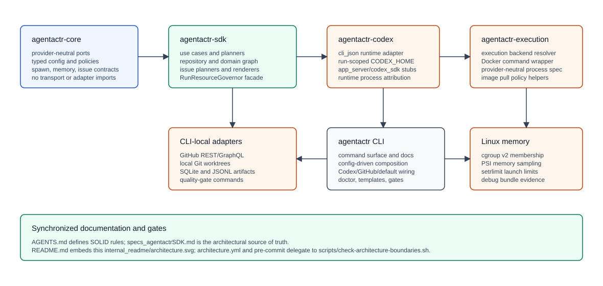
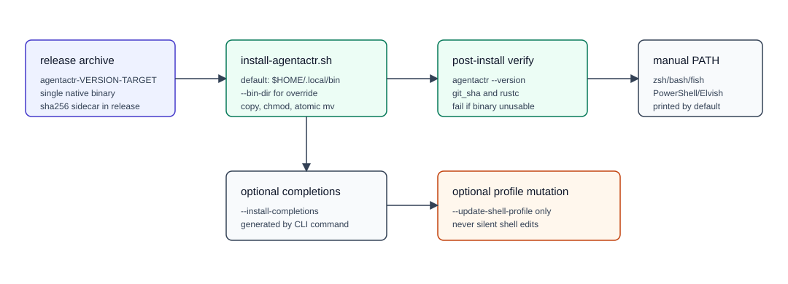
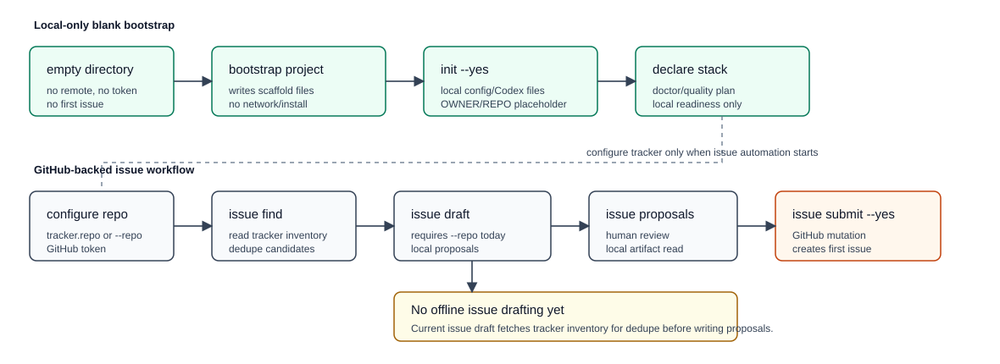
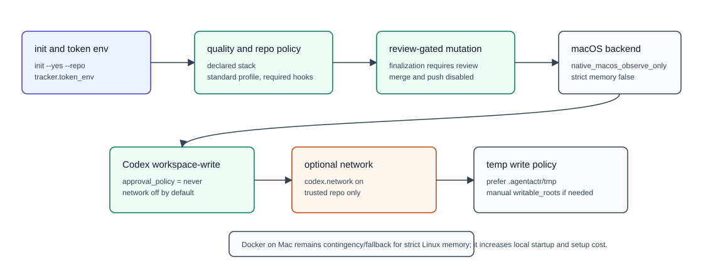
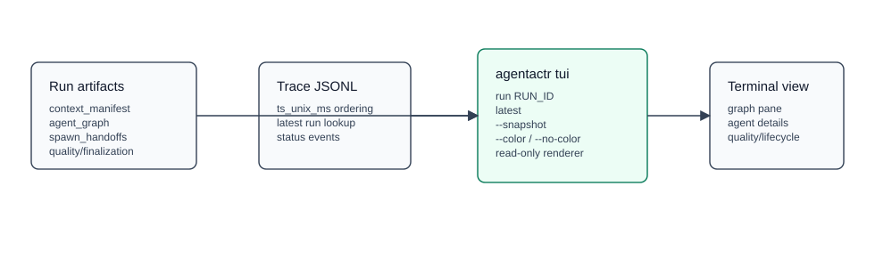
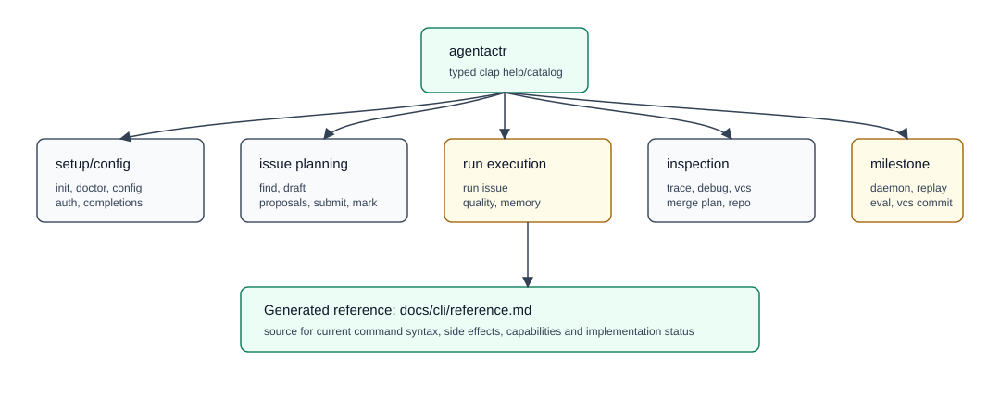
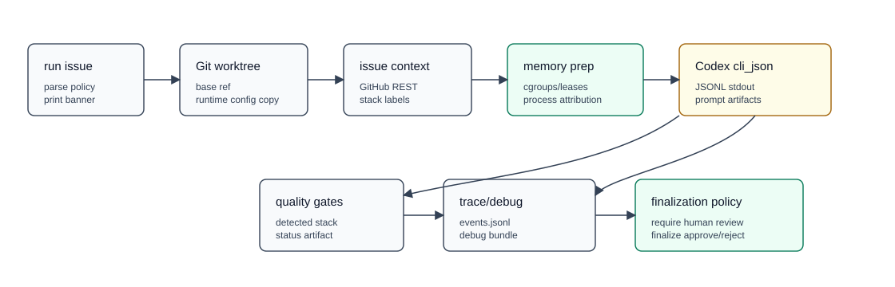
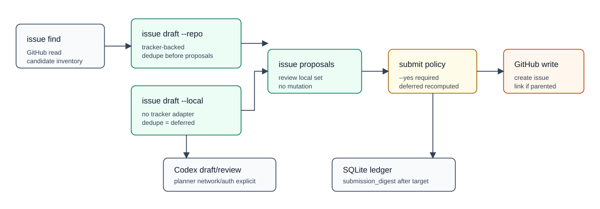
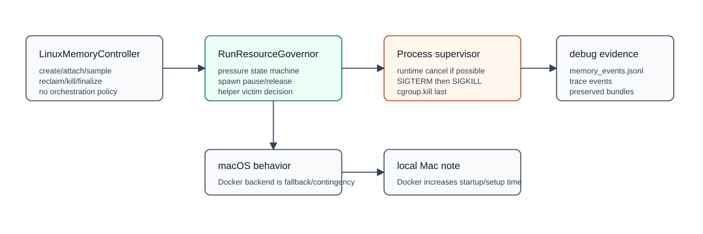
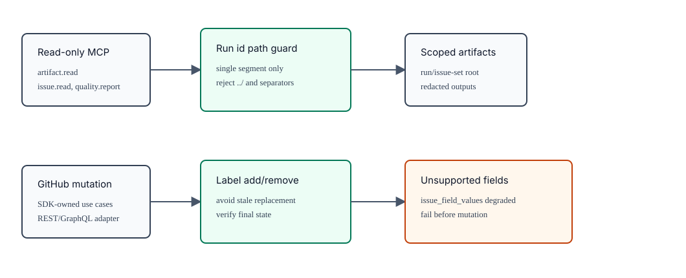

<!-- START doctoc generated TOC please keep comment here to allow auto update -->

**Table of Contents**  *generated with [DocToc](https://github.com/ktechhub/doctoc)*

<!---toc start-->

* [agentactrSDK](#agentactrsdk)
  * [Implementation-Agnostic, Opinionated Agent Actuator](#implementation-agnostic-opinionated-agent-actuator)
  * [Table Of Documents](#table-of-documents)
  * [Current Architecture](#current-architecture)
  * [Build And Version Provenance](#build-and-version-provenance)
  * [Install And PATH Management](#install-and-path-management)
    * [Build Locally For Current Releases](#build-locally-for-current-releases)
    * [Blank Project Bootstrap](#blank-project-bootstrap)
    * [Recommended Mac Unattended Defaults](#recommended-mac-unattended-defaults)
    * [Issue Creation, LLM Resolution, And Manual Merge](#issue-creation-llm-resolution-and-manual-merge)
  * [Default CLI Surface](#default-cli-surface)
  * [Configuration Files](#configuration-files)
  * [Run Issue Flow](#run-issue-flow)
  * [Issue Proposal Submission](#issue-proposal-submission)
  * [Linux Memory Governance](#linux-memory-governance)
  * [GitHub Adapter Behavior](#github-adapter-behavior)
  * [Domain And Quality Discovery](#domain-and-quality-discovery)
  * [Artifacts And State](#artifacts-and-state)
  * [Validation Commands](#validation-commands)
  * [GitHub Actions Docker Builds](#github-actions-docker-builds)
  * [Roadmap Snapshot](#roadmap-snapshot)
  * [UX Improvements And Better Defaults To Consider](#ux-improvements-and-better-defaults-to-consider)
  * [Documentation Maintenance Contract](#documentation-maintenance-contract)
  * [References](#references)

<!---toc end-->

<!-- END doctoc generated TOC please keep comment here to allow auto update -->


# agentactrSDK

[](https://github.com/dwaiba/agentactrSDK/actions/workflows/ci.yml)
[](https://github.com/dwaiba/agentactrSDK/actions/workflows/build.yml)
[](https://github.com/dwaiba/agentactrSDK/actions/workflows/architecture.yml)
[](https://github.com/dwaiba/agentactrSDK/actions/workflows/security.yml)
[](https://github.com/dwaiba/agentactrSDK/actions/workflows/docker-main.yml)
[](https://github.com/dwaiba/agentactrSDK/actions/workflows/nightly.yml)
[](https://github.com/dwaiba/agentactrSDK/actions/workflows/release.yml)

`agentactrSDK` is a Rust workspace for a strict, provider-neutral coding-agent orchestration SDK plus the default `agentactr` CLI product. The current default product is intentionally opinionated around Codex, GitHub Issues, Git worktrees, local artifacts, JSONL/SQLite run state, and Linux userspace memory controls. The architecture is still adapter-first: Codex, GitHub, Git, Linux memory, quality gates, stores, and observability are concrete implementations behind provider-neutral contracts.

## Implementation-Agnostic, Opinionated Agent Actuator

**This repository implements an implementation-agnostic but opinionated harness design: Agent Actuator.** The design is implementation-agnostic because the stable architecture is expressed through provider-neutral SDK contracts, typed ports, capability reports, and replaceable adapters. Codex, GitHub, Git, SQLite, Linux cgroups, and the Rust CLI are the default implementation choices, not architectural lock-in.

The design is also intentionally opinionated. Agent Actuator is not a loose wrapper around arbitrary agent tools. It defines a concrete operating model for coding-agent work: explicit issue or proposal intake, isolated workspaces, bounded helper agents, one writer, deterministic quality gates, structured artifacts, traceable lifecycle state, review-gated mutation, and secure-by-default failure behavior.

"Actuator" is used deliberately. In a control system, an actuator converts a policy decision or control signal into bounded physical action. Agent Actuator does the same for software-agent operations: SDK policy decisions are converted into controlled runtime, tracker, VCS, memory, quality, and observability actions through typed adapters. The core decides what should happen; adapters perform only the primitive external actions they are authorized and capable of performing.

The architectural source of truth is [specs_agentactrSDK.md](specs_agentactrSDK.md). This README is the living operator document for the present repository state. If code, command behavior, diagrams, or the spec change, update this README and the diagrams under [internal_readme/](internal_readme/) in the same change.

Spec adapter boundary quote: "These official APIs define default adapter behavior only. The stable architecture is provider-neutral: runtimes, trackers, project-management systems, stores, execution backends, memory controllers, and quality providers must remain replaceable through typed ports, capability reports, and SDK-owned use cases." See [specs_agentactrSDK.md:141](specs_agentactrSDK.md#L141).

## Table Of Documents

| Document | Role | Keep synchronized with |
| --- | --- | --- |
| [specs_agentactrSDK.md](specs_agentactrSDK.md) | Architectural source of truth for contracts, boundaries, defaults, roadmap status, provider-neutral design, and normative behavior. | Core/SDK/CLI contract changes, adapter capability changes, workflow policy, memory policy, tracker lifecycle, diagrams under [internal_specs_agentactrSDK/svgs/](internal_specs_agentactrSDK/svgs/). |
| [AGENTS.md](AGENTS.md) | Repository instructions for agents and contributors: SOLID boundaries, spec sync, README/diagram sync, citation policy, and trusted remote-build policy. | Any change to repo governance, documentation rules, citation rules, architecture-source rules, or build-service trust policy. |
| [docs/cli/reference.md](docs/cli/reference.md) | Generated CLI command reference from the typed Clap tree and command catalog. | CLI command, flag, help, completion, status, side-effect, credential, or command-catalog changes. Regenerate with `cargo run --bin agentactr -- docs cli-markdown --output docs/cli/reference.md`. |
| [docs/release-readiness.md](docs/release-readiness.md) | Public-release checklist for branch protection, required checks, release gating, Depot variables/secrets, and runner cost controls. | GitHub workflow changes, release workflow changes, required-check names, Depot usage, branch protection/ruleset decisions. |
| [CONTRIBUTING.md](CONTRIBUTING.md) | Contributor workflow, validation commands, PR expectations, and trusted/untrusted workflow boundaries. | Local validation gates, PR process, architecture-boundary requirements, Docker/Depot workflow posture. |
| [SECURITY.md](SECURITY.md) | Security reporting policy and workflow security posture. | Vulnerability-reporting process, secret handling, release/publishing rules, MCP/artifact scoping, Docker/Depot trust boundaries. |
| [WORKFLOW.md](WORKFLOW.md) | Short operator workflow and strict runtime defaults for day-to-day use. | Default unattended behavior, Codex/GitHub setup, strict mode defaults, workflow trigger defaults, Depot/schedule status. |

## Current Architecture



Workspace crates:

| Crate | Present role | Source |
| --- | --- | --- |
| `agentactr-core` | Provider-neutral contracts, config, ports, spawn policy, memory policy, process attribution, and issue-submission domain types. | [crates/agentactr-core/src/lib.rs](crates/agentactr-core/src/lib.rs), [ports.rs](crates/agentactr-core/src/ports.rs), [config.rs](crates/agentactr-core/src/config.rs) |
| `agentactr-sdk` | SDK facade, repository discovery, domain graph generation, config rendering, issue proposal planning, issue submission planning, run use cases, and `RunResourceGovernor`. | [crates/agentactr-sdk/src/lib.rs](crates/agentactr-sdk/src/lib.rs), [issue_submission.rs](crates/agentactr-sdk/src/issue_submission.rs), [resource_governor.rs](crates/agentactr-sdk/src/resource_governor.rs), [render.rs](crates/agentactr-sdk/src/render.rs) |
| `agentactr-codex` | Default Codex runtime adapter. `cli_json` is implemented; `app_server` and `codex_sdk` are selectable fail-closed stubs until contract-tested. | [crates/agentactr-codex/src/lib.rs](crates/agentactr-codex/src/lib.rs) |
| `agentactr-execution` | Execution backend resolution and Docker command wrapping. | [crates/agentactr-execution/src/lib.rs](crates/agentactr-execution/src/lib.rs) |
| `agentactr-cli` | Default Rust CLI product, Clap help/catalog generation, GitHub adapter, local Git adapter, SQLite/JSONL artifact wiring, artifact integrity verification, quality gates, Linux memory adapter, setup/config/auth/doctor commands, issue planning/submission commands, bootstrap project command templates, MCP stdio serving, trace inspection, read-only TUI rendering, debug bundle creation, terminal color policy, and operator commands. Focused command modules use explicit imports instead of crate-wide wildcard imports. | [crates/agentactr-cli/src/main.rs](crates/agentactr-cli/src/main.rs), [adapters.rs](crates/agentactr-cli/src/adapters.rs), [vcs_adapter.rs](crates/agentactr-cli/src/vcs_adapter.rs), [vcs_commands.rs](crates/agentactr-cli/src/vcs_commands.rs), [setup_commands.rs](crates/agentactr-cli/src/setup_commands.rs), [issue_commands.rs](crates/agentactr-cli/src/issue_commands.rs), [quality_command.rs](crates/agentactr-cli/src/quality_command.rs), [bootstrap_project.rs](crates/agentactr-cli/src/bootstrap_project.rs), [command_catalog.rs](crates/agentactr-cli/src/command_catalog.rs), [docs_command.rs](crates/agentactr-cli/src/docs_command.rs), [mcp_command.rs](crates/agentactr-cli/src/mcp_command.rs), [trace_command.rs](crates/agentactr-cli/src/trace_command.rs), [tui_command.rs](crates/agentactr-cli/src/tui_command.rs), [terminal.rs](crates/agentactr-cli/src/terminal.rs), [debug_bundle.rs](crates/agentactr-cli/src/debug_bundle.rs), [linux_memory.rs](crates/agentactr-cli/src/linux_memory.rs), [artifacts.rs](crates/agentactr-cli/src/artifacts.rs) |

Rust workspace governance:

- [rust-toolchain.toml](rust-toolchain.toml) pins the checked Rust toolchain and required `clippy`/`rustfmt` components.
- [Cargo.toml](Cargo.toml) declares the workspace MSRV with `[workspace.package].rust-version`, centralizes dependency versions in `[workspace.dependencies]`, and centralizes warning policy in `[workspace.lints]`.
- Unsafe Rust is limited to narrow process-boundary setup and must carry local `SAFETY:` comments; `clippy::undocumented_unsafe_blocks` is denied.
- Public core port traits use typed `PortError`/`PortResult` errors instead of new stringly `Result<_, String>` surfaces.

Consolidated stub, milestone, degraded, and finding-only surfaces:

| Surface | Exposed through | Present repo behavior | Pluggability and promotion path |
| --- | --- | --- | --- |
| Codex `cli_json` session APIs | `AgentRuntime::start`, `run_turn`, and `cancel` capabilities | Production `cli_json` supports single-shot `run_issue`; session start, turn streaming, and cancellation are reported as degraded in adapter capabilities. | Promote only after runtime session, cancellation, memory attribution, trace, and contract tests pass. |
| Codex app-server runtime | `codex.mode = "app_server"` | Config parsing, diagnostics, version report, capability report, and adapter type exist; all runtime entry points fail closed with an unsupported transport message. | Implement app-server initialize/thread/turn/cancel lifecycle inside `agentactr-codex`, keep CLI as wiring, and satisfy [specs_agentactrSDK.md:2939](specs_agentactrSDK.md#L2939)-[2949](specs_agentactrSDK.md#L2949). |
| Codex SDK runtime | `codex.mode = "codex_sdk"` | Config parsing, diagnostics, version report, capability report, and adapter type exist; TypeScript SDK bridge is not implemented and fails closed. | Implement a sidecar/bridge behind the runtime port, prove schema drift, auth, approval, cancellation, and memory attribution behavior, and satisfy [specs_agentactrSDK.md:2952](specs_agentactrSDK.md#L2952)-[2960](specs_agentactrSDK.md#L2960). |
| Scheduler daemon | `agentactr daemon --config agentactr.toml` | Cataloged as `milestone`; dispatch returns the explicit not-implemented milestone diagnostic. | Add SDK scheduler use case before promotion; CLI must stay HCI/wiring. |
| Tracker query runner | `agentactr run query --repo OWNER/REPO --label ...` | Cataloged as `milestone`; explicit `run issue` is implemented, but poll/query dispatch is not. | Add SDK query/poller orchestration and lease behavior before promotion; see [specs_agentactrSDK.md:2918](specs_agentactrSDK.md#L2918)-[2925](specs_agentactrSDK.md#L2925). |
| Replay | `agentactr replay RUN_ID` | Cataloged as `milestone`; trace/event writing exists, but replay orchestration is not implemented. | Add replay use case that rebuilds run state from JSONL/artifacts and reports divergence; see [specs_agentactrSDK.md:3009](specs_agentactrSDK.md#L3009)-[3014](specs_agentactrSDK.md#L3014). |
| Evaluation harness | `agentactr eval swe-bench --subset verified-smoke` | Cataloged as `milestone`; no evaluation harness is implemented. | Add provider-neutral eval use case and fixtures before enabling. |
| Local VCS commit | `agentactr vcs commit RUN_ID` | Cataloged as `milestone`; read-only VCS prepare/status/list/show/diff and merge-plan are implemented. | Implement commit behind the version-control port and SDK policy after quality gates; see [specs_agentactrSDK.md:2583](specs_agentactrSDK.md#L2583)-[2615](specs_agentactrSDK.md#L2615). |
| Worktree cleanup | `agentactr vcs cleanup RUN_ID` | Cataloged as `milestone`; retained worktrees can be inspected, but cleanup command is not implemented. | Implement retention/approval-aware cleanup behind SDK/VCS policy. |
| Cross-issue overlap enforcement | `vcs.detect_cross_issue_file_overlap`, VCS status/debug output | Config and diagnostic placeholders exist; cross-issue overlap is reported as not implemented in this milestone. | Requires durable active-run file index and scheduler coordination before enforcement. |
| Generic tracker issue create/link defaults | `IssueTracker::create_issue`, `IssueTracker::link_issue` | Core ports default to fail-closed; the GitHub REST adapter implements create-then-link. New tracker adapters must opt in by capability. | Add Linear/Jira/etc. adapters behind `IssueTracker`; no production Linear/Jira adapter ships in this repo state. |
| Issue field values | `issue_field_values` proposal metadata and GitHub adapter capability report | GitHub adapter reports this as degraded and rejects unsupported field values before mutation. Issue type, labels, assignees, and milestones are implemented separately. | Promote only after parser, REST/GraphQL mutation, response verification, and mismatch handling are round-tripped. |
| GitHub Projects V2 automation | `github.project_automation = "ensure_on_issue_create"` | Default is disabled/degraded. Opt-in project item creation and representative field filling are present for configured GitHub Projects V2 metadata. | Keep project automation capability-gated; expand only through provider-neutral tracker/project contracts. |
| Issue draft planner default port | `IssueDraftPlanner::draft` | Core planner port default fails closed; CLI wires deterministic prompt drafting and optional Codex draft/review behavior for the default product. | Concrete planners must return structured proposals and artifacted validation results without tracker mutation. |
| Memory controller optional primitives | `MemoryController::reclaim`, `kill_group`, `finalize_group` | Core defaults fail closed. Linux cgroup v2 wiring feature-detects and records degraded events where kernel files are unsupported. | New memory backends must expose primitive capabilities only; policy stays in `RunResourceGovernor`. |
| Runtime process cancellation default | `RuntimeProcessSupervisor::cancel_process_tree` | Core default fails closed. CLI runtime supervisor implements process-group cancellation for local processes. | Runtime adapters must emit neutral process events so supervisors can cancel without provider-specific parsing. |
| Platform live validation | Domain graph for PostgreSQL, ClickHouse, Valkey, Kafka, storage, communications, observability, resilience, tenancy, UUIDv7, and errors | Detection, graph nodes, typed quality gates, and finding-only guidance exist. No live database, broker, storage, email, or observability provider calls are made. | Add provider-specific adapters only behind neutral ports and opt-in credential/network gates. |
| Python non-uv tool command families | Python discovery | Hatch, Poetry, PDM, tox, and nox evidence is detected, but the strict quality command family remains uv-first. | Add package-manager/tool-family resolvers before advertising equivalent Hatch/Poetry/PDM execution. |
| Terraform/Pulumi live cloud operations | Domain graph and domain quality gates | Terraform local validation gates exist; Pulumi preview is opt-in, credential-required, and network-required. No cloud mutation is automatic. | Keep cloud calls opt-in and artifacted; reusable component/policy analysis remains provider-neutral. |

Important spec anchors:

| Topic | Spec lines |
| --- | --- |
| CLI discoverability and required command inventory | [specs_agentactrSDK.md:297](specs_agentactrSDK.md#L297)-[322](specs_agentactrSDK.md#L322) |
| Implemented bootstrap command surface | [specs_agentactrSDK.md:342](specs_agentactrSDK.md#L342)-[385](specs_agentactrSDK.md#L385) |
| Version output contract | [specs_agentactrSDK.md:316](specs_agentactrSDK.md#L316) |
| Config rendering and inline possible-value comments | [specs_agentactrSDK.md:522](specs_agentactrSDK.md#L522)-[784](specs_agentactrSDK.md#L784) |
| Codex mode and fail-closed milestone transports | [specs_agentactrSDK.md:1314](specs_agentactrSDK.md#L1314)-[1320](specs_agentactrSDK.md#L1320) |
| Linux userspace memory governance | [specs_agentactrSDK.md:1681](specs_agentactrSDK.md#L1681)-[1727](specs_agentactrSDK.md#L1727) |
| GitHub finalization policy | [specs_agentactrSDK.md:2644](specs_agentactrSDK.md#L2644)-[2686](specs_agentactrSDK.md#L2686) |
| Review-gated issue proposal submission | [specs_agentactrSDK.md:2689](specs_agentactrSDK.md#L2689)-[2814](specs_agentactrSDK.md#L2814) |
| Milestone roadmap/status | [specs_agentactrSDK.md:2894](specs_agentactrSDK.md#L2894)-[3014](specs_agentactrSDK.md#L3014) |

## Build And Version Provenance

Build:

```bash
cargo build --release --workspace --all-features
```

Release binary:

```bash
target/release/agentactr --version
```

Current `--version` shape:

```text
agentactr 0.1.0 (git_sha=<12-char-sha-or-unknown> rustc="<rustc --version>")
```

The version string is generated from:

- `CARGO_PKG_VERSION`
- `AGENTACTR_BUILD_GIT_SHA`
- `AGENTACTR_BUILD_RUSTC_VERSION`

The build script captures those values in [crates/agentactr-cli/build.rs](crates/agentactr-cli/build.rs). If Git `HEAD` cannot be resolved, the Git SHA degrades to `unknown` as required by [specs_agentactrSDK.md:316](specs_agentactrSDK.md#L316).

## Install And PATH Management



Current public releases intentionally do not attach native CLI binary archives or macOS `.pkg` installers. Release notes and image metadata remain published, but operators should build the CLI locally from source for now.

### Build Locally For Current Releases

Build and install from a trusted checkout:

```bash
cargo build --release --bin agentactr
target/release/agentactr --version

mkdir -p "$HOME/.local/bin"
cp target/release/agentactr "$HOME/.local/bin/agentactr"
agentactr --version
```

Then ensure `$HOME/.local/bin` is on `PATH`. The conservative installer is still useful when you already have a local or downloaded binary artifact:

```bash
scripts/install-agentactr.sh --source target/release/agentactr
```

Default behavior:

- installs to `$HOME/.local/bin/agentactr`;
- accepts `--bin-dir PATH` for another install location;
- verifies the installed binary with `agentactr --version`;
- prints shell-specific PATH instructions;
- never edits shell profiles unless `--update-shell-profile` is passed;
- never installs completions unless `--install-completions` is passed.

Examples:

```bash
scripts/install-agentactr.sh \
  --source target/release/agentactr \
  --bin-dir "$HOME/.local/bin"

scripts/install-agentactr.sh \
  --source target/release/agentactr \
  --shell zsh \
  --install-completions

scripts/install-agentactr.sh \
  --source target/release/agentactr \
  --shell zsh \
  --update-shell-profile
```

Manual PATH guidance by shell:

```bash
# zsh: add to ~/.zshrc
export PATH="$HOME/.local/bin:$PATH"

# bash: add to ~/.bashrc, or ~/.bash_profile on macOS login shells
export PATH="$HOME/.local/bin:$PATH"

# fish
fish_add_path ~/.local/bin

# PowerShell
# Add ~/.local/bin to the user PATH or profile explicitly.

# Elvish: add to ~/.config/elvish/rc.elv
set paths = [~/.local/bin $@paths]
```

Completion generation remains CLI-owned and explicit:

```bash
agentactr completions bash
agentactr completions zsh
agentactr completions fish
agentactr completions powershell
agentactr completions elvish
```

There is no Homebrew formula in the present repo state. Native binary archives, a signed macOS `.pkg`, and Homebrew packaging are deferred release surfaces; each needs dedicated signing, provenance, installation, and verification tests before being re-enabled.

### Blank Project Bootstrap



For a new empty project, choose the workflow based on whether GitHub issue automation is needed immediately.

Local-only bootstrap does not require a Git remote, GitHub repository, GitHub token, or first issue. It creates local scaffold files and can also create local agentactr/Codex operator files:

```bash
mkdir my-project
cd my-project

# Scaffold the application or infrastructure project.
agentactr bootstrap project --stack <python|golang|rust|typescript|pulumi|terraform|sql> --yes

# Optional local agentactr metadata. Without --repo, init renders tracker.repo = "OWNER/REPO"
# as a placeholder until a real tracker repo is configured.
agentactr init --yes

# Declare the primary stack for doctor, quality planning, and generated AGENTS.md.
agentactr config set repository.declared_primary_stack <python|golang|rust|typescript>
agentactr doctor --fix-codex-config
agentactr quality plan
```

GitHub-backed blank-project issue creation requires a real remote repository slug before issue discovery, drafting, submission, or `run issue`:

```bash
export GITHUB_TOKEN=...

agentactr init --yes --repo <OWNER/REPONAME>
agentactr config set tracker.token_env GITHUB_TOKEN
agentactr config set repository.declared_primary_stack <python|golang|rust|typescript>
agentactr bootstrap project --stack <python|golang|rust|typescript|pulumi|terraform|sql> --yes

# Optional: inspect existing tracker issues for dedupe inventory.
agentactr issue find --repo <OWNER/REPONAME> --limit 50 --json

# Draft tracker-backed local issue proposals from a prompt and repo evidence.
agentactr issue draft \
  --repo <OWNER/REPONAME> \
  --prompt "Create the initial backlog for this blank project." \
  --stack <python|golang|rust|typescript> \
  --json

# Review local proposals, then submit one reviewed proposal to GitHub.
agentactr issue proposals <ISSUE_SET_ID>
agentactr issue submit <ISSUE_SET_ID> --proposal <PROPOSAL_ID> --yes

# Run only after a GitHub issue exists.
agentactr run issue --repo <OWNER/REPONAME> --issue <ISSUE_NUMBER>
```

`bootstrap project` is explicit and write-capable. It is intended for blank projects, refuses non-empty directories by default, allows agentactr init metadata such as `.git`, `.codex`, `.agentactr`, `agentactr.toml`, `WORKFLOW.md`, and `.gitignore`, refuses to overwrite existing files unless `--force` is supplied, and merges missing `.gitignore` scaffold entries without deleting existing entries. It prints every written file and the stack-specific start commands. Use `--allow-non-empty` only after reviewing the target directory.

Tracker-offline drafting is available with `issue draft --local`. Deterministic local drafts do not construct the GitHub adapter, write an empty candidate artifact with `reason = "not_fetched_local_draft"`, use `repo = "local:<workspace_slug>"`, and mark proposal dedupe as `deferred`. Submit-time GitHub mutation still requires an explicit target repository:

```bash
agentactr issue draft \
  --local \
  --prompt "Create the initial backlog for this blank project." \
  --stack <python|golang|rust|typescript> \
  --json

agentactr issue proposals <ISSUE_SET_ID>
agentactr issue submit <ISSUE_SET_ID> \
  --proposal <PROPOSAL_ID> \
  --repo <OWNER/REPONAME> \
  --yes
```

`--codex-draft` and `--codex-review` may be combined with `--local`, but those modes are only tracker-offline: they can still require Codex auth and planner network access. Plain deterministic `--local --prompt ...` remains fully offline.

Supported scaffold surfaces:

| Stack | Scaffold focus |
| --- | --- |
| `python` | `pyproject.toml` with Hatch build backend, `uv`, Ruff, Pytest, Pyright, `poetry.toml`, `src/`, `tests/`, and pre-commit hooks. |
| `golang` / `go` | `go.mod`, `cmd/`, `internal/`, tests, `golangci-lint`, and pre-commit hooks. |
| `rust` | Workspace layout modeled after this repo, pinned `rust-toolchain.toml`, declared workspace MSRV, `deny.toml`, tests, and pre-commit hooks. |
| `typescript` | Bun, Biome, TypeScript strict mode, tests, and pre-commit hooks. Fresh scaffolds use plain `bun install` so the first install can create `bun.lock`, and generated NodeNext tests import local TypeScript modules through emitted `.js` specifiers. |
| `pulumi` | TypeScript Pulumi project with Bun, Biome, tests, and pre-commit hooks. Fresh scaffolds use plain `bun install` so the first install can create `bun.lock`. Live `pulumi preview` is documented as optional because it can require credentials, backend access, and network. |
| `terraform` | Modular Terraform layout, tracked `.terraform.lock.hcl` provider lock policy, `terraform fmt`, `validate`, `test`, and pre-commit hooks. |
| `sql` | Forward migrations, reviewed rollbacks, backfills, seeds, smoke tests, SQLFluff, and pre-commit hooks. |

### Recommended Mac Unattended Defaults



For a trusted local macOS checkout where unattended runs should write inside the workspace without prompting, start with secure review gates and native macOS observe-only execution:

```bash
export GITHUB_TOKEN=...

agentactr init --yes --repo <OWNER/REPONAME>
agentactr config set tracker.token_env GITHUB_TOKEN

agentactr config set repository.declared_primary_stack <typescript|rust|golang|python>
agentactr config set quality.profile standard
agentactr config set quality.pre_commit_mode required
agentactr config set quality.fail_on_missing_toolchain true
agentactr config set quality.fail_on_untracked_generated_files true

agentactr config set github.finalization require_human_review
agentactr config set github.project_automation disabled
agentactr config set merge.mode disabled
agentactr config set merge.push disabled

agentactr config set execution.backend native_macos_observe_only
agentactr config set execution.strict_memory_required false

agentactr config set codex.sandbox_mode workspace-write
agentactr config set codex.approval_policy never
agentactr config set codex.network off

agentactr config set human_intervention.mode fail_closed
agentactr config set human_intervention.on_codex_approval_request fail_run

agentactr doctor --fix-codex-config
agentactr doctor --fix-agents
agentactr doctor --trust-codex-project
agentactr quality plan
```

For long unattended runs that need dependency installs or web/network access, add:

```bash
agentactr config set codex.network on
agentactr doctor --fix-codex-config
```

Example long-run config, shown verbatim:

```bash
export GITHUB_TOKEN=..
export HF_TOKEN=..
CODEX_HOME="$HOME/.codex-otherhome" agentactr init --yes --repo dwaiba/testpython
CODEX_HOME="$HOME/.codex-otherhome" agentactr config set tracker.token_env GITHUB_TOKEN
CODEX_HOME="$HOME/.codex-otherhome" agentactr config set repository.declared_primary_stack python
CODEX_HOME="$HOME/.codex-otherhome" agentactr config set quality.profile standard
CODEX_HOME="$HOME/.codex-otherhome" agentactr config set quality.pre_commit_mode required
CODEX_HOME="$HOME/.codex-otherhome" agentactr config set quality.fail_on_missing_toolchain true
CODEX_HOME="$HOME/.codex-otherhome" agentactr config set quality.fail_on_untracked_generated_files true
CODEX_HOME="$HOME/.codex-otherhome" agentactr config set github.finalization require_human_review
CODEX_HOME="$HOME/.codex-otherhome" agentactr config set github.project_automation disabled
CODEX_HOME="$HOME/.codex-otherhome" agentactr config set merge.mode disabled
CODEX_HOME="$HOME/.codex-otherhome" agentactr config set merge.push disabled
CODEX_HOME="$HOME/.codex-otherhome" agentactr config set execution.backend native_macos_observe_only
CODEX_HOME="$HOME/.codex-otherhome" agentactr config set execution.strict_memory_required false
CODEX_HOME="$HOME/.codex-otherhome" agentactr config set codex.sandbox_mode workspace-write
CODEX_HOME="$HOME/.codex-otherhome" agentactr config set codex.approval_policy never
CODEX_HOME="$HOME/.codex-otherhome" agentactr config set human_intervention.mode fail_closed
CODEX_HOME="$HOME/.codex-otherhome" agentactr config set human_intervention.on_codex_approval_request fail_run
CODEX_HOME="$HOME/.codex-otherhome" agentactr config set vcs.workspace_strategy worktree
CODEX_HOME="$HOME/.codex-otherhome" agentactr config set vcs.base_ref origin/main
CODEX_HOME="$HOME/.codex-otherhome" agentactr config set vcs.record_base_commit true
CODEX_HOME="$HOME/.codex-otherhome" agentactr config set vcs.copy_runtime_config_to_worktree true
CODEX_HOME="$HOME/.codex-otherhome" agentactr config set vcs.detect_cross_issue_file_overlap true
CODEX_HOME="$HOME/.codex-otherhome" agentactr config set vcs.overlap_policy fail_closed
CODEX_HOME="$HOME/.codex-otherhome" agentactr config set vcs.fail_on_dirty_source_checkout false
CODEX_HOME="$HOME/.codex-otherhome" agentactr config set codex.network on
CODEX_HOME="$HOME/.codex-otherhome" agentactr quality plan
CODEX_HOME="$HOME/.codex-otherhome" agentactr doctor --fix-codex-config
```

That maps into generated `.codex/config.toml` as `sandbox_workspace_write.network_access = true`. OpenAI's Codex docs describe `workspace-write` as the lower-friction local mode, and network access is separately controlled for workspace-write [3]. Keep `approval_policy = "never"` only when you are comfortable with non-prompted network commands in a trusted repo.

Filesystem writes to temp:

Current `agentactr config set` does not expose Codex `sandbox_workspace_write.writable_roots`. The generated `.codex/config.toml` currently sets network access, but not extra writable roots.

Prefer repo-local temp first:

```bash
mkdir -p .agentactr/tmp
export TMPDIR="$PWD/.agentactr/tmp"
```

If you truly need `/tmp` or macOS temp roots, manually add this after `agentactr doctor --fix-codex-config`:

```toml
[sandbox_workspace_write]
network_access = true
writable_roots = ["/tmp", "/private/tmp"]
exclude_slash_tmp = false
exclude_tmpdir_env_var = false
```

Avoid broad `/var/folders` unless a tool absolutely requires it; on macOS that is where `$TMPDIR` often resolves, but it is a much wider permission surface.

Git defaults for real release or public usage:

```bash
agentactr config set vcs.workspace_strategy worktree
agentactr config set vcs.base_ref origin/main
agentactr config set vcs.record_base_commit true
agentactr config set vcs.copy_runtime_config_to_worktree true
agentactr config set vcs.detect_cross_issue_file_overlap true
agentactr config set vcs.overlap_policy fail_closed
```

Safer public default:

```bash
agentactr config set vcs.fail_on_dirty_source_checkout true
```

Use this only when intentionally dogfooding from a dirty local source checkout:

```bash
agentactr config set vcs.fail_on_dirty_source_checkout false
```

One missing product gap:

A useful hardening slice would add first-class `agentactr config` keys for:

```text
codex.workspace_writable_roots
codex.workspace_exclude_slash_tmp
codex.workspace_exclude_tmpdir_env_var
```

Then `agentactr doctor --fix-codex-config` can render temp-write policy without manual TOML edits. Right now, manual `.codex/config.toml` editing is the only path for extra writable roots.

### Issue Creation, LLM Resolution, And Manual Merge

Use this path when you want agentactr to help create GitHub issues, run an LLM against one issue, then review and merge manually.

```bash
# 1. Inspect existing GitHub issues without running agents or mutating GitHub.
agentactr issue find --repo <OWNER/REPONAME> --limit 50 --json

# 2a. Draft tracker-backed local issue proposals from a reviewed prompt and repo evidence.
agentactr issue draft \
  --repo <OWNER/REPONAME> \
  --prompt "Break this work into small independently implementable issues." \
  --stack <typescript|rust|golang|python> \
  --framework <nextjs|none> \
  --codex-draft \
  --codex-review \
  --json

# 2b. Or draft tracker-offline proposals first, then bind a target repo only at submit time.
agentactr issue draft \
  --local \
  --prompt "Break this work into small independently implementable issues." \
  --stack <typescript|rust|golang|python> \
  --domain <postgres|terraform|grpc|none> \
  --json

# 3. Review local proposals before GitHub mutation.
agentactr issue proposals <ISSUE_SET_ID>

# 4. Submit one reviewed proposal to GitHub. Local issue sets require explicit --repo.
agentactr issue submit <ISSUE_SET_ID> \
  --proposal <PROPOSAL_ID> \
  --repo <OWNER/REPONAME> \
  --yes \
  --require-codex-review

# 5. Let Codex work on an existing GitHub issue in an isolated worktree.
agentactr run issue --repo <OWNER/REPONAME> --issue <ISSUE_NUMBER>

# 6. Inspect the result locally.
agentactr vcs status <RUN_ID>
agentactr vcs diff <RUN_ID>
agentactr vcs apply <RUN_ID> --check
agentactr quality run <RUN_ID>

# 7. Approve or reject tracker finalization after human review.
agentactr finalize <RUN_ID> --approve
agentactr finalize <RUN_ID> --reject --reason "needs manual follow-up"
```

Manual patch and merge path:

```bash
# Validate the current worktree patch against the source checkout.
agentactr vcs apply <RUN_ID> --check

# Apply the reviewed patch; use --3way when Git can help with conflicts.
agentactr vcs apply <RUN_ID> --yes --3way

# If the source checkout is intentionally dirty, make that explicit.
agentactr vcs apply <RUN_ID> --yes --3way --allow-dirty

# Run project checks, then commit and push through normal Git workflow.
agentactr quality plan
git status
git add -A
git commit -m "agentactr: resolve issue <ISSUE_NUMBER>"
git push
```

Notes:

- `issue find`, `issue draft`, and `issue proposals` are local/read-only until `issue submit --yes`.
- `issue draft --local` is tracker-offline and defers dedupe until `issue submit ... --repo OWNER/REPO --yes`.
- `--codex-draft` asks Codex to draft structured proposals; `--codex-review` records a separate Codex review artifact before submission.
- `run issue` creates an isolated worktree and artifacts; `vcs apply` helps move reviewed patch artifacts into the source checkout, while commit, push, PR, and merge remain normal Git workflow.
- `finalize --approve` updates tracker lifecycle state after review; it is not a Git merge.

## Default CLI Surface

The generated reference is [docs/cli/reference.md](docs/cli/reference.md). Regenerate it from the typed command model:

```bash
target/release/agentactr docs cli-markdown --output docs/cli/reference.md
```



Human output accepts a top-level `--color auto|always|never` flag before the command. `NO_COLOR`, non-TTY output, and `--json` keep machine-readable output uncolored. The read-only TUI consumes existing run artifacts and trace events only:

```bash
agentactr tui run RUN_ID --snapshot
agentactr tui run RUN_ID --refresh 1s
agentactr tui latest
```

`tui latest` resolves the newest run from trace `ts_unix_ms` ordering, not artifact directory modification time. Missing graph artifacts are reported as diagnostics. When artifacts are present, the TUI renders agent graph nodes with event-derived pending/active/complete/failed/blocked/review state, runtime process activity, parsed quality gate status, GitHub lifecycle events, and finalization state. The TUI does not mutate worktrees, SQLite state, GitHub, Codex state, or run lifecycle.



Implemented read-only discovery commands:

```bash
agentactr --version
agentactr -V
agentactr help
agentactr help run issue
agentactr commands
agentactr commands --json
agentactr menu
agentactr menu --json
agentactr completions bash
agentactr completions zsh
agentactr completions fish
agentactr completions powershell
agentactr completions elvish
agentactr docs cli-markdown
agentactr docs cli-markdown --output docs/cli/reference.md
```

Setup and config commands:

```bash
agentactr init --yes
agentactr init --yes --repo OWNER/REPO
agentactr init --yes --repo OWNER/REPO --codex-auth auto
agentactr init --yes --repo OWNER/REPO --codex-auth chatgpt
agentactr init --yes --repo OWNER/REPO --codex-auth api-key
agentactr init --yes --codex-auth chatgpt
agentactr doctor
agentactr doctor --fix-codex-config
agentactr doctor --fix-agents
agentactr doctor --trust-codex-project
agentactr doctor --fix-codex-config --fix-agents
agentactr config get
agentactr config get codex.mode
agentactr config set codex.approval_policy never
agentactr config set codex.approval_policy on-request
agentactr auth codex --method chatgpt
agentactr auth codex --method subscription
agentactr auth codex --method api-key
agentactr auth codex --method api-key --api-key-env CODEX_API_KEY
agentactr bootstrap project --stack python --yes
agentactr bootstrap project --stack golang --yes
agentactr bootstrap project --stack rust --yes
agentactr bootstrap project --stack typescript --yes
agentactr bootstrap project --stack pulumi --yes
agentactr bootstrap project --stack terraform --yes
agentactr bootstrap project --stack sql --yes
```

Blank local project commands that do not require GitHub:

```bash
mkdir my-project
cd my-project
agentactr bootstrap project --stack python --yes
agentactr init --yes
agentactr config set repository.declared_primary_stack python
agentactr doctor --fix-codex-config
agentactr quality plan
```

Issue discovery, drafting, review, and submission commands:

```bash
agentactr issue find --repo OWNER/REPO
agentactr issue find --repo OWNER/REPO --query TEXT
agentactr issue find --repo OWNER/REPO --state open
agentactr issue find --repo OWNER/REPO --state closed
agentactr issue find --repo OWNER/REPO --state all
agentactr issue find --repo OWNER/REPO --label bug --label enhancement
agentactr issue find --repo OWNER/REPO --assignee USER
agentactr issue find --repo OWNER/REPO --assignee none
agentactr issue find --repo OWNER/REPO --assignee '*'
agentactr issue find --repo OWNER/REPO --author USER
agentactr issue find --repo OWNER/REPO --since 2026-05-15T00:00:00Z
agentactr issue find --repo OWNER/REPO --sort created --direction asc
agentactr issue find --repo OWNER/REPO --sort updated --direction desc
agentactr issue find --repo OWNER/REPO --sort comments
agentactr issue find --repo OWNER/REPO --page 1 --per-page 50 --limit 100
agentactr issue find --repo OWNER/REPO --include-pull-requests
agentactr issue find --repo OWNER/REPO --artifact-root .agentactr/artifacts/issues --json

agentactr issue draft --repo OWNER/REPO --prompt "TEXT" --stack typescript
agentactr issue draft --local --prompt "TEXT" --stack python
agentactr issue draft --local --prompt-file prompt.txt --stack rust --domain grpc
agentactr issue draft --repo OWNER/REPO --prompt-file prompt.txt --stack rust
agentactr issue draft --repo OWNER/REPO --prompt "TEXT" --stack typescript --framework nextjs
agentactr issue draft --repo OWNER/REPO --prompt "TEXT" --stack typescript --framework none
agentactr issue draft --repo OWNER/REPO --prompt "TEXT" --stack typescript --parent 123
agentactr issue draft --repo OWNER/REPO --prompt "TEXT" --stack typescript --codex-draft
agentactr issue draft --repo OWNER/REPO --prompt "TEXT" --stack typescript --codex-review
agentactr issue draft --repo OWNER/REPO --prompt "TEXT" --stack typescript --codex-draft --codex-review --json

agentactr issue proposals ISSUE_SET_ID
agentactr issue mark ISSUE_SET_ID --proposal PROPOSAL_ID --dedupe unique --reason "reviewed"
agentactr issue mark ISSUE_SET_ID --proposal PROPOSAL_ID --dedupe duplicate_blocked --reason "already covered"
agentactr issue submit ISSUE_SET_ID --proposal PROPOSAL_ID --yes
agentactr issue submit ISSUE_SET_ID --proposal PROPOSAL_ID --repo OWNER/REPO --yes
agentactr issue submit ISSUE_SET_ID --proposal PROPOSAL_ID --yes --require-codex-review
agentactr issue submit ISSUE_SET_ID --proposal PROPOSAL_ID --yes --allow-possible-duplicate --reason "operator approved duplicate risk"
agentactr issue submit ISSUE_SET_ID --proposal PROPOSAL_ID --resume --yes
```

Run, quality, VCS, trace, debug, memory, and finalization commands:

```bash
agentactr run issue --repo OWNER/REPO --issue 123
agentactr run issue --repo OWNER/REPO --issue 123 --dry-run
agentactr run issue --repo OWNER/REPO --issue 123 --human-intervention fail-closed
agentactr run issue --repo OWNER/REPO --issue 123 --human-intervention interactive --codex-approval on-request
agentactr run issue --repo OWNER/REPO --issue 123 --human-intervention review-required --github-finalization require_human_review
agentactr run issue --repo OWNER/REPO --issue 123 --github-finalization disabled
agentactr run issue --repo OWNER/REPO --issue 123 --github-finalization automatic_after_quality_gates

agentactr repo inspect
agentactr quality plan
agentactr quality run RUN_ID
agentactr vcs prepare --issue 123
agentactr vcs prepare --issue 123 --repo OWNER/REPO
agentactr vcs list
agentactr vcs list --json
agentactr vcs show RUN_ID
agentactr vcs show RUN_ID --json
agentactr vcs status RUN_ID
agentactr vcs diff RUN_ID
agentactr vcs diff RUN_ID --output .agentactr/artifacts/runs/RUN_ID/workspace.diff
agentactr vcs apply RUN_ID --check
agentactr vcs apply RUN_ID --yes
agentactr vcs apply RUN_ID --yes --3way
agentactr vcs apply RUN_ID --yes --3way --allow-dirty
agentactr merge plan RUN_ID
agentactr merge plan RUN_ID --json
agentactr trace list
agentactr trace show RUN_ID
agentactr --color auto tui run RUN_ID --snapshot
agentactr --color never tui latest
agentactr tui run RUN_ID --refresh 1s
agentactr debug bundle RUN_ID
agentactr memory status
agentactr memory pressure
agentactr finalize RUN_ID --approve
agentactr finalize RUN_ID --approve --resume
agentactr finalize RUN_ID --reject --reason "reason"
agentactr finalize RUN_ID --reject --reason "reason" --resume
agentactr status
```

Milestone commands are present in the catalog but intentionally fail with an explicit milestone diagnostic:

```bash
agentactr daemon --config agentactr.toml
agentactr run query --repo OWNER/REPO --label agentactr:ready --human-intervention fail-closed
agentactr replay RUN_ID
agentactr vcs commit RUN_ID
agentactr vcs cleanup RUN_ID
agentactr eval swe-bench --subset verified-smoke
```

For exact option defaults and generated help, use [docs/cli/reference.md](docs/cli/reference.md). The README command list must not be treated as a separate command source.

## Configuration Files

`agentactr init --yes [--repo OWNER/REPO]` writes:

- `agentactr.toml`
- `.codex/config.toml`
- `WORKFLOW.md`
- `AGENTS.md` when absent
- `specs_<repo>.md` when generated AGENTS needs a project-local source of truth
- `.gitignore` additions

Generated AGENTS files reference the project-local `specs_<repo>.md`, not this SDK repository's `specs_agentactrSDK.md`. If `agentactr config set ...` changes selected stack, quality profile, domain policy, or other rendered guidance, agentactr refreshes AGENTS only when the existing file is recognized as agentactr-generated; hand-written AGENTS files still win by default. Generated project specs refresh only their metadata context block, preserving operator-authored requirements and notes.

All CLI-owned TOML writes keep possible values visible beside closed-set values:

```toml
approval_policy = "never" # possible values: never, on-request
sandbox_mode = "workspace-write" # possible values: read-only, workspace-write, danger-full-access
```

`agentactr config set` rewrites `agentactr.toml` through `toml_edit` and then reapplies the deterministic possible-value annotations from the SDK render layer. Free-form paths, labels, commands, templates, URLs, and artifact locations are intentionally not annotated as finite value sets.

Codex project config is repo-local and top-level. It does not render `[profiles.agentactr]` in project-local `.codex/config.toml`; profile tables belong in user-level Codex config. This matches [specs_agentactrSDK.md:780](specs_agentactrSDK.md#L780)-[784](specs_agentactrSDK.md#L784).

Current generated `agentactr.toml` surface, including closed-set possible values:

```toml
[tracker]
kind = "github" # possible values: github
repo = "OWNER/REPO"
token_env = "GITHUB_TOKEN"
github_api_version = "2026-03-10"
active_labels = ["agentactr:ready"]
ignore_labels = ["agentactr:blocked"]
claim_label = "agentactr:claimed"
running_label = "agentactr:running"
failed_label = "agentactr:failed"
done_label = "agentactr:done"

[codex]
command = "codex"
mode = "cli_json" # possible values: cli_json, app_server, codex_sdk
profile = "agentactr"
approval_policy = "never" # possible values: never, on-request
sandbox_mode = "workspace-write" # possible values: read-only, workspace-write, danger-full-access
network = "off" # possible values: off, on
default_model = "configured-by-codex"
model_reasoning_effort = "medium" # possible values: minimal, low, medium, high, xhigh
auth_mode = "auto" # possible values: auto, chatgpt, api_key
openai_api_key_env = "CODEX_API_KEY"
app_server_transport = "stdio" # possible values: stdio, websocket
app_server_experimental_api = false # possible values: true, false
sdk_bridge = "typescript" # possible values: typescript
fallback_mode = "cli_json" # possible values: cli_json

[human_intervention]
mode = "fail_closed" # possible values: fail_closed, interactive, review_required
on_codex_approval_request = "fail_run" # possible values: fail_run, prompt_operator
on_ambiguous_diff = "fail_quality_gate" # possible values: fail_quality_gate, prompt_operator
on_review_disagreement = "fail_quality_gate" # possible values: fail_quality_gate, prompt_operator
on_missing_codex_auth = "fail_startup" # possible values: fail_startup, prompt_operator
on_missing_github_token = "fail_startup" # possible values: fail_startup, prompt_operator
run_start_banner = true # possible values: true, false
print_override_steps = true # possible values: true, false

[github]
finalization = "require_human_review" # possible values: automatic_after_quality_gates, require_human_review, disabled
standard_label_policy = "ensure_on_issue_create" # possible values: ensure_on_issue_create, disabled
project_automation = "disabled" # possible values: disabled, ensure_on_issue_create
project_owner = "auto"
project_number = 0
project_title = "Agentactr"
project_priority_field = "Priority"
project_size_field = "Size"

[mcp]
default_policy = "auto_setup_detected_credentials" # possible values: auto_setup_detected_credentials, disabled
remote_research_servers = "auto_enable_when_credentials_detected" # possible values: auto_enable_when_credentials_detected, disabled
remote_github_read_tools = "auto_enable_when_token_detected" # possible values: auto_enable_when_token_detected, disabled
remote_github_write_tools = "disabled_by_default" # possible values: disabled_by_default, explicit_only
openai_developer_docs = "auto_enable_no_auth" # possible values: auto_enable_no_auth, disabled
google_developer_api = "auto_enable_with_GOOGLE_API_KEY" # possible values: auto_enable_with_GOOGLE_API_KEY, disabled
huggingface = "auto_enable_with_oauth_or_HF_TOKEN" # possible values: auto_enable_with_oauth_or_HF_TOKEN, disabled
github_remote = "auto_enable_read_only_with_token" # possible values: auto_enable_read_only_with_token, disabled
fail_on_required_mcp_missing = true # possible values: true, false

[repository]
empty_repo_policy = "fail_closed_unless_stack_declared" # possible values: fail_closed_unless_stack_declared, allow_empty
declared_primary_stack = "auto" # possible values: auto, rust, typescript, golang, python
allowed_bootstrap = "explicit_only" # possible values: explicit_only, disabled
bootstrap_prereqs = "minimal_for_declared_stack" # possible values: minimal_for_declared_stack, none
fail_on_low_confidence_stack_detection = true # possible values: true, false

[vcs]
kind = "git" # possible values: git
workspace_strategy = "worktree" # possible values: worktree
base_ref = "origin/main"
worktree_root = ".agentactr/worktrees"
branch_template = "agentactr/{repo_slug}/issue-{issue_number}/{run_id}"
record_base_commit = true # possible values: true, false
fail_on_dirty_source_checkout = true # possible values: true, false
copy_runtime_config_to_worktree = true # possible values: true, false
detect_cross_issue_file_overlap = true # possible values: true, false
overlap_policy = "fail_closed" # possible values: fail_closed, warn, disabled

[quality]
profile = "strict" # possible values: strict, standard, minimal
pre_commit_mode = "required" # possible values: required, disabled
technology_detection = "auto" # possible values: auto, declared_only
domains = ["auto"] # possible values: auto, language, iac, database, streaming, storage, communications, observability, security, resilience, tenancy, service_patterns, api_contracts.protobuf, rpc.grpc
domain_gate_opt_ins = [] # possible values: domain id, gate name, domain:gate, domain:*, all
run_existing_pre_commit_config = true # possible values: true, false
fail_on_missing_toolchain = true # possible values: true, false
fail_on_untracked_generated_files = true # possible values: true, false
allow_test_omission_reason = true # possible values: true, false
artifact_dir = ".agentactr/artifacts/quality"
dependency_checks = true # possible values: true, false
architecture_checks = true # possible values: true, false
tool_pinning = "required_for_strict" # possible values: required_for_strict, optional, disabled

[quality.typescript]
enabled = "auto" # possible values: auto, true, false
package_manager = "auto" # possible values: auto, npm, pnpm, yarn, bun
install = "frozen" # possible values: frozen, skip
node_version = "nvmrc_or_node_version_required"
bun = "pinned_when_used"
biome = "pinned_when_used_or_config_present"
zod = "required_for_new_boundary_validation"
framework_detection = ["vite", "next", "remix", "sveltekit", "astro"]
commands = ["install", "biome", "lint", "typecheck", "test", "build", "framework_smoke"]
run_only_existing_scripts = true # possible values: true, false

[quality.rust]
enabled = "auto" # possible values: auto, true, false
commands = [
  "cargo fmt --all -- --check",
  "cargo clippy --workspace --all-targets --all-features -- -D warnings",
  "cargo nextest run --workspace --all-features",
  "cargo test --doc --workspace --all-features",
  "cargo deny check",
  "cargo machete"
]
public_library_extra = ["cargo semver-checks"]
unsafe_parser_network_input_heavy_extra = ["cargo miri test", "cargo fuzz run"]

[quality.golang]
enabled = "auto" # possible values: auto, true, false
golangci_lint = "pinned_required"
module_files = "go_mod_and_go_sum_required"
commands = [
  "gofmt-check",
  "go mod verify",
  "go mod tidy-check",
  "go vet ./...",
  "golangci-lint run",
  "govulncheck ./...",
  "go test ./..."
]
architecture_checks = ["golangci-lint-depguard", "import-boundary-check", "package-cycle-check"]

[quality.python]
enabled = "auto" # possible values: auto, true, false
package_manager = "uv_preferred"
python_version = "requires_pin"
dependency_lock = "required"
commands = [
  "uv sync --frozen",
  "uv run ruff format --check .",
  "uv run ruff check .",
  "uv run pyright",
  "uv run pytest",
  "uv run pip-audit",
  "uv run deptry ."
]
optional_commands = [
  "uv run mypy",
  "uv run coverage run -m pytest",
  "uv run coverage report --fail-under CONFIGURED_THRESHOLD",
  "uv run bandit -r .",
  "uv run interrogate ."
]
library_extra = ["uv build", "uv run twine check dist/*"]
service_extra = ["contract-tests", "openapi-schema-check-if_present"]
parser_network_input_heavy_extra = ["uv run bandit -r .", "uv run semgrep --config auto", "uv run pytest --hypothesis-profile ci"]
architecture_checks = ["import-linter-if_config_present", "layer-boundary-review"]

[architecture]
domains = ["auto"] # possible values: auto, detected_only, declared_only
domain_graph_artifact = ".agentactr/artifacts/domain_graph.json"
fail_on_domain_drift = true # possible values: true, false

[templates]
enabled_domains = ["auto"] # possible values: auto, detected_only, declared_only
framework_profile = "auto" # possible values: auto, nextjs, none
agents_policy = "generate_when_absent" # possible values: generate_when_absent, artifact_only, disabled

[commit]
mode = "local_after_quality_gates" # possible values: local_after_quality_gates, disabled
signoff = false # possible values: true, false
gpg_sign = "inherit" # possible values: inherit, true, false
message_template = "agentactr: fix {tracker_ref}"
required_trailers = ["Agentactr-Run-Id", "Tracker-Ref", "Base-Commit", "Policy"]

[merge]
mode = "disabled" # possible values: disabled, local, pull_request
push = "disabled" # possible values: disabled, enabled
strategy = "fast_forward_only" # possible values: fast_forward_only
require_clean_rebase = true # possible values: true, false
require_no_cross_issue_overlap = true # possible values: true, false
require_human_review_for_merge = true # possible values: true, false

[workspace]
root = ".agentactr/workspaces"
keep_successful = true # possible values: true, false
keep_failed = true # possible values: true, false

[scheduling]
poll_interval_ms = 30000
max_concurrent_issue_runs = 3
lease_ttl_ms = 300000
max_retries = 5

[spawn]
enabled = true # possible values: true, false
max_child_agents_per_issue = 4
max_spawn_depth = 1
allow_parallel_read_only = true # possible values: true, false
allow_parallel_writers = false # possible values: true, false
strategy = "budget_aware_one_writer" # possible values: budget_aware_one_writer
max_total_uncached_input_tokens = 250000
max_child_uncached_input_tokens = 80000
max_child_output_tokens = 12000
artifact_handoff = "refs_summaries_and_digests" # possible values: refs_summaries_and_digests
pause_on_memory_pressure = true # possible values: true, false

[execution]
backend = "auto" # possible values: auto, native_linux_cgroup_v2, docker_linux_vm, native_macos_observe_only, observe_only
strict_memory_required = true # possible values: true, false

[execution.docker]
command = "docker"
image = "ghcr.io/dwaiba/agentactr-runtime:0.1.0-linux-arm64"
pull_policy = "if_missing" # possible values: if_missing, always, never
network = "bridge" # possible values: bridge, none, host
workspace_mount = "rw" # possible values: rw, ro
artifact_mount = "rw" # possible values: rw, ro
remove_containers = true # possible values: true, false
container_prefix = "agentactr"

[linux_memory]
enabled = true # possible values: true, false
cgroup_root = "auto" # possible values: auto, absolute cgroup v2 path
root_group = "agentactr"
mode = "enforce_on_linux_observe_elsewhere" # possible values: enforce_on_linux_observe_elsewhere, observe_only
cgroup_v2_required = true # possible values: true, false
psi_required = true # possible values: true, false
per_issue_memory_high = "4G"
per_issue_memory_max = "6G"
per_agent_memory_high = "2G"
per_agent_memory_max = "2G"
psi_memory_some_threshold_us = 150000
psi_memory_window_us = 1000000
oom_score_adj = 300
setrlimit_address_space = "disabled" # possible values: disabled, memory size such as 4G
setrlimit_file_size = "disabled" # possible values: disabled, memory size such as 1G
kill_policy = "cancel_lowest_priority_subagent" # possible values: cancel_lowest_priority_subagent, fail_run, observe
oom_policy = "fail_run_preserve_debug_bundle" # possible values: fail_run_preserve_debug_bundle, fail_agent, observe

[observability]
jsonl = ".agentactr/runs/events.jsonl"
sqlite = ".agentactr/runs/agentactr.sqlite"
artifact_root = ".agentactr/artifacts"
otel_enabled = false # possible values: true, false
otel_endpoint = "http://localhost:4317"
debug_bundle_root = ".agentactr/debug"
redact_secrets = true # possible values: true, false
```

## Run Issue Flow



`agentactr run issue` currently:

1. Loads `agentactr.toml` and environment overrides.
2. Resolves the execution backend.
3. Prepares or validates a Git worktree.
4. Fetches GitHub issue context.
5. Enriches empty/low-confidence repositories with tracker stack-label metadata when applicable.
6. Prepares Linux/Docker memory attribution when strict memory is required.
7. Launches Codex through `codex exec --json` for `cli_json`.
8. Captures prompt, stdout JSONL, stderr, trace, memory, and debug artifacts.
9. Runs or reruns quality gates where the current bootstrap supports them.
10. Stops before terminal GitHub success mutation unless policy allows automatic finalization.

The default finalization policy is `github.finalization = "require_human_review"`. After review:

```bash
agentactr finalize RUN_ID --approve
agentactr finalize RUN_ID --reject --reason "reason"
```

## Issue Proposal Submission



Issue proposal workflow is separate from implementation runs:

1. `issue find` creates read-only candidate inventory artifacts.
2. `issue draft --repo OWNER/REPO` creates local issue proposals using deterministic stack/domain templates or optional read-only Codex drafting after fetching tracker inventory for dedupe.
3. `issue draft --local` creates tracker-offline issue proposals without constructing the GitHub adapter. The candidate artifact records `reason = "not_fetched_local_draft"`, proposal repo is `local:<workspace_slug>`, and dedupe is `deferred`.
4. `issue draft --codex-review` records Codex review artifacts and an approval status.
5. `issue proposals` lists local proposals.
6. `issue mark` records local dedupe decisions.
7. `issue submit ... --yes` performs review-gated GitHub mutation through the tracker port. Local issue sets must pass `--repo OWNER/REPO`; submit then fetches candidates, recomputes dedupe, blocks exact duplicates, and uses a target-bound `submission_digest` for ledger rows and recovery markers.

Submission idempotency is ledger-backed. The SDK key is:

```text
(issue_set_id, proposal_id, repo, parent_issue_key, proposal_digest)
```

For tracker-backed drafts, `proposal_digest` is the proposal's draft digest. For local drafts submitted to GitHub, the stored draft artifact keeps `draft_digest`, while submit computes a separate target-bound `submission_digest` and uses that value in the ledger and recovery marker.

Allowed states are `pending`, `submitted`, `created`, `linked`, `created_unlinked`, `created_metadata_mismatch`, and `failed`, matching [specs_agentactrSDK.md:2777](specs_agentactrSDK.md#L2777)-[2787](specs_agentactrSDK.md#L2787).

GitHub sub-issues are modeled as provider-neutral link semantics: create a normal issue first, then link it to the parent issue if `parent_issue` is present. Child agents and Codex planner/reviewer runs cannot call GitHub write MCP tools directly.

## Linux Memory Governance



The current memory posture is proactive but explicitly scoped:

- `agentactr-core` defines memory policy and `MemoryController` primitive contracts.
- `agentactr-sdk` owns `RunResourceGovernor`, pressure transitions, helper selection, and spawn-pressure decisions.
- `agentactr-cli/src/linux_memory.rs` wires Linux cgroup v2, PSI sampling, `memory.events`, `memory.pressure`, descendant attachment, debug artifacts, optional `memory.reclaim`, and `cgroup.kill` where available.
- Runtime/process cancellation is attempted through process supervision before cgroup kill is used as a final helper/terminal cleanup primitive.
- `setrlimit_address_space` and `setrlimit_file_size` are opt-in and disabled by default.

Linux strict enforcement uses cgroup v2 and PSI. On Linux, `execution.backend = "auto"` resolves toward native cgroup v2 enforcement when available. **On macOS, Docker Linux VM usage is a contingency/fallback path for strict memory correctness, not the preferred fast local path. Docker on a local Mac can materially increase startup time and setup friction, so use `native_macos_observe_only` with `execution.strict_memory_required = false` for trusted local development when strict cgroup enforcement is not required.**

Useful memory diagnostics:

```bash
agentactr memory status
agentactr memory pressure
AGENTACTR_LINUX_CGROUP_IT=1 cargo test -p agentactr-cli linux_memory -- --ignored
```

## GitHub Adapter Behavior

Default tracker configuration is GitHub:

```toml
[tracker]
kind = "github"
repo = "OWNER/REPO"
token_env = "GITHUB_TOKEN"
github_api_version = "2026-03-10"
```

Credential lookup prefers the configured `tracker.token_env`, then falls back to `GITHUB_TOKEN` or `GH_TOKEN`.

Implemented GitHub behavior includes:

- explicit issue fetch and candidate listing;
- rate-limit response/header artifacting;
- claim/comment/finalization support through SDK-owned lifecycle use cases;
- issue creation/linking for review-gated issue proposals;
- lifecycle label add/remove with post-mutation verification, avoiding stale full-label replacement from old issue snapshots;
- fail-closed handling for unsupported issue metadata such as degraded `issue_field_values`;
- narrowly scoped standard-label creation during `issue submit --yes` when `github.standard_label_policy = "ensure_on_issue_create"`;
- opt-in GitHub Projects V2 automation when `github.project_automation = "ensure_on_issue_create"`.

GitHub write MCP tools remain disabled by default. SDK-owned REST/GraphQL adapter calls are the mutation path.



## Domain And Quality Discovery

`agentactr-sdk/src/discovery.rs` detects repository stack and quality plans for TypeScript, Rust, Golang, and Python. It skips symlinked directories during discovery to avoid traversing outside the checkout.

`agentactr-sdk/src/domains.rs` builds a domain graph from repository evidence and configured domain profiles. `agentactr doctor` reports domain graph and AGENTS policy readiness. `agentactr doctor --fix-agents` creates AGENTS.md only when absent or writes a review artifact when present. For blank or newly initialized projects, `repository.declared_primary_stack` is treated as the selected stack for generated AGENTS.md and quality context, so a declared Python, Rust, Go, or TypeScript project does not render as `unknown` just because source files do not exist yet. Generated AGENTS.md references a project-local `specs_<repo>.md` file for requirements and architectural notes, and `agentactr config set` refreshes AGENTS only when the existing file is recognized as agentactr-generated. Generated project specs refresh their project-context metadata block while preserving requirements and notes. Generated AGENTS.md keeps provider/platform guidance scoped to detected or explicitly declared domains; projects without database, streaming, storage, communications, protobuf/gRPC, or observability evidence receive only generic provider-neutral boundary rules plus universal secrets-management guidance.

Current graph usage:

| Graph use | Current implementation |
| --- | --- |
| Repository context | Root node plus discovered repository modules from `Cargo.toml`, `package.json`, `go.mod`, and `pyproject.toml` manifests. |
| Language stack context | Domain nodes for Rust, Go, Python, and TypeScript when source or manifest evidence exists. |
| Platform context | Domain nodes and file-backed graph nodes for IaC, database migration, streaming, object storage, communications, observability, security/authz, resilience, tenancy, UUIDv7, and error-registry evidence. |
| Protobuf/gRPC context | Proto schema, package, service, RPC, Buf lock/config, and generated artifact nodes when proto evidence exists. |
| Quality governance | Domain quality gates are graph nodes linked by `covered_by_gate`. Finding-only checks have no shell command. |
| Findings and gaps | Domain findings become `domain_finding:*` nodes linked by `has_gap`. |
| Templates | `AGENTS.md` and template-like files become template nodes. |
| Issue drafting context | Issue-set and issue-proposal artifacts under `.agentactr/artifacts/issues` become issue graph nodes linked by `maps_to_issue`. |

Current graph artifacts:

| Artifact | Producer | Purpose |
| --- | --- | --- |
| `.agentactr/artifacts/domain_graph.json` | `agentactr-sdk` through CLI wiring | Schema-versioned replay/debug graph with nodes, edges, detected domains, and redacted artifact references. |
| `.agentactr/artifacts/domain_findings.json` | `agentactr-sdk` through CLI wiring | Architecture and domain-governance findings, currently strongest for protobuf/gRPC governance. |
| `.agentactr/artifacts/domain_quality_plan.json` | `agentactr-sdk` through CLI wiring | Typed domain quality plan, including shell gates and finding-only gates. |

Domain graph node and edge vocabulary currently emitted by code:

| Category | Current values |
| --- | --- |
| Node kinds | `repo`, `repo_module`, `language`, `iac`, `database`, `streaming`, `storage`, `communications`, `observability`, `security`, `service_pattern`, `tenancy`, `identity`, `errors`, `api_contract`, `rpc`, `quality_gate`, `domain_finding`, `template`, `issue_set`, `tracker_issue`, `issue_proposal`, `protobuf_schema`, `proto_package`, `grpc_service`, `generated_artifact`, `protobuf_dependency_lock`, `protobuf_plugin_config`, `db_schema`, `db_migration`, `db_backfill`, `db_seed`, `clickhouse_schema`, `clickhouse_materialized_view`, `clickhouse_dictionary`, `clickhouse_replicated_table`, `clickhouse_ingestion_schema`, `valkey_cache`, `valkey_pubsub`, `valkey_stream`, `valkey_lock`, `valkey_rate_limit_counter`, `valkey_ephemeral_queue`, `kafka_topic`, `kafka_retry_topic`, `kafka_dlq`, `schema_registry_subject`, `consumer_group`, `outbox`, `inbox`, `event_projection`, `object_storage_bucket`, `object_storage_signed_url`, `object_storage_lifecycle_policy`, `notification_channel`, `notification_template`, `notification_suppression`, `metric_signal`, `trace_signal`, `log_signal`, `telemetry_signal`, `authentication_boundary`, `authorization_policy`, `security_policy`, `circuit_breaker`, `retry_policy`, `bulkhead_policy`, `deadline_policy`, `middleware`. |
| Edge kinds | `has_domain`, `depends_on`, `covered_by_gate`, `has_gap`, `maps_to_issue`, `imports`, `generates`, `serves`, `consumes`, `validates`, `observes`. |

Consolidated detection, resolver, graph, and gate status:

| Surface | Evidence detected | Resolver behavior | Quality gates and findings | Current limitation |
| --- | --- | --- | --- | --- |
| TypeScript | `package.json`, `tsconfig.json`, `bun.lock`, `bun.lockb`, `pnpm-lock.yaml`, `package-lock.json`, `yarn.lock`, `biome.json`, `biome.jsonc`, `deno.json`, `deno.jsonc`, `deno.lock`, `.ts`, `.tsx`. | Full package-manager resolution for Bun, pnpm, npm, Yarn, and Deno; project-root/workspace scoping; root package-manager inheritance for workspace packages. | Install when appropriate, Biome when present, `lint`, `typecheck`, `test`, `build`, framework smoke scripts when present; Deno uses `deno fmt --check`, `deno lint`, `deno test --frozen`. | Richest resolver today; framework-specific behavior remains evidence/script driven. |
| Rust | `Cargo.toml`, `Cargo.lock`, `deny.toml`, `rust-toolchain`, `rust-toolchain.toml`, `.rs`. | Fixed Cargo strict profile; no alternative build-system resolver. | `cargo fmt --all -- --check`, `cargo clippy --workspace --all-targets --all-features -- -D warnings`, `cargo nextest run --workspace --all-features`, doc tests, `cargo deny check`, `cargo machete`. | Assumes Cargo workspace/application conventions. |
| Go | `go.mod`, `go.sum`, `go.work`, `.golangci.yml`, `.golangci.yaml`, `.go`. | Module-root resolution with scoped commands; checks Go version/toolchain and golangci pinning. | Per-module `gofmt` check, `go mod verify`, `go mod tidy` check, `go vet ./...`, `golangci-lint run`, `govulncheck ./...`, `go test ./...`. | No alternate Go build-system resolver; race/protobuf gates are domain/tool evidence driven. |
| Python | `pyproject.toml`, `uv.lock`, `poetry.lock`, `pdm.lock`, `Pipfile.lock`, `setup.py`, `setup.cfg`, `tox.ini`, `noxfile.py`, `pytest.ini`, `mypy.ini`, `requirements*.txt`, `.py`. | Python stack detection plus uv-first strict profile. Hatch, Poetry, PDM, tox, and nox evidence can identify Python but does not yet switch command families. | `uv sync --frozen`, `uv run ruff format --check .`, `uv run ruff check .`, `uv run pyright`, `uv run pytest`, `uv run pip-audit`, `uv run deptry .`. | Hatch/Poetry/PDM-specific quality command resolution is pending. |
| Pulumi | `Pulumi.yaml`, `Pulumi.yml`, Pulumi file names/content. | Domain profile only; no TypeScript/Go Pulumi component resolver yet. | Reusable component finding; `pulumi preview --non-interactive --diff` exists but is opt-in, credential-required, and network-required. | Preview is skipped unless opted in; reusable component analysis is advisory. |
| Terraform | `.tf`, `.terraform.lock.hcl`, `.tflint.hcl`. | Domain profile and command gates; no module-registry resolver. | `terraform fmt -check -recursive`, `terraform init -backend=false -lockfile=readonly && terraform validate`, and module architecture finding. | Provider/module upgrade and registry policy remain findings, not automated remediation. |
| PostgreSQL migrations | SQL migration/backfill/seed paths, Prisma, Drizzle, SQLx markers. | Domain graph nodes for schemas, migrations, backfills, and seeds. | Finding-only migration safety guidance for ordering, destructive changes, expand/contract, concurrent indexes, rollback notes, and backfill runbooks. | No live database drift check or migration execution. |
| ClickHouse migrations | ClickHouse markers, materialized views, dictionaries, replicated engines, ingestion/analytics SQL markers. | Domain graph nodes for ClickHouse schemas, materialized views, dictionaries, replicated tables, and ingestion schemas. | Finding-only schema evolution guidance for materialized-view dependencies, mutation-heavy update cautions, ingestion-compatible backfills. | No live ClickHouse drift check or mutation simulation. |
| Valkey/Redis | Valkey/Redis, `xreadgroup`, `xadd`, pub/sub, cache, rate-limit markers. | Domain graph nodes for cache, pub/sub, streams, locks, rate-limit counters, and ephemeral queues. | Finding-only guidance for Pub/Sub vs Streams, TTL, replay, pending entries, retries, idempotency, and cache stampede protection. | No live Valkey inspection or consumer-group validation. |
| Kafka | Kafka, schema registry, outbox, retry/DLQ markers. | Domain graph nodes for topics, retry topics, DLQs, schema registry subjects, consumer groups, outbox/inbox, and projections. | Finding-only operational guidance for topic naming, partition keys, consumer groups, schema compatibility, idempotent producers, transactions, replay, DLQ, and lag metrics. | No broker/schema-registry calls. |
| Object storage | S3, GCS, Google Storage, blob, bucket, storage paths. | Provider-neutral storage domain profile. | Finding-only guidance for IAM/identity access, public access prevention, encryption, lifecycle, signed URLs, ownership, and data classification. | No cloud provider adapter calls. |
| Communications | Resend, SendGrid, Mailgun, SMTP, email paths. | Provider-neutral communications profile. | Finding-only guidance for idempotency keys, verified senders, suppression/bounce handling, rate limits, and redacted artifacts. | No provider mutation or live sending. |
| Observability | OpenTelemetry, OTEL, Prometheus, metrics, tracing, logs, observability paths. | Provider-neutral observability profile. | Finding-only guidance for traces, metrics, logs, propagation, tenant/run correlation, Prometheus naming, and high-cardinality labels. | No live collector or Prometheus queries. |
| Security/authz, resilience, tenancy, identity, errors | Auth/authz, policy, retry, circuit, bulkhead, deadline, middleware, tenant/RLS, UUIDv7, error registry markers. | Provider-neutral service-pattern domain profiles. | Finding-only guidance for boundaries, redaction, tenant isolation, retries/circuit breakers, sortable UUIDv7 policy, and stable error registry metadata. | Findings only; no service-specific enforcement. |
| Protobuf/gRPC | `.proto`, `buf.yaml`, `buf.gen.yaml`, `buf.lock`, protoc plugin config, generated files, services/RPCs, Connect/gateway/OpenAPI/health/reflection markers. | Domain graph nodes for schemas, packages, services, RPCs, generated artifacts, locks, and plugin config. | Buf command gates when Buf config exists; otherwise degraded protobuf governance finding. gRPC finding-only checks for deadlines, cancellation, retry/idempotency, status mapping, generated-client boundary wrapping, and streaming runbooks. | Non-Buf protoc governance is degraded unless pinned explicitly. |

Project-local status for this repository:

```text
detected_stack = rust
selected_stack = rust
domain_profiles:
  - language.rust
  - security.auth_authz
domain_quality_gates = 7
```

The current repo quality plan is:

```text
cargo fmt --all -- --check
cargo clippy --workspace --all-targets --all-features -- -D warnings
cargo nextest run --workspace --all-features
cargo test --doc --workspace --all-features
cargo deny check
cargo machete
```

The current repo domain quality plan migrates those Rust gates into typed `language.rust` gates and adds the finding-only `security_boundary_policy` gate. Platform domains such as PostgreSQL, ClickHouse, Valkey, Kafka, storage, communications, Pulumi, Terraform, protobuf, and gRPC are supported by discovery/guidance code but are not detected as active implementation domains in this repository unless matching evidence or explicit `quality.domains` / `architecture.domains` config is present.

Quality commands:

```bash
agentactr repo inspect
agentactr quality plan
agentactr quality run RUN_ID
```

Strict quality defaults are intentionally conservative:

- fail on missing toolchain;
- fail on untracked generated files unless classified;
- run existing pre-commit config where present;
- keep Docker and dependency checks explicit in artifacts.

## Artifacts And State

Default paths:

| Path | Purpose |
| --- | --- |
| `.agentactr/runs/events.jsonl` | Append-only trace/run event ledger. |
| `.agentactr/runs/agentactr.sqlite` | Local SQLite state for leases, issue submission ledger, and recorded run metadata. |
| `.agentactr/artifacts/` | Run, quality, issue-set, prompt, GitHub, memory, and version artifacts. |
| `.agentactr/debug/` | Debug bundle root. |
| `.agentactr/worktrees/` | Git worktrees created for issue runs. |
| `.agentactr/workspaces/` | Workspace root reserved by config. |

Debug bundles reject symlink traversal and path escapes. CLI markdown output also rejects directory and symlink targets.

The local MCP server exposes read-only context tools. When a tool accepts `run_id`, the CLI validates it as a single opaque path segment before joining it to `.agentactr/artifacts`; values with path separators, relative traversal, or absolute paths fail before filesystem access.

## Validation Commands

Recommended full local validation for this repository:

```bash
cargo fmt --all -- --check
scripts/check-architecture-boundaries.sh
scripts/check-github-workflow-gates.sh
scripts/check-docker-release-metadata.sh
cargo check --workspace --all-features
cargo clippy --workspace --all-targets --all-features -- -D warnings
cargo test --workspace --all-features
cargo test --doc --workspace --all-features
cargo run --bin agentactr -- docs cli-markdown --output docs/cli/reference.md
cargo run --bin agentactr -- commands --json
cargo build --release --workspace --all-features
cargo audit
```

Opt-in native Linux cgroup/PSI integration:

```bash
AGENTACTR_LINUX_CGROUP_IT=1 cargo test --workspace --all-features
```

Docker image metadata checks:

```bash
scripts/check-docker-release-metadata.sh
scripts/verify-agentactr-images.sh
```

## GitHub Actions Docker Builds

Pull-request and merge-queue workflows stay secret-free. They run Rust validation, architecture checks, security checks, and Dockerfile checks only; Docker Build checks are the documented non-publish validation path for Dockerfile/build configuration review [2].

Every external GitHub Action reference is pinned to a full 40-character commit SHA, with the human-readable version tag retained only as a YAML comment. `scripts/check-github-workflow-gates.sh` and the security workflow both fail closed on missing refs, mutable tags, branches, or short SHAs, matching GitHub's immutable-action hardening guidance [5].

Remote build services such as Depot are trusted and preferred over local machine Docker builds for expensive or release-sensitive image work when the workflow context is trusted. Depot's GitHub Actions integration supports container builds through `depot/setup-action` and `depot/build-push-action` [1]. Trusted image builds and trusted push-to-main Dockerfile checks are Depot-backed:

| Workflow | Docker behavior | Credential source |
| --- | --- | --- |
| `build.yml` | PR and merge-queue Dockerfile checks only; no image publish. Runs on GitHub-hosted `ubuntu-latest` runners because Depot runners require a GitHub organization. Uses Docker Build checks rather than a full image build [2]. | no Depot secret |
| `docker-main.yml` | Push-to-main Dockerfile checks through Depot `call: check`; no image publish. Depot provides the remote build action, while Docker defines `call: check` for build-configuration validation [1], [2]. | `vars.DEPOT_PROJECT_ID`, `secrets.DEPOT_TOKEN` |
| `nightly.yml` | Manual-only at present because the cron schedule is commented out. Builds runtime and static CLI images with Depot, loads them into the runner, and runs smoke checks [1]. | `vars.DEPOT_PROJECT_ID`, `secrets.DEPOT_TOKEN` |
| `release.yml` | Builds and pushes runtime and static CLI images with Depot after a trusted tag push or trusted manual dispatch [1]. Native CLI binaries and macOS `.pkg` assets are intentionally not attached in the current release policy; build locally from source. | `vars.DEPOT_PROJECT_ID`, `secrets.DEPOT_TOKEN` |
| `security.yml` | PR, merge-queue, and push-to-main security gates. The weekly cron schedule is commented out. | no Depot secret |

Before enabling public release automation, configure the repository/action variable `DEPOT_PROJECT_ID` with the Depot project ID and the action secret `DEPOT_TOKEN` with a project-scoped Depot token, which matches Depot's documented token-based authentication path when OIDC is not used [1]. Keep both unavailable to untrusted PR workflows.

## Roadmap Snapshot

The roadmap is in [specs_agentactrSDK.md:2894](specs_agentactrSDK.md#L2894)-[3014](specs_agentactrSDK.md#L3014). Current high-level status from the code:

- Implemented: core ports, config defaults, CLI inventory/help/docs, `init`, `doctor`, `bootstrap project`, MCP bridge, Git worktrees, `cli_json` Codex runtime, issue proposal creation/submission, Linux memory primitives/governor wiring, trace/debug artifacts, VCS inspection/diff/apply/merge-plan commands, and Depot-backed trusted Docker image build workflows.
- Partial: public SDK stabilization, adapter extraction, full provider-neutral event normalization, stable quality rerun/finalization integration, structured store facade, complete docs/help richness per command, and remote release protection/ruleset activation.
- Pending or fail-closed: daemon polling, run query, replay, local commit, worktree cleanup, native binary release distribution, evaluation harness, production app-server transport, and production Codex SDK transport.

## UX Improvements And Better Defaults To Consider

These are not implemented defaults unless the command reference says otherwise:

1. Add `agentactr issue submit ISSUE_SET_ID --all-approved --yes` for bulk submission of proposals approved by Codex review and not blocked by dedupe.
2. Add `agentactr issue ledger ISSUE_SET_ID` to show local submission states without inspecting SQLite.
3. Add `agentactr doctor --fix-all-local-safe` that runs `--fix-codex-config`, AGENTS review/generation, generated docs freshness checks, and non-mutating config validation without touching user-level Codex trust.
4. Add `agentactr config explain KEY` so possible values, defaults, environment overrides, and spec anchors are available without opening the README/spec.
5. Add `agentactr run issue --preflight-only` as a stronger dry-run that validates Codex auth, GitHub token, worktree, backend, memory, quality tools, and labels without creating a run worktree.
6. Add a first-class `agentactr issue clean-drafts [--older-than DAYS] [--yes]` for issue-set artifact cleanup.
7. Add `agentactr debug doctor RUN_ID` to summarize missing artifacts, failed gates, ledger state, memory state, and retry/resume commands.
8. Add Mac-specific startup guidance in `doctor` when strict memory selects Docker, including expected image pull and Docker Desktop cgroup/PSI checks.
9. Add a `--network on` run override that maps safely to `codex.network = "on"` plus `.codex/config.toml` regeneration guidance, while still preserving fail-closed approval policy.
10. Add machine-readable `--json` outputs to every read-only command that currently only prints text.
11. Add `agentactr commands --implemented-only` and `--milestone-only` filters for operator scanning.
12. Add generated README command matrix checks so README command examples cannot drift from `docs/cli/reference.md`.

## Documentation Maintenance Contract

When changing source behavior:

1. Update `specs_agentactrSDK.md` if the contract, architecture, protocol, lifecycle, or policy changed.
2. Update or add diagrams under `internal_specs_agentactrSDK/svgs/` and embed them in the relevant spec section when they explain the contract.
3. Regenerate [docs/cli/reference.md](docs/cli/reference.md) for CLI changes.
4. Update diagrams under [internal_readme/](internal_readme/) and this README so it remains synchronized with the code.
5. Run the validation commands appropriate to the changed surface.

## References

[1] Depot, "Container builds in GitHub Actions," Depot Documentation. [Online]. Available: https://depot.dev/docs/container-builds/integrations/github-actions. [Accessed: May 16, 2026].

[2] Docker, "Validating build configuration with GitHub Actions," Docker Docs. [Online]. Available: https://docs.docker.com/build/ci/github-actions/checks/. [Accessed: May 16, 2026].

[3] OpenAI, "Configuration Reference," Codex Documentation. [Online]. Available: https://developers.openai.com/codex/config-reference. [Accessed: May 16, 2026].

[4] Apple, "Notarizing macOS software before distribution," Apple Developer Documentation. [Online]. Available: https://developer.apple.com/documentation/security/notarizing-macos-software-before-distribution. [Accessed: May 16, 2026].

[5] GitHub, "Secure use reference," GitHub Docs. [Online]. Available: https://docs.github.com/en/actions/reference/security/secure-use. [Accessed: May 17, 2026].
