<!-- START doctoc generated TOC please keep comment here to allow auto update -->

**Table of Contents**  *generated with [DocToc](https://github.com/ktechhub/doctoc)*

<!---toc start-->

* [agentactrSDK Specific Design Specification](#agentactrsdk-specific-design-specification)
  * [1. Purpose](#1-purpose)
  * [2. Research Grounding](#2-research-grounding)
  * [3. Design Delta From OpenAI Codex Harness Sources](#3-design-delta-from-openai-codex-harness-sources)
  * [4. SDK and Default CLI Boundary](#4-sdk-and-default-cli-boundary)
  * [5. Product Boundary](#5-product-boundary)
    * [5.1 In Scope](#51-in-scope)
    * [5.2 Out of Scope for v0.1](#52-out-of-scope-for-v01)
  * [6. High Level Architecture](#6-high-level-architecture)
  * [7. Default CLI](#7-default-cli)
    * [7.1 Binary](#71-binary)
    * [7.2 CLI Commands](#72-cli-commands)
    * [7.3 HCI and UX Contract](#73-hci-and-ux-contract)
    * [7.4 Run Start Human-Intervention Banner](#74-run-start-human-intervention-banner)
* [or, for non-interactive codex exec automation:](#or-for-non-interactive-codex-exec-automation)
    * [7.5 Rust CLI Dependencies](#75-rust-cli-dependencies)
    * [7.6 Container Images and Docker Runtime Backend](#76-container-images-and-docker-runtime-backend)
  * [8. Default Configuration](#8-default-configuration)
    * [8.1 `agentactr.toml`](#81-agentactrtoml)
* [Optional app-server / Codex SDK milestone keys. Bootstrap init may omit these while cli_json is default.](#optional-app-server--codex-sdk-milestone-keys-bootstrap-init-may-omit-these-while-cli_json-is-default)
    * [8.2 `.codex/config.toml`](#82-codexconfigtoml)
  * [9. SOLID Implementation Contracts](#9-solid-implementation-contracts)
    * [9.1 Core Ports](#91-core-ports)
    * [9.2 Strict SOLID Rules](#92-strict-solid-rules)
    * [9.2.1 Public SDK Facade](#921-public-sdk-facade)
    * [9.2.2 Domain Graph and Platform Profiles](#922-domain-graph-and-platform-profiles)
    * [9.3 API Drift and Compatibility Policy](#93-api-drift-and-compatibility-policy)
    * [9.4 Human Intervention Semantics](#94-human-intervention-semantics)
  * [10. GitHub Default Adapter](#10-github-default-adapter)
    * [10.1 Authentication](#101-authentication)
    * [10.2 API Versioning](#102-api-versioning)
    * [10.3 Candidate Query](#103-candidate-query)
    * [10.4 Claim Protocol](#104-claim-protocol)
    * [10.5 Rate Limits](#105-rate-limits)
  * [11. Codex Runtime Default Adapter](#11-codex-runtime-default-adapter)
    * [11.1 Modes](#111-modes)
    * [11.1.1 Codex Identity and Authentication](#1111-codex-identity-and-authentication)
    * [11.2 CLI JSON Exec Contract](#112-cli-json-exec-contract)
    * [11.3 App-Server Contract](#113-app-server-contract)
    * [11.3.1 Codex SDK Contract](#1131-codex-sdk-contract)
    * [11.4 Codex Sub-Agent Mapping](#114-codex-sub-agent-mapping)
    * [11.5 MCP Tool Policy](#115-mcp-tool-policy)
  * [12. Agent Roles and Default Workflow](#12-agent-roles-and-default-workflow)
    * [12.1 Default Agent Graph](#121-default-agent-graph)
    * [12.2 Role Defaults](#122-role-defaults)
    * [12.3 Default Skills](#123-default-skills)
    * [12.4 Provider-Neutral SpawnManager](#124-provider-neutral-spawnmanager)
    * [12.5 Artifact Handoff and Context Budgeting](#125-artifact-handoff-and-context-budgeting)
  * [13. Linux Userspace Memory Management](#13-linux-userspace-memory-management)
    * [13.1 Design Boundary](#131-design-boundary)
    * [13.2 Cgroup Hierarchy](#132-cgroup-hierarchy)
    * [13.3 Memory Files](#133-memory-files)
    * [13.4 Memory Policy](#134-memory-policy)
    * [13.5 Pressure Event Flow](#135-pressure-event-flow)
    * [13.6 Memory Debug Bundle](#136-memory-debug-bundle)
    * [13.7 Cross-Platform Memory Pressure Semantics](#137-cross-platform-memory-pressure-semantics)
  * [14. State, Traceability, and Debugging](#14-state-traceability-and-debugging)
    * [14.1 Storage](#141-storage)
    * [14.2 Event Log](#142-event-log)
    * [14.3 Trace Span Tree](#143-trace-span-tree)
    * [14.4 Required Debug Commands](#144-required-debug-commands)
  * [15. Scheduler and Run Lifecycle](#15-scheduler-and-run-lifecycle)
    * [15.1 Daemon Tick](#151-daemon-tick)
    * [15.2 Failure Handling](#152-failure-handling)
  * [16. Workspace, VCS, Pre-Commit, Commit, and Merge Contract](#16-workspace-vcs-pre-commit-commit-and-merge-contract)
    * [16.1 Git Worktree Usage](#161-git-worktree-usage)
    * [16.2 Cross-Issue Codebase Contention](#162-cross-issue-codebase-contention)
    * [16.3 Pre-Commit Scope](#163-pre-commit-scope)
    * [16.4 Clean Repository and Bootstrap Policy](#164-clean-repository-and-bootstrap-policy)
    * [16.5 Technology Detection and Prerequisite Setup](#165-technology-detection-and-prerequisite-setup)
    * [16.6 Technology-Specific Strict Policies](#166-technology-specific-strict-policies)
    * [16.7 Default Rust CLI Implementation Behavior](#167-default-rust-cli-implementation-behavior)
    * [16.8 Commit Policy](#168-commit-policy)
    * [16.9 Merge Policy](#169-merge-policy)
  * [17. GitHub Finalization](#17-github-finalization)
    * [17.1 Issue Proposal Submission](#171-issue-proposal-submission)
  * [18. Quality Gates](#18-quality-gates)
  * [19. Security Defaults](#19-security-defaults)
  * [20. Evaluation Harness](#20-evaluation-harness)
    * [20.1 Local Evaluation](#201-local-evaluation)
    * [20.2 SWE-bench Evaluation](#202-swe-bench-evaluation)
  * [21. MVP Milestones](#21-mvp-milestones)
    * [Milestone 1: SDK and Rust CLI Skeleton](#milestone-1-sdk-and-rust-cli-skeleton)
    * [Milestone 2: GitHub Poller](#milestone-2-github-poller)
    * [Milestone 3: Codex Single-Agent Run](#milestone-3-codex-single-agent-run)
    * [Milestone 3.5: Codex App-Server Adapter](#milestone-35-codex-app-server-adapter)
    * [Milestone 3.6: Codex SDK Adapter](#milestone-36-codex-sdk-adapter)
    * [Milestone 4: Pre-Commit and VCS Policy](#milestone-4-pre-commit-and-vcs-policy)
    * [Milestone 5: Linux Memory Plane](#milestone-5-linux-memory-plane)
    * [Milestone 6: Sub-Agent Spawn](#milestone-6-sub-agent-spawn)
    * [Milestone 7: Replay and Evaluation](#milestone-7-replay-and-evaluation)
  * [22. References](#22-references)

<!---toc end-->

<!-- END doctoc generated TOC please keep comment here to allow auto update -->

# agentactrSDK Specific Design Specification

Status: Draft v0.1, specialized from OpenAI Codex orchestration and harness-engineering source material [1], [2]  
Default runtime adapter: Codex `exec --json` / feature-gated Codex app-server  
Default tracker: GitHub Issues and Pull Requests  
Default product implementation: Rust CLI named `agentactr`; daemon mode is specified but not part of the current bootstrap  
Primary non-functional focus: Linux userspace memory control, traceability, debugging, and replayable state.
Implementation phase: bootstrap SDK and default Rust CLI. The current repository keeps default Git, GitHub, Linux memory, SQLite, command templates, and quality-gate implementations inside `agentactr-cli` while their public SDK contracts stabilize, but the default Codex runtime adapter is extracted into `agentactr-codex`, the local Git implementation is isolated in the CLI-local `vcs_adapter` module, VCS operator dispatch is isolated in the CLI-local `vcs_commands` module, setup/config/auth/doctor dispatch and AGENTS generation helpers are isolated in the CLI-local `setup_commands` module, issue planning/submission dispatch, issue-set artifacts, Codex issue draft/review artifacts, dedupe, and issue-submission ledger helpers are isolated in the CLI-local `issue_commands` module, quality command dispatch and quality-gate process execution are isolated in the CLI-local `quality_command` module, bootstrap project scaffolding is isolated in the CLI-local `bootstrap_project` command module, command inventory/menu rendering is isolated in the CLI-local `command_catalog` module, CLI documentation rendering is isolated in the CLI-local `docs_command` module, MCP stdio serving is isolated in the CLI-local `mcp_command` module, trace inspection is isolated in the CLI-local `trace_command` module, read-only run visibility rendering is isolated in the CLI-local `tui_command` module, terminal color policy is isolated in the CLI-local `terminal` module, debug bundle creation is isolated in the CLI-local `debug_bundle` module, and artifact integrity verification is isolated in the CLI-local `artifacts` module for trace/debug consumers. Focused CLI command modules must import explicit dependencies rather than `use crate::*`, so wiring dependencies remain reviewable at each module boundary. Any remaining CLI-local adapters and command modules are packaging shortcuts only; the logical SOLID boundaries in this document are still mandatory and must be visible in the types, requests, events, and adapter seams.

## 1. Purpose

`agentactrSDK` is a Rust-first SDK for orchestrating coding agents with strict adapter boundaries. The default product built from the SDK is the `agentactr` CLI and daemon, which runs Codex against GitHub issues by default, while preserving the SOLID, pluggable architecture derived as a concrete harness delta from the OpenAI Codex orchestration and harness-engineering sources [1], [2].

The first product shape is:

```text
agentactr
  -> reads GitHub work
  -> creates one isolated workspace per issue
  -> starts Codex as the default coding runtime
  -> optionally spawns bounded Codex sub-agent sessions
  -> controls Linux memory through userspace cgroup v2 and PSI interfaces
  -> emits structured traces, logs, artifacts, and replayable run events
```

The SDK must default to Codex and GitHub, but Codex and GitHub are still adapters. Core orchestration remains closed to provider-specific changes.

The default CLI is intentionally opinionated: it optimizes for Codex plus GitHub. The SDK is intentionally not opinionated: another binary can combine Anthropic Claude plus GitHub, Anthropic Claude plus Linear, OpenAI Codex plus Linear, or another runtime/tracker pair without forking `agentactr-core`.

The default adapter set is concrete but not architectural lock-in:

- Codex `cli_json` follows the official Codex CLI command-line reference [6].
- Codex `app_server` is a contract-tested future transport target based on the official Codex app-server documentation [7].
- Codex `codex_sdk` is a contract-tested future SDK target based on the official Codex SDK documentation [8].
- The GitHub issue adapter follows the official GitHub REST Issues API [41].
- GitHub Projects V2 automation is separate, opt-in, and follows GitHub's official Projects API guidance [43].

These official APIs define default adapter behavior only. The stable architecture is provider-neutral: runtimes, trackers, project-management systems, stores, execution backends, memory controllers, and quality providers must remain replaceable through typed ports, capability reports, and SDK-owned use cases.

## 2. Research Grounding

The following facts drive this design:

- OpenAI Codex docs describe durable configuration through `~/.codex/config.toml` and repo `.codex/config.toml`, with defaults for model choice, `model_reasoning_effort`, sandbox mode, approval policy, MCP setup, `features.multi_agent`, `agents.max_depth`, `agents.max_threads`, and role-specific `agents.<name>` config. Profile-scoped overrides belong in user-level Codex configuration; agentactr-generated repo-local config must use supported top-level project defaults so worktree runs do not depend on global profile loading.
- OpenAI Codex non-interactive docs define `codex exec --json` as the stable machine-readable automation surface. With `--json`, stdout is JSON Lines containing events such as `thread.started`, `turn.started`, `turn.completed`, `turn.failed`, `item.*`, and `error`. For CI and other non-interactive `codex exec` automation, `CODEX_API_KEY` is the preferred API-key auth path and must be accepted without requiring a persisted `codex login` session.
- Codex docs describe OS-enforced sandboxing, approval policy, default network-off behavior, CLI subagent inspection through `/agent`, context compaction through `/compact`, token/status visibility through `/status`, and debugging through `/debug-config`.
- Codex app-server exposes richer thread, turn, command, model, feature, MCP, config, and filesystem APIs, but the command is experimental. It is a design target and optional adapter, not the v0.1 stable default.
- OpenAI Agents SDK docs emphasize that the harness/control plane owns model calls, tool routing, handoffs, approvals, tracing, recovery, and run state, while compute/sandbox execution owns files, commands, packages, ports, snapshots, and workspace mutation.
- Anthropic Claude Code docs expose SDK, subagent, hook, and MCP concepts that map cleanly to the same runtime port, validating that runtime-specific agent features must stay behind adapters rather than leaking into core orchestration.
- Linear developer docs expose a GraphQL API, webhooks, OAuth/API-key auth, request-rate headers, complexity headers, and rate-limited GraphQL error extensions. Linear is a first-class future tracker adapter example, not a v0.1 default.
- Hugging Face `smolagents` validates the manager/specialist pattern: a manager agent can call named managed agents with role descriptions. Its docs also distinguish code agents from JSON tool-calling agents, expose agent memory, step callbacks, planning intervals, and sandbox executor modes.
- Hugging Face SWE-bench datasets are the default external evaluation family. The current default verified dataset is `SWE-bench/SWE-bench_Verified`; `princeton-nlp/SWE-bench_Verified` remains a compatibility alias. Related repositories include `ScaleAI/SWE-bench_Pro`, `SWE-bench/SWE-smith`, and SWE-agent-LM models.
- Linux kernel cgroup v2 docs define memory controller files such as `memory.current`, `memory.high`, `memory.max`, `memory.events`, and `memory.reclaim`. `memory.high` throttles and applies reclaim pressure; `memory.max` is the hard limit that can trigger cgroup OOM.
- Linux PSI docs expose CPU, memory, and IO pressure through `/proc/pressure/*` and per-cgroup pressure files. Userspace can register triggers and poll file descriptors when pressure crosses thresholds.
- GitHub docs expose REST issue endpoints for repository issues, comments, labels, assignees, and milestones, while GraphQL supports precise queries, global IDs, cursor pagination, and Projects-style data. The REST adapter must send the latest supported `X-GitHub-Api-Version` header by default and surface version changes in `agentactr doctor`.
- GitHub rate-limit docs require primary and secondary rate-limit handling, use of response headers, respecting `retry-after`, and exponential backoff for repeated secondary-limit failures.
- Rust ecosystem grounding: `clap` derive is the default CLI parser, Tokio plus `tracing` is the default async execution and structured diagnostic stack, and OpenTelemetry Rust provides traces, metrics, and logs with OTLP exporters. Required crates are implementation contracts, not decorative dependencies: default adapters must use structured libraries where the spec relies on structured semantics.

## 3. Design Delta From OpenAI Codex Harness Sources

This file establishes the Agent Actuator harness design as a concrete v0.1 delta from the OpenAI Codex orchestration and harness-engineering sources [1], [2]:

| Area | OpenAI source baseline | This spec |
| --- | --- | --- |
| Runtime | Pluggable runtimes | Codex is default and required |
| Tracker | Pluggable trackers | GitHub is default and required |
| CLI | Language-neutral | Rust CLI is required |
| Memory | Generic budgets | Linux cgroup v2 + PSI manager is required |
| Traceability | Trace interface | JSONL + `tracing` + OTLP + replay events are required |
| Storage | Abstract stores | SQLite + append-only JSONL are required for v0.1 |
| Sub-agents | Generic spawn policy | Codex sub-agent sessions are the default spawn mechanism |

The SOLID rule still holds: a future Linear tracker, Jira tracker, Anthropic Claude runtime, OpenHands runtime, or container provider must be addable behind ports without editing core orchestration.

## 4. SDK and Default CLI Boundary

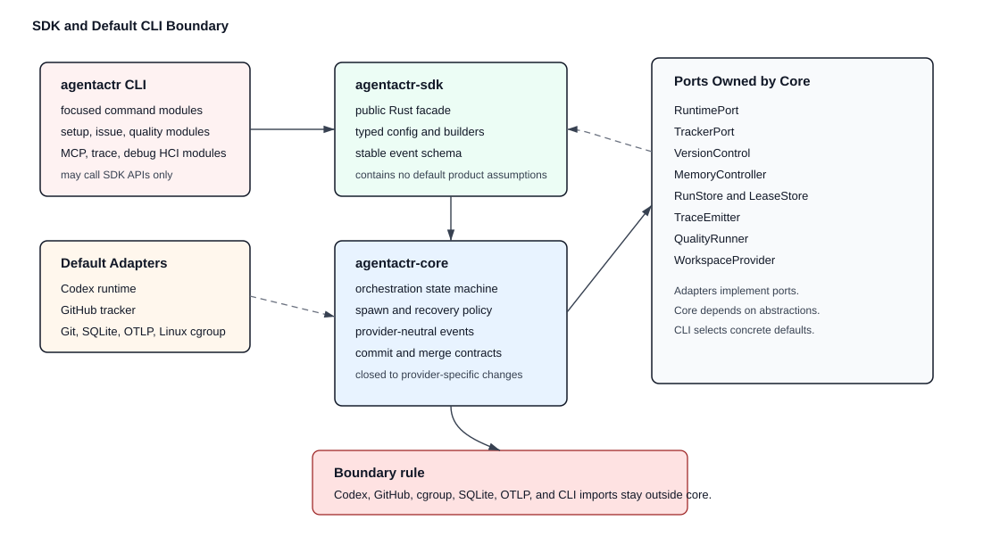

`agentactrSDK` and the `agentactr` CLI have separate responsibilities:

| Layer | Responsibility | Must not contain |
| --- | --- | --- |
| `agentactr-core` | orchestration state machine, spawn policy, recovery, provider-neutral events, SOLID ports | Codex, Claude, GitHub, Linear, CLI, HTTP client, cgroup, SQLite, OTLP imports |
| `agentactr-sdk` | public Rust API, builders, typed config, extension traits, stable event schema | default product assumptions |
| adapter crates | runtime, tracker, memory, store, and trace implementations | cross-adapter orchestration decisions |
| `agentactr-cli` | HCI, command parsing, config scaffolding, doctor checks, default Codex/GitHub wiring | business rules that are not expressible as SDK calls |

The CLI is the default implementation of the SDK, not the SDK itself. A downstream CLI must be able to depend on `agentactr-sdk` and choose a different adapter set without importing `agentactr-cli`.

Required extension combinations:

| Product shell | Runtime adapter | Tracker adapter | Required core change |
| --- | --- | --- | --- |
| `agentactr` default | Codex | GitHub | none |
| `agentactr-claude-github` | Anthropic Claude Code | GitHub | none |
| `agentactr-claude-linear` | Anthropic Claude Code | Linear | none |
| `agentactr-codex-linear` | Codex | Linear | none |

## 5. Product Boundary

### 5.1 In Scope

- Rust CLI binary named `agentactr`.
- Long-running daemon mode and one-shot issue mode.
- GitHub issue discovery, claim markers, comments, labels, PR links, and rate-limit handling.
- Codex runtime adapter using `codex exec --json` first, with app-server mode as the stronger structured protocol target behind a feature gate.
- Per-issue workspace directories.
- Git worktree isolation when the target repository uses Git.
- Provider-neutral VCS diff, commit, and merge-plan ports.
- Pre-commit and technology-specific quality gates for the target repository.
- Bounded sub-agent spawning for read-only exploration, implementation, testing, review, and security checks.
- Linux userspace memory control through cgroup v2, PSI, `/proc`, `rlimit`, and process supervision.
- Structured traces, debug bundles, run replay, and artifact storage.
- SWE-bench-family evaluation harness hooks.

### 5.2 Out of Scope for v0.1

- Web dashboard.
- Multi-tenant hosted SaaS.
- Kernel modules.
- Custom syscall virtualization as a required feature.
- Full GitHub Projects v2 mutation coverage.
- Non-GitHub trackers as built-in defaults.
- Non-Codex runtimes as built-in defaults.
- Fully autonomous publishing to protected branches without explicit policy.

## 6. High Level Architecture

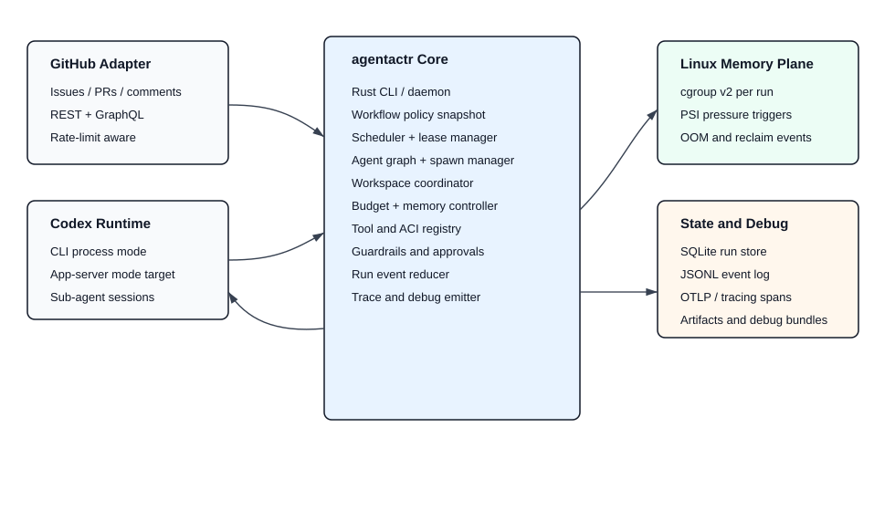

## 7. Default CLI

### 7.1 Binary

Binary name: `agentactr`

Rust crate layout:

```text
crates/
  agentactr-sdk/              # public SDK facade, builders, extension traits
  agentactr-core/             # orchestration, state reducers, provider-neutral ports
  agentactr-cli/              # clap entrypoint for the default Codex + GitHub product
  agentactr-codex/            # Codex runtime adapter
  agentactr-github/           # GitHub tracker adapter
  agentactr-linux-memory/     # cgroup v2, PSI, procfs, rlimits
  agentactr-vcs/              # Git worktree, diff, commit, merge policy adapter
  agentactr-quality/          # pre-commit and technology-specific quality gates
  agentactr-observability/    # tracing, JSONL, OTLP, debug bundles
  agentactr-store/            # SQLite and artifact store
  agentactr-eval/             # replay and SWE-bench hooks
  agentactr-adapter-testkit/   # conformance tests shared by all adapters
```

Bootstrap repository layout:

```text
crates/
  agentactr-core/             # provider-neutral bootstrap ports and domain types
  agentactr-sdk/              # public facade, config/discovery/render helpers
  agentactr-codex/            # extracted default Codex runtime adapter
  agentactr-cli/              # CLI plus private default adapter implementations
```

The bootstrap layout is conforming only if concrete default adapters remain private to the CLI crate or narrow adapter modules and do not leak into the public `agentactr-sdk` facade. The present implementation shape is:

| Current file/module | Logical adapter boundary | Stable extraction target |
| --- | --- | --- |
| `agentactr-codex` Codex process launcher | runtime adapter | extracted; owns `cli_json`, app-server fail-closed stub, and Codex SDK fail-closed stub |
| `agentactr-cli/src/adapters.rs` GitHub REST reader | tracker adapter | `agentactr-github` |
| `agentactr-cli/src/vcs_adapter.rs` local Git worktree helper | VCS adapter | `agentactr-vcs` |
| `agentactr-cli/src/vcs_commands.rs` VCS operator command dispatch | command/HCI module | remains CLI-owned while VCS use cases stabilize |
| `agentactr-cli/src/setup_commands.rs` setup, config, auth, doctor, AGENTS generation, and domain-artifact command dispatch | command/HCI module | remains CLI-owned while setup and operator diagnostics stabilize |
| `agentactr-cli/src/issue_commands.rs` issue find/draft/proposals/submit/mark dispatch, issue-set artifacts, Codex issue draft/review artifacts, dedupe, and issue-submission ledger helpers | command/tracker HCI module | `agentactr-issues` if issue proposal and tracker-submission tooling becomes shared across products |
| `agentactr-cli/src/quality_command.rs` quality plan/run dispatch, safe quality process supervision, Go logical wrappers, domain gate execution, and quality report rendering | command/quality HCI module | `agentactr-quality` if quality execution contracts become shared across products |
| `agentactr-cli/src/bootstrap_project.rs` blank-project scaffold command | command template/HCI module | `agentactr-templates` if template rendering grows beyond CLI defaults |
| `agentactr-cli/src/command_catalog.rs` command inventory and menu rendering | command catalog/HCI module | remains CLI-owned unless multiple products need a shared catalog |
| `agentactr-cli/src/docs_command.rs` CLI reference rendering | command docs/HCI module | remains CLI-owned unless multiple products need shared documentation rendering |
| `agentactr-cli/src/mcp_command.rs` local stdio MCP server and read-only MCP tool rendering | command/HCI module | remains CLI-owned until MCP bridge contracts need a shared adapter crate |
| `agentactr-cli/src/trace_command.rs` trace ledger reading and trace command rendering | command/observability module | `agentactr-trace` if replay/debug tooling becomes shared across products |
| `agentactr-cli/src/debug_bundle.rs` redacted debug bundle assembly and artifact integrity reporting | command/observability module | `agentactr-debug` if bundle schema/redaction become shared SDK contracts |
| `agentactr-cli/src/artifacts.rs` artifact digest and run-artifact integrity verification | artifact integrity module | `agentactr-artifacts` if artifact schema/integrity contracts become shared SDK contracts |
| `agentactr-cli/src/linux_memory.rs` cgroup/PSI/process monitor | memory/process adapter | `agentactr-linux-memory` |
| `agentactr-cli/src/main.rs` SQLite run-state helper | store adapter | `agentactr-store` |
| `agentactr-sdk/src/discovery.rs` stack and quality-plan helpers | quality planning | `agentactr-quality` or SDK extension module |
| `agentactr-sdk/src/render.rs` config/Codex/MCP rendering helpers | config rendering facade | remains SDK facade unless provider-specific logic grows |

Extraction into `agentactr-codex`, `agentactr-github`, `agentactr-linux-memory`, `agentactr-vcs`, `agentactr-quality`, `agentactr-observability`, and `agentactr-store` is required before declaring the SDK API stable. Until then, module privacy and typed request/result seams are the enforcement mechanism.

`agentactr-sdk` re-exports stable SDK types from `agentactr-core` and selected extension traits. It must not re-export concrete Codex or GitHub adapter types from its root module.

### 7.2 CLI Commands

The bootstrap CLI must show implemented commands separately from specified milestone commands. It must not make future commands look production-ready. Either hide unavailable commands from default help or suffix them with milestone status and route them to the same explicit `specified but not implemented in this milestone` diagnostic.

The default CLI is an operator surface and must be exhaustively discoverable. The stable CLI target uses a typed `clap` subcommand tree, not a catch-all string dispatcher. Every command, subcommand, positional argument, flag, enum value, default, environment override, side-effect level, and milestone/degradation status must be represented in generated help and shell completions from the same command model.

Required operator-discovery commands:

```text
agentactr help
agentactr help COMMAND [SUBCOMMAND...]
agentactr COMMAND --help
agentactr --version
agentactr commands
agentactr commands --json
agentactr completions bash|zsh|fish|powershell|elvish
agentactr docs cli-markdown [--output PATH]
agentactr menu
agentactr menu --json
```

`agentactr --version` and `agentactr -V` must report the CLI package version, the build Git commit SHA when the checkout has a resolvable `HEAD`, and the `rustc --version` value used at compile time. If a source archive or newly initialized checkout has no resolvable commit, the Git SHA field must degrade explicitly to `unknown` rather than failing the build or inventing a value.

`agentactr commands` is non-interactive inventory output. It lists every implemented, degraded, and milestone command with status, one-line purpose, side effects, required credentials, platform constraints, and SDK use-case owner. The `--json` form is for docs, UI, CI smoke tests, and completion generation audits. `agentactr menu` is a human-oriented command picker and setup navigator; it may be a simple numbered text menu in bootstrap and a richer TUI later. The menu must never be required for automation, and every menu action must print the exact equivalent non-interactive command before running it. Bootstrap `menu` may be read-only: it prints exact commands, statuses, and side effects without executing actions until the interactive action-execution milestone lands.

`agentactr docs cli-markdown` generates the Markdown CLI reference from the same typed `clap` command tree and bootstrap command catalog used by `help`, `commands`, `menu`, and shell completions. It must not use a handwritten command list. Without `--output`, it writes to stdout and has no repository, credential, GitHub, Codex, Docker, cgroup, or artifact-store dependency. With `--output PATH`, it writes only the requested documentation artifact path, creates missing parent directories, and fails closed before writing when the target is empty, a directory, or a symlink. Regression coverage must prove that every command catalog entry appears in the generated Markdown reference and that the checked-in reference artifact is not stale.

Completion scripts must be generated by the CLI itself, not maintained as handwritten shell snippets. Completions must include command names, aliases only when documented, enum values such as `fail-closed|interactive|review-required`, config keys for `config get/set`, supported shells, and file/path completion where safe. Completion generation must be side-effect free and must not require GitHub, Codex, Docker, cgroups, or a configured repository. Dynamic completions may later suggest local `RUN_ID` values from the artifact store, VCS branches, or config keys, but those suggestions must fail open to static completions when local state is unavailable.

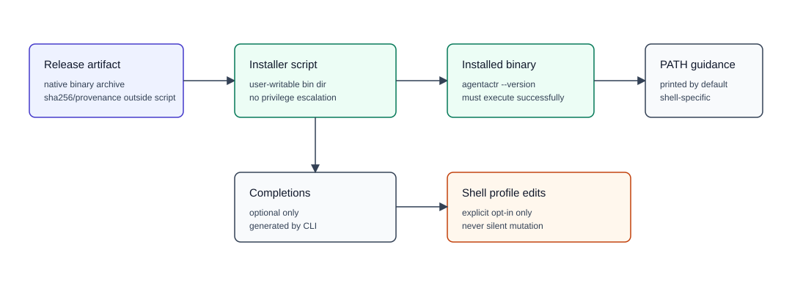

Release binary installation is an operator convenience surface, not an SDK orchestration use case. Current public releases intentionally do not attach native CLI binary archives or macOS `.pkg` installers; operators build locally with `cargo build --release --bin agentactr` and may install `target/release/agentactr` into a user-writable bin directory. `scripts/install-agentactr.sh` installs a local or downloaded native binary into a user-writable bin directory, defaults to `$HOME/.local/bin`, accepts `--bin-dir PATH`, verifies the installed binary with `agentactr --version`, and prints shell-specific PATH instructions. It must never edit shell profiles unless `--update-shell-profile` is passed. Completion installation is optional and must call the CLI's generated `agentactr completions bash|zsh|fish|powershell|elvish` surface rather than shipping handwritten completion files. Future Apple Silicon macOS release binaries must be Developer-ID signed, notarized, and Gatekeeper-assessed before upload, and future release automation must publish a signed, notarized, and stapled `.pkg` installer for the Mac distribution path Apple supports outside the Mac App Store [66]. Homebrew packaging is deferred until a dedicated formula/update/test/provenance surface exists.

Nested help is required for all command groups:

```text
agentactr help run
agentactr help run issue
agentactr help vcs
agentactr help vcs status
agentactr help quality run
agentactr help trace show
agentactr help debug bundle
```

Nested help must include: synopsis, description, arguments, flags, defaults, config/env precedence, required adapter capabilities, generated artifacts, trace events emitted, side effects, fail-closed conditions, examples, and current implementation status.

Implemented bootstrap command surface:

```text
agentactr --version
agentactr help
agentactr help COMMAND [SUBCOMMAND...]
agentactr COMMAND --help
agentactr commands
agentactr commands --json
agentactr completions bash|zsh|fish|powershell|elvish
agentactr docs cli-markdown [--output PATH]
agentactr menu
agentactr menu --json
agentactr init --yes [--repo OWNER/REPO] [--codex-auth auto|chatgpt|api-key]
agentactr doctor
agentactr doctor [--fix-codex-config] [--fix-agents] [--trust-codex-project]
agentactr config get [KEY]
agentactr config set KEY VALUE
agentactr auth codex --method chatgpt|subscription|api-key [--api-key-env CODEX_API_KEY]
agentactr bootstrap project --stack python|golang|rust|typescript|pulumi|terraform|sql --yes [--force] [--allow-non-empty]
agentactr mcp serve
agentactr run issue --repo OWNER/REPO --issue 123 [--human-intervention fail-closed|interactive|review-required] [--codex-approval never|on-request] [--github-finalization automatic_after_quality_gates|require_human_review|disabled] [--dry-run]
agentactr issue find --repo OWNER/REPO [--query TEXT] [--state open|closed|all] [--label LABEL...] [--assignee USER|none|*] [--author USER] [--since ISO8601] [--sort created|updated|comments] [--direction asc|desc] [--page N] [--per-page N] [--limit N] [--artifact-root PATH] [--include-pull-requests] [--json]
agentactr issue draft (--repo OWNER/REPO|--local) [--prompt TEXT|--prompt-file PATH] --stack rust|typescript|golang|python [--framework nextjs|none] [--domain DOMAIN] [--parent ISSUE_NUMBER] [--artifact-root PATH] [--codex-draft] [--codex-review] [--json]
agentactr issue proposals ISSUE_SET_ID
agentactr issue submit ISSUE_SET_ID --proposal PROPOSAL_ID --yes [--repo OWNER/REPO for local issue sets] [--resume] [--allow-possible-duplicate --reason REASON] [--require-codex-review]
agentactr issue mark ISSUE_SET_ID --proposal PROPOSAL_ID --dedupe unique|duplicate_blocked --reason REASON
agentactr repo inspect
agentactr quality plan
agentactr quality run RUN_ID
agentactr vcs prepare --issue 123 [--repo OWNER/REPO]
agentactr vcs list [--json]
agentactr vcs show RUN_ID [--json]
agentactr vcs status RUN_ID
agentactr vcs diff RUN_ID [--output PATH]
agentactr vcs apply RUN_ID --check|--yes [--3way] [--allow-dirty]
agentactr merge plan RUN_ID [--json]
agentactr trace list
agentactr trace show RUN_ID
agentactr --color auto tui run RUN_ID --snapshot
agentactr tui run RUN_ID [--refresh 1s] [--snapshot] [--no-color]
agentactr tui latest [--refresh 1s] [--no-color]
agentactr debug bundle RUN_ID
agentactr memory status
agentactr memory pressure
agentactr finalize RUN_ID --approve [--resume]
agentactr finalize RUN_ID --reject --reason "REASON" [--resume]
agentactr status
```

Specified milestone command surface:

```text
agentactr daemon --config agentactr.toml
agentactr run query --repo OWNER/REPO --label agentactr:ready --human-intervention fail-closed
agentactr replay RUN_ID
agentactr vcs commit RUN_ID
agentactr vcs cleanup RUN_ID
agentactr eval swe-bench --subset verified-smoke
```

The SDK must expose use cases behind implemented orchestration commands before those commands are promoted from milestone help to default help. CLI-only operator commands may inspect local artifacts and render status, but commands that prepare workspaces, run agents, rerun quality gates, finalize, merge, replay, or mutate trackers must either call SDK use cases or be explicitly documented as bootstrap-local until their SDK use case lands. The CLI must not implement durable orchestration by bypassing SDK ports just because a command is invoked directly.

Current bootstrap note: the CLI now has a typed `clap` command tree for top-level and nested generated help while retaining the existing execution dispatcher for backward-compatible command handling. `agentactr help COMMAND [SUBCOMMAND...]`, `agentactr COMMAND --help`, `agentactr completions bash|zsh|fish|powershell|elvish`, and `agentactr docs cli-markdown [--output PATH]` are implemented from that tree for the current command surface. The generated nested help is not yet fully exhaustive against the target schema: detailed config/env precedence, generated artifacts, trace events, fail-closed conditions, and examples remain to be added per command. The CLI also has a bootstrap-static `commands` inventory, a read-only `menu` navigator, top-level `--color auto|always|never`, and a read-only `tui` snapshot/refresh renderer for run artifacts and trace state, but interactive menu action execution remains pending. Milestone commands may remain visible for roadmap clarity only when they are labeled as not implemented and route to the explicit milestone diagnostic.

### 7.3 HCI and UX Contract

The CLI must make Codex and GitHub feel like one workflow without hiding the adapter boundary:

- `agentactr init --yes [--repo OWNER/REPO]` creates local agentactr/Codex/workflow configuration without prompting. When `--repo` is omitted, the default CLI writes the explicit placeholder `OWNER/REPO`; issue discovery, drafting, submission, and `run issue` still require a concrete tracker repository before tracker-backed work can start. Plain `agentactr init` may ask at most one confirmation only when running in an interactive terminal.
- `agentactr doctor` validates Codex, GitHub auth, cgroup v2, PSI, SQLite, OTLP, workspace permissions, and API version compatibility in one report.
- `agentactr run issue ...` must launch Codex through `codex exec --json` and stream concise phase updates, not raw JSONL.
- `agentactr trace show RUN_ID` must explain the agent tree, tool calls, GitHub mutations, memory pressure, and failure points without requiring users to inspect raw logs.
- interactive Codex use must be delegated to Codex itself; `agentactr` owns orchestration UX, not the Codex TUI.
- prompts must use exact next actions, for example `run agentactr doctor --fix-codex-config`, instead of generic setup errors.

### 7.4 Run Start Human-Intervention Banner

Every `agentactr daemon`, `agentactr run issue`, and `agentactr run query` start must print the effective human-intervention semantics before any GitHub claim or Codex launch:

```text
Human intervention: fail-closed
Codex approval policy: never
GitHub finalization: require human review before terminal finalization/close
Runtime prompting: disabled

This run will not wait for human input. If Codex requests approval, if a diff is ambiguous, or if a policy gate cannot be decided deterministically, the SDK will fail the run, preserve a debug bundle, and label/comment the issue according to policy.

Required operator setup before unattended runs:
  codex login
  # or, for non-interactive codex exec automation:
  export CODEX_API_KEY=...
  export GITHUB_TOKEN=...
  agentactr doctor

To allow prompts for this run only:
  agentactr run issue --repo OWNER/REPO --issue 123 --human-intervention interactive --codex-approval on-request

To persist interactive prompting for this repository:
  agentactr config set human_intervention.mode interactive
  agentactr config set codex.approval_policy on-request
  agentactr doctor --fix-codex-config

To require human review before GitHub finalization:
  agentactr config set human_intervention.mode review_required
  agentactr config set github.finalization require_human_review

To return to unattended fail-closed mode:
  agentactr config set human_intervention.mode fail_closed
  agentactr config set codex.approval_policy never
  agentactr doctor --fix-codex-config
```

The banner must use the exact configured values, not hardcoded examples. If the CLI was launched with override flags, the banner must show both the override and the persistent config source.

CLI flags use kebab-case, such as `--human-intervention fail-closed`. Config values use snake_case, such as `human_intervention.mode = "fail_closed"`. The banner must show both forms whenever it prints override guidance.

### 7.5 Rust CLI Dependencies

Required:

- `clap` with derive for command parsing.
- `tokio` for async scheduling, process IO, signal handling, and timers.
- `tracing` and `tracing-subscriber` for structured events and spans.
- `opentelemetry` and OTLP exporter behind a feature flag in the full runtime; the bootstrap CLI may emit local `tracing` and JSONL events until that feature lands.
- `serde`, `serde_json`, `toml`, and format-preserving `toml_edit` for config and MCP/Codex JSON semantics. `schemars` is required when the public config-schema generation milestone lands.
- `sqlx` with SQLite support for the run store, migrations, and async integration. The bootstrap CLI may depend on `sqlx-core` and `sqlx-sqlite` directly while the store port is still private, but SQLx types must not appear in `agentactr-core` or the public SDK facade.
- `reqwest` for GitHub REST/GraphQL.
- `octocrab` may be used only inside `agentactr-github` if it does not leak into core.
- `nix`, `procfs`, and small direct filesystem readers for Linux process/cgroup data are required for the Linux enforcement runtime; bootstrap implementations may keep the dependencies out of the default manifest until enforcement is implemented.

Declaring these dependencies is not enough. The default CLI and adapters must use them where correctness depends on structured semantics: `reqwest` for GitHub status codes, headers, rate limits, retry-after, deprecation, and sunset handling; `serde_json` for MCP JSON-RPC and Codex JSONL; `toml` for config reads/writes; and `tracing` plus JSONL event records for traceable orchestration. Shell commands and ad hoc string scanning are acceptable only at narrow process boundaries where no structured API exists, and must not replace these semantics.

The CLI parser is not core orchestration. It constructs dependencies, validates config, and calls SDK use cases.

Rust workspace governance is part of the default CLI contract:

- the repository must pin the Rust toolchain with `rust-toolchain.toml`;
- `[workspace.package]` must declare the supported `rust-version` MSRV floor;
- repeated third-party and internal crate dependencies must be centralized under `[workspace.dependencies]`;
- every workspace package must opt into `[workspace.lints]`;
- unsafe Rust must be minimal, locally documented with `SAFETY:` invariants, and guarded by `clippy::undocumented_unsafe_blocks`;
- public core/SDK port traits must use typed errors such as `PortError`/`PortResult`, not new raw `Result<_, String>` surfaces.

### 7.6 Container Images and Docker Runtime Backend

`agentactr` publishes two distinct image families. They are not interchangeable:

| Image family | Purpose | Required contents | Non-goal |
| --- | --- | --- | --- |
| Static CLI image | distribute and run the `agentactr` binary itself | one verified static Linux binary | not an agent execution runtime |
| Agent runtime image | execute agents and sub-agents through the Docker Linux backend | Codex CLI, shell, Git, CA certificates, Node/npm/corepack, Go, Rust, Python/uv, and configured quality-gate tools | not distroless |

The static CLI image may use `gcr.io/distroless/static-debian13:nonroot` only when the binary is built for a musl/static target and verified with `readelf`/`ldd` to have no dynamic interpreter. A bare distroless image is non-conforming for agent execution because quality gates, Codex runtime launch, repository setup, and debugging require shell and toolchain surfaces.

The Docker Linux runtime image is part of the execution backend, not part of the Codex adapter API. It must be usable for `cli_json` today and must remain provider-neutral enough to host future `app_server`, `codex_sdk`, or non-Codex runtime commands after their adapters are implemented and contract-tested. Including Node and `@openai/codex-sdk` in the image is preparation only; it does not make `codex.mode = "codex_sdk"` production-supported.

Runtime images must be built with reproducible release inputs:

- base images pinned by digest in release pipelines and release Dockerfiles;
- external tool versions supplied as build arguments with non-`latest` release defaults;
- upstream checksums verified where available;
- OCI labels, SBOM, and provenance emitted by image build scripts or the trusted CI image-build action;
- vulnerability scanning before publish;
- no OpenAI, GitHub, or repository secrets baked into layers.

Trusted GitHub Actions image builds must keep untrusted pull-request and merge-queue workflows secret-free. Remote build services such as Depot are trusted and preferred over local machine Docker builds for expensive or release-sensitive image work when the workflow context is trusted. Full runtime/static image builds use Depot-backed trusted workflows with the Depot project ID supplied from a repository/action variable and the Depot token supplied from an action secret. PR and merge-queue workflows remain limited to validation and local Dockerfile checks without Depot secrets. Push-to-main Dockerfile checks are trusted and may use Depot `call: check` without publishing images. All external action references in checked-in workflows must execute by full 40-character commit SHA only, with readable version tags limited to comments, because GitHub documents full-length SHA pins as the immutable action reference form [67]. The checked-in release workflow intentionally disables native binary archive and macOS `.pkg` asset publication; release notes instruct operators to build locally from source. The checked-in workflow surface currently keeps `nightly` and `security` cron schedules commented out; `nightly` remains manually runnable through `workflow_dispatch` [64], [65].

Docker container network policy is separate from Codex command sandbox policy. The runtime container must have enough egress for Codex to reach the configured OpenAI endpoint unless a managed proxy or allowlist replaces direct egress. Repository command network access remains governed by Codex sandbox/project settings such as `sandbox_workspace_write.network_access = false` and `codex.network = "off"`.

## 8. Default Configuration

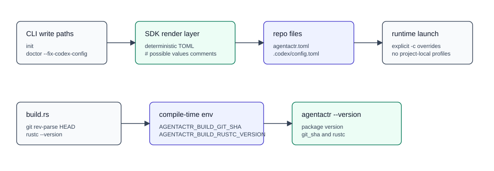

`agentactr init` creates:

```text
agentactr.toml
.codex/config.toml
WORKFLOW.md
AGENTS.md when absent and template policy permits generation
specs_<repo>.md when generated AGENTS references a project-local specification
.gitignore additions for .agentactr/
```

### 8.1 `agentactr.toml`

Representative full configuration follows. Bootstrap `agentactr init` renders the app-server / Codex SDK milestone keys even while `cli_json` remains the default. The config loader must accept and validate these keys before the corresponding adapters are promoted so operators can pin future transport policy without changing core or SDK surfaces.

```toml
[tracker]
kind = "github"
repo = "OWNER/REPO"
token_env = "GITHUB_TOKEN"
github_api_version = "2026-03-10"
active_labels = ["agentactr:ready"]
ignore_labels = ["agentactr:blocked"]
claim_label = "agentactr:claimed"
running_label = "agentactr:running"
failed_label = "agentactr:failed"
done_label = "agentactr:done"

[codex]
command = "codex"
mode = "cli_json"
profile = "agentactr"
approval_policy = "never"
sandbox_mode = "workspace-write"
network = "off"
default_model = "configured-by-codex"
model_reasoning_effort = "medium"
auth_mode = "auto"
openai_api_key_env = "CODEX_API_KEY"

# Optional app-server / Codex SDK milestone keys. Bootstrap init may omit these while cli_json is default.
app_server_transport = "stdio"
app_server_experimental_api = false
sdk_bridge = "typescript"
fallback_mode = "cli_json"

[codex.identity.default]
home = "auto"
auth_mode = "auto"

[codex.identity.ci]
home = ".agentactr/codex-home"
auth_mode = "api_key"
api_key_env = "CODEX_API_KEY"

[human_intervention]
mode = "fail_closed"
on_codex_approval_request = "fail_run"
on_ambiguous_diff = "fail_quality_gate"
on_review_disagreement = "fail_quality_gate"
on_missing_codex_auth = "fail_startup"
on_missing_github_token = "fail_startup"
run_start_banner = true
print_override_steps = true

[github]
finalization = "require_human_review"
standard_label_policy = "ensure_on_issue_create"
project_automation = "disabled"
project_owner = "auto"
project_number = 0
project_title = "Agentactr"
project_priority_field = "Priority"
project_size_field = "Size"

[mcp]
default_policy = "auto_setup_detected_credentials"
remote_research_servers = "auto_enable_when_credentials_detected"
remote_github_read_tools = "auto_enable_when_token_detected"
remote_github_write_tools = "disabled_by_default"
openai_developer_docs = "auto_enable_no_auth"
google_developer_api = "auto_enable_with_GOOGLE_API_KEY"
huggingface = "auto_enable_with_oauth_or_HF_TOKEN"
github_remote = "auto_enable_read_only_with_token"
fail_on_required_mcp_missing = true

[repository]
empty_repo_policy = "fail_closed_unless_stack_declared"
declared_primary_stack = "auto"
allowed_bootstrap = "explicit_only"
bootstrap_prereqs = "minimal_for_declared_stack"
fail_on_low_confidence_stack_detection = true

[vcs]
kind = "git"
workspace_strategy = "worktree"
base_ref = "origin/main"
worktree_root = ".agentactr/worktrees"
branch_template = "agentactr/{repo_slug}/issue-{issue_number}/{run_id}"
record_base_commit = true
fail_on_dirty_source_checkout = true
detect_cross_issue_file_overlap = true
overlap_policy = "fail_closed"

[quality]
profile = "strict"
pre_commit_mode = "required"
technology_detection = "auto"
run_existing_pre_commit_config = true
fail_on_missing_toolchain = true
fail_on_untracked_generated_files = true
allow_test_omission_reason = true
artifact_dir = ".agentactr/artifacts/quality"
dependency_checks = true
architecture_checks = true
tool_pinning = "required_for_strict"

[quality.typescript]
enabled = "auto"
package_manager = "auto"
install = "frozen"
node_version = "nvmrc_or_node_version_required"
bun = "pinned_when_used"
biome = "pinned_when_used_or_config_present"
zod = "required_for_new_boundary_validation"
framework_detection = ["vite", "next", "remix", "sveltekit", "astro"]
commands = ["install", "biome", "lint", "typecheck", "test", "build", "framework_smoke"]
run_only_existing_scripts = true

[quality.rust]
enabled = "auto"
commands = [
  "cargo fmt --all -- --check",
  "cargo clippy --workspace --all-targets --all-features -- -D warnings",
  "cargo nextest run --workspace --all-features",
  "cargo test --doc --workspace --all-features",
  "cargo deny check",
  "cargo machete"
]
public_library_extra = ["cargo semver-checks"]
unsafe_parser_network_input_heavy_extra = ["cargo miri test", "cargo fuzz run"]

[quality.golang]
enabled = "auto"
golangci_lint = "pinned_required"
module_files = "go_mod_and_go_sum_required"
commands = [
  "gofmt-check",
  "go mod verify",
  "go mod tidy-check",
  "go vet ./...",
  "golangci-lint run",
  "govulncheck ./...",
  "go test ./..."
]
architecture_checks = ["golangci-lint-depguard", "import-boundary-check", "package-cycle-check"]

[quality.python]
enabled = "auto"
package_manager = "uv_preferred"
python_version = "requires_pin"
dependency_lock = "required"
commands = [
  "uv sync --frozen",
  "uv run ruff format --check .",
  "uv run ruff check .",
  "uv run pyright",
  "uv run pytest",
  "uv run pip-audit",
  "uv run deptry ."
]
optional_commands = [
  "uv run mypy",
  "uv run coverage run -m pytest",
  "uv run coverage report --fail-under CONFIGURED_THRESHOLD",
  "uv run bandit -r .",
  "uv run interrogate ."
]
library_extra = ["uv build", "uv run twine check dist/*"]
service_extra = ["contract-tests", "openapi-schema-check-if_present"]
parser_network_input_heavy_extra = ["uv run bandit -r .", "uv run semgrep --config auto", "uv run pytest --hypothesis-profile ci"]
architecture_checks = ["import-linter-if_config_present", "layer-boundary-review"]

[commit]
mode = "local_after_quality_gates"
signoff = false
gpg_sign = "inherit"
message_template = "agentactr: fix {tracker_ref}"
required_trailers = ["Agentactr-Run-Id", "Tracker-Ref", "Base-Commit", "Policy"]

[merge]
mode = "disabled"
push = "disabled"
strategy = "fast_forward_only"
require_clean_rebase = true
require_no_cross_issue_overlap = true
require_human_review_for_merge = true

[workspace]
root = ".agentactr/workspaces"
keep_successful = true
keep_failed = true

[scheduling]
poll_interval_ms = 30000
max_concurrent_issue_runs = 3
lease_ttl_ms = 300000
max_retries = 5

[spawn]
enabled = true
max_child_agents_per_issue = 4
max_spawn_depth = 1
allow_parallel_read_only = true
allow_parallel_writers = false
strategy = "budget_aware_one_writer"
max_total_uncached_input_tokens = 250000
max_child_uncached_input_tokens = 80000
max_child_output_tokens = 12000
artifact_handoff = "refs_summaries_and_digests"
pause_on_memory_pressure = true

[execution]
backend = "auto"
strict_memory_required = true

[execution.docker]
command = "docker"
image = "ghcr.io/dwaiba/agentactr-runtime:0.1.0-linux-arm64"
pull_policy = "if_missing"
network = "bridge"
workspace_mount = "rw"
artifact_mount = "rw"
remove_containers = true
container_prefix = "agentactr"

[linux_memory]
enabled = true
cgroup_root = "auto"
root_group = "agentactr"
mode = "enforce_on_linux_observe_elsewhere"
cgroup_v2_required = true
psi_required = true
per_issue_memory_high = "4G"
per_issue_memory_max = "6G"
per_agent_memory_high = "2G"
per_agent_memory_max = "2G"
psi_memory_some_threshold_us = 150000
psi_memory_window_us = 1000000
oom_score_adj = 300
setrlimit_address_space = "disabled"
setrlimit_file_size = "disabled"
kill_policy = "cancel_lowest_priority_subagent"
oom_policy = "fail_run_preserve_debug_bundle"

[observability]
jsonl = ".agentactr/runs/events.jsonl"
sqlite = ".agentactr/runs/agentactr.sqlite"
artifact_root = ".agentactr/artifacts"
otel_enabled = false
otel_endpoint = "http://localhost:4317"
debug_bundle_root = ".agentactr/debug"
redact_secrets = true
```

The SDK/core config contract owns milestone transport validation. Stored TOML and environment-derived config must use canonical values: `codex.mode = "cli_json" | "app_server" | "codex_sdk"`, `app_server_transport = "stdio" | "websocket"`, `sdk_bridge = "typescript"`, and `fallback_mode = "cli_json"`. `app_server_transport = "websocket"` additionally requires `app_server_experimental_api = true`; WebSocket remains experimental and unsupported for production. Alias spellings such as `exec-json`, `ws`, or `ts` may be accepted only by CLI-facing parsers and must be normalized before writing config. CLI loaders and concrete Codex adapters must fail closed on non-canonical or invalid values before runtime selection or process launch.

### 8.2 `.codex/config.toml`

`agentactr` does not own global Codex configuration. It writes repo-local defaults only.

The only exception is the explicit operator opt-in `agentactr doctor --trust-codex-project`, which may write the minimal Codex user/global project-trust entry required for Codex to load this repository's local `.codex/config.toml`. This flag must not be implied by `agentactr init`, `agentactr doctor`, or `agentactr doctor --fix-codex-config`; it must not rewrite unrelated Codex user settings; and it must report the user/global config path it changed.

Every CLI-owned TOML write must keep operator-facing closed-set values discoverable inline. Rendered `agentactr.toml`, rendered `.codex/config.toml`, and `agentactr config set` rewrites must preserve valid TOML, use a deterministic top-level section layout without tab-indented section headers, and add deterministic trailing comments in the form `# possible values: ...` beside enum-like, boolean, and policy keys while leaving free-form paths, labels, command strings, and templates uncommented.

Repo-local defaults are project-scoped Codex settings, not profile tables:

```toml
approval_policy = "never"
sandbox_mode = "workspace-write"
model_reasoning_effort = "medium"

[sandbox_workspace_write]
network_access = false

[features]
multi_agent = true

[agents]
max_depth = 1
max_threads = 6
job_max_runtime_seconds = 1800

[agents.explorer]
description = "Read-only codebase exploration and scoped findings."

[agents.reviewer]
description = "Read-only code review and risk finding."

[mcp_servers.agentactr]
command = "agentactr"
args = ["mcp", "serve"]
cwd = "."
env_vars = ["AGENTACTR_ARTIFACT_ROOT", "AGENTACTR_REPO_ROOT", "AGENTACTR_RUN_ID", "AGENTACTR_TRACE_PATH"]
required = true
startup_timeout_sec = 10
tool_timeout_sec = 60
enabled_tools = [
  "agentactr.issue.read",
  "agentactr.run.status",
  "agentactr.trace.read",
  "agentactr.artifact.read",
  "agentactr.vcs.status",
  "agentactr.quality.report",
  "agentactr.memory.status",
  "agentactr.policy.read"
]

[mcp_servers.openaiDeveloperDocs]
url = "https://developers.openai.com/mcp"
enabled = true
required = false
startup_timeout_sec = 10
tool_timeout_sec = 60
enabled_tools = ["search_openai_docs", "fetch_openai_doc", "list_openai_docs", "list_api_endpoints", "get_openapi_spec"]

[mcp_servers.GoogleDeveloperAPI]
url = "https://developerknowledge.googleapis.com/mcp"
enabled = false
required = false
startup_timeout_sec = 10
tool_timeout_sec = 60
env_http_headers = { "X-Goog-Api-Key" = "GOOGLE_API_KEY" }
http_headers = { "Accept" = "application/json" }
enabled_tools = ["answer_query", "get_documents", "search_documents"]

[mcp_servers.hf-mcp-server]
url = "https://huggingface.co/mcp?login"
enabled = false
required = false
startup_timeout_sec = 10
tool_timeout_sec = 60
bearer_token_env_var = "HF_TOKEN"
enabled_tools = [
  "hf_doc_fetch",
  "hf_doc_search",
  "hf_hub_query",
  "hf_whoami",
  "hub_repo_details",
  "hub_repo_search",
  "paper_search",
  "space_search"
]

[mcp_servers.github_remote]
url = "https://api.githubcopilot.com/mcp/"
enabled = false
required = false
startup_timeout_sec = 10
tool_timeout_sec = 60
bearer_token_env_var = "GITHUB_TOKEN"
enabled_tools = [
  "get_commit",
  "get_file_contents",
  "get_label",
  "get_latest_release",
  "get_me",
  "get_release_by_tag",
  "get_tag",
  "issue_read",
  "list_branches",
  "list_commits",
  "list_issues",
  "list_pull_requests",
  "list_releases",
  "list_tags",
  "pull_request_read",
  "search_code",
  "search_issues",
  "search_pull_requests",
  "search_repositories",
  "search_users"
]
disabled_tools = [
  "add_comment_to_pending_review",
  "add_issue_comment",
  "add_reply_to_pull_request_comment",
  "create_branch",
  "create_or_update_file",
  "create_pull_request",
  "create_repository",
  "delete_file",
  "fork_repository",
  "issue_write",
  "merge_pull_request",
  "pull_request_review_write",
  "push_files",
  "request_copilot_review",
  "run_secret_scanning",
  "sub_issue_write",
  "update_pull_request",
  "update_pull_request_branch"
]

[mcp_servers.codex_apps]
enabled = false
required = false
startup_timeout_sec = 10
tool_timeout_sec = 60
enabled_tools = []
```

If Codex config schema changes, the adapter must fail with a clear `codex_config_incompatible` error instead of silently writing unknown settings.

The local stdio MCP server must receive run-scoped environment explicitly through Codex MCP configuration, using `env` for fixed values and `env_vars` for selected inherited values. At minimum, the generated repo-local `.codex/config.toml` must forward `AGENTACTR_ARTIFACT_ROOT`, `AGENTACTR_REPO_ROOT`, `AGENTACTR_RUN_ID`, `AGENTACTR_AGENT_RUN_ID`, `AGENTACTR_TRACE_PATH`, and `AGENTACTR_CONTEXT_MANIFEST`. Artifact, trace, and context-manifest lookup must not depend on shell environment accidentally surviving Codex filtering or process-manager policy.

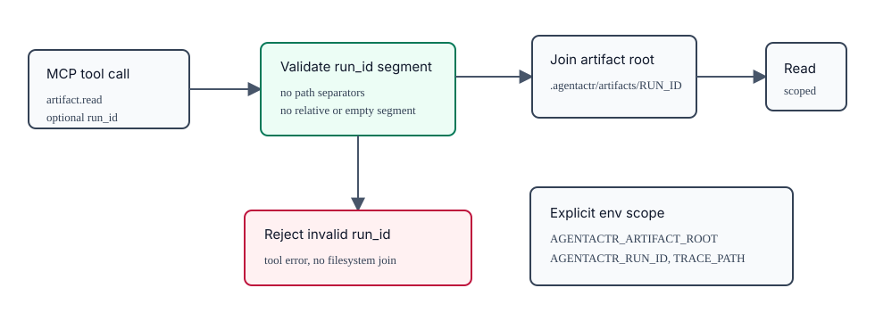

Local MCP artifact tools that accept a `run_id` must validate it with the same opaque run-id segment rules used by run artifact loading before joining it to `observability.artifact_root`. Invalid values, empty values, path separators, absolute paths, or relative traversal segments fail as tool errors before filesystem lookup. Read-only MCP tools must remain scoped to the configured artifact root or explicit run context and must not rely on prompt-supplied paths to escape that scope.

## 9. SOLID Implementation Contracts

### 9.1 Core Ports

The current bootstrap implementation may keep synchronous traits in `agentactr-core` while the default adapters are single-process blocking wrappers around Git, GitHub REST, local SQLite, Linux cgroup files, and `codex exec`. This temporary shape is acceptable only under these constraints:

- synchronous traits are treated as bootstrap contracts, not stable SDK contracts
- every bootstrap trait still exposes provider-neutral request/result types
- marker structs are allowed only when the corresponding command is explicitly milestone-scoped
- default adapter structs and command-template modules may live in narrow adapter crates such as `agentactr-codex`, or temporarily in focused CLI-private modules such as `agentactr-cli::adapters`, `agentactr-cli::vcs_adapter`, `agentactr-cli::vcs_commands`, `agentactr-cli::setup_commands`, `agentactr-cli::issue_commands`, `agentactr-cli::quality_command`, `agentactr-cli::bootstrap_project`, `agentactr-cli::command_catalog`, `agentactr-cli::docs_command`, `agentactr-cli::mcp_command`, `agentactr-cli::trace_command`, `agentactr-cli::tui_command`, `agentactr-cli::terminal`, and `agentactr-cli::debug_bundle` while not yet extracted; core and SDK users must not import concrete defaults
- adapter capability and version reporting must be present even in bootstrap implementations
- provider-specific strings, raw JSON payloads, command-line flags, HTTP clients, cgroup paths, process IDs, and SQLite handles must not become stable SDK surface

Current bootstrap ports are permitted to include the following temporary conveniences:

- `AgentRuntime::run_issue` as a single-shot helper for the default CLI, provided it internally normalizes Codex JSONL into artifacts and events
- blocking `VersionControl::prepare_workspace`, `VersionControl::diff`, and read-only `VersionControl::merge_plan` for Git worktree inspection, provided `commit` remains an explicit milestone error until implemented and merge planning performs no Git or tracker mutation
- blocking `IssueTracker::fetch_candidates` and `IssueTracker::fetch_by_ids` for GitHub issue inventory and reads, provided issue creation/linking remains review-gated and lifecycle/finalization mutations are routed through SDK-owned typed use cases
- blocking `IssueDraftPlanner` for read-only issue proposal drafting, provided planner output is schema-validated and treated as issue-set artifacts rather than implementation-agent work
- CLI-private memory setup that passes a concrete cgroup path to the default runtime adapter, provided this path is removed from SDK-stable runtime requests

Bootstrap port methods must return `PortResult<T>` backed by a typed `PortError { code, message }`. Adapter implementations may continue to normalize legacy helper errors from strings during the bootstrap phase, but new public core/SDK port methods must not expose raw `Result<_, String>`.

Present implementation snapshot:

- `agentactr-core` currently exposes blocking traits and keeps marker request/result structs only for commands that remain explicitly milestone-scoped.
- `AgentIssueRunRequest` currently carries `context_manifest: PathBuf`, an optional provider-neutral `MemoryLease`, and child `AgentMemoryLease` entries for the default CLI runtime bridge; concrete cgroup paths are resolved inside memory/process supervisor adapters.
- `agentactr-codex` owns the concrete Codex runtime adapter. `agentactr-cli` wires it as the default runtime and supplies a thin Linux-memory supervisor bridge for cgroup attachment.
- `agentactr-cli` still owns the concrete GitHub, local Git, Linux-memory adapters, default command templates, and operator command catalog and wires them directly; local Git behavior is isolated in `agentactr-cli::vcs_adapter`, VCS operator dispatch is isolated in `agentactr-cli::vcs_commands`, setup/config/auth/doctor dispatch is isolated in `agentactr-cli::setup_commands`, issue planning and submission dispatch is isolated in `agentactr-cli::issue_commands`, quality command execution is isolated in `agentactr-cli::quality_command`, blank-project scaffolding is isolated in `agentactr-cli::bootstrap_project`, command inventory/menu rendering is isolated in `agentactr-cli::command_catalog`, CLI reference rendering is isolated in `agentactr-cli::docs_command`, MCP stdio serving is isolated in `agentactr-cli::mcp_command`, trace inspection is isolated in `agentactr-cli::trace_command`, read-only TUI rendering is isolated in `agentactr-cli::tui_command`, terminal color policy is isolated in `agentactr-cli::terminal`, debug bundle assembly is isolated in `agentactr-cli::debug_bundle`, and artifact integrity verification is isolated in `agentactr-cli::artifacts` to keep HCI, observability, catalog/docs logic, artifact verification, GitHub, runtime, quality, setup, issue, and VCS adapter code separated.
- `agentactr-sdk` currently re-exports core types and provides repository discovery plus config/Codex/MCP rendering helpers.

This snapshot is implementation-shaped, not SDK-stable. Any public API stabilization must replace raw filesystem cgroup paths and provider command details with typed SDK references, leases, and events.

The target SDK surface is async. The public SDK stabilization milestone must converge to this async shape before declaring the SDK API stable:

```rust
#[async_trait::async_trait]
pub trait IssueTracker: Send + Sync {
    async fn fetch_candidates(&self, q: CandidateQuery) -> Result<Vec<Issue>>;
    async fn fetch_by_ids(&self, ids: &[IssueId]) -> Result<Vec<Issue>>;
    async fn claim(&self, req: ClaimRequest) -> Result<ClaimResult>;
    async fn release(&self, req: ReleaseRequest) -> Result<ReleaseResult>;
    async fn comment(&self, req: CommentRequest) -> Result<CommentRef>;
    async fn create_issue(&self, req: IssueCreateRequest) -> Result<IssueCreateResult>;
    async fn link_issue(&self, req: IssueLinkRequest) -> Result<IssueLinkResult>;
}

#[async_trait::async_trait]
pub trait IssueDraftPlanner: Send + Sync {
    async fn draft(&self, req: IssueDraftRequest) -> Result<IssueDraftResult>;
}

#[async_trait::async_trait]
pub trait AgentRuntime: Send + Sync {
    fn capabilities(&self) -> AgentRuntimeCapabilities;
    async fn start(&self, req: AgentStartRequest) -> Result<AgentSession>;
    async fn run_turn(&self, req: AgentTurnRequest) -> Result<AgentTurnStream>;
    async fn cancel(&self, session_id: &str, reason: CancelReason) -> Result<()>;
}

#[async_trait::async_trait]
pub trait MemoryController: Send + Sync {
    async fn create_run_group(&self, req: MemoryGroupRequest) -> Result<MemoryGroup>;
    async fn attach_pid(&self, group: &MemoryGroup, pid: u32) -> Result<()>;
    async fn sample(&self, group: &MemoryGroup) -> Result<MemorySample>;
    async fn reclaim(&self, group: &MemoryGroup, bytes: u64) -> Result<MemoryActionResult>;
    async fn kill_group(&self, group: &MemoryGroup, terminal_cleanup: bool) -> Result<MemoryActionResult>;
    async fn finalize_group(&self, group: &MemoryGroup) -> Result<MemoryActionResult>;
}

#[async_trait::async_trait]
pub trait TraceSink: Send + Sync {
    async fn emit(&self, event: TraceEvent) -> Result<()>;
}

#[async_trait::async_trait]
pub trait HumanIntervention: Send + Sync {
    fn mode(&self) -> HumanInterventionMode;
    async fn resolve(&self, req: InterventionRequest) -> Result<InterventionDecision>;
}

#[async_trait::async_trait]
pub trait VersionControl: Send + Sync {
    async fn detect(&self, root: &Path) -> Result<VcsCapabilities>;
    async fn prepare_workspace(&self, req: WorktreeRequest) -> Result<WorktreeRef>;
    async fn diff(&self, worktree: &WorktreeRef) -> Result<WorkspaceDiff>;
    async fn commit(&self, req: CommitRequest) -> Result<CommitRef>;
    async fn merge_plan(&self, req: MergePlanRequest) -> Result<MergePlan>;
}

#[async_trait::async_trait]
pub trait PreCommitRunner: Send + Sync {
    async fn detect_stack(&self, worktree: &WorktreeRef) -> Result<TechnologyStack>;
    async fn plan(&self, req: PreCommitPlanRequest) -> Result<PreCommitPlan>;
    async fn run(&self, plan: PreCommitPlan) -> Result<PreCommitReport>;
}
```

GitHub, Codex, Git, pre-commit tooling, Linux cgroup v2, SQLite, JSONL, and OTLP are adapters. No adapter crate may be imported by `agentactr-core`.

The default SDK implementation is `FailClosedHumanIntervention`: it never prompts, always returns a deterministic deny/fail decision for unsafe or ambiguous requests, and records the exact reason in the event log. The default CLI may provide `InteractiveHumanIntervention`, but it is used only when explicitly configured or passed as a run override.

SDK-stable runtime requests must use a provider-neutral memory handle rather than Linux filesystem paths:

```rust
pub struct RuntimeIssueRunRequest {
    pub run_id: RunId,
    pub agent_run_id: AgentRunId,
    pub parent_agent_run_id: Option<AgentRunId>,
    pub role: AgentRole,
    pub objective: AgentObjective,
    pub write_scope: WriteScope,
    pub workspace: WorkspaceRef,
    pub artifacts: ArtifactRoot,
    pub trace: TraceRef,
    pub context_manifest: ContextManifestRef,
    pub memory: Option<MemoryLease>,
    pub tracker_ref: TrackerRef,
    pub issue: Issue,
    pub approval_policy: RuntimeApprovalPolicy,
}

pub struct MemoryLease {
    pub group_id: MemoryGroupId,
    pub policy: MemoryPolicyRef,
}
```

Only the Linux memory adapter may translate `MemoryGroupId` into cgroup paths such as `/sys/fs/cgroup/...`. Runtime adapters receive a lease and must ask the memory-controller port to attach PIDs or report pressure; they must not open cgroup files directly.

Runtime adapters must also expose provider-neutral process attribution so memory, cancellation, trace, and debug code can work with Codex, Claude, or any future harness without provider-specific branches in core:

```rust
pub struct RuntimeProcessAttribution {
    pub run_id: RunId,
    pub agent_run_id: AgentRunId,
    pub parent_agent_run_id: Option<AgentRunId>,
    pub runtime_kind: RuntimeKind,
    pub transport_kind: RuntimeTransportKind,
    pub process_model: RuntimeProcessModel,
    pub root_pid: Option<ProcessId>,
    pub child_pids: Vec<ProcessId>,
    pub process_group_id: Option<ProcessGroupId>,
    pub container_ref: Option<ContainerRef>,
    pub vm_ref: Option<VmRef>,
    pub memory_group_id: Option<MemoryGroupId>,
    pub identity_ref: Option<RuntimeIdentityRef>,
}

pub enum RuntimeProcessModel {
    OneShotProcess,
    PerRunServer,
    PerAgentServer,
    SharedServer,
    RemoteSession,
}
```

The default strict policy forbids `SharedServer` for multiple active runs until the adapter proves identity isolation, workspace isolation, token accounting, cancellation, and memory attribution through adapter-testkit fixtures. Runtime adapters must emit or construct `runtime.process.started`, `runtime.process.attributed`, `runtime.process.child_discovered`, and `runtime.process.terminated` events. Memory controllers and runtime process supervisors consume these neutral events; they do not parse Codex, Claude, shell, Docker, or app-server logs directly. Bootstrap `cli_json` enforcement must at minimum construct `runtime.process.started`, `runtime.process.attributed`, and `runtime.process.terminated` events with run id, agent run id, parent agent run id when available, runtime kind, transport kind, root pid, process group id where available, and `MemoryGroupId`, then pass the started event to the injected supervisor before starting memory monitoring. `runtime.process.child_discovered` is required when an adapter observes descendants beyond the root process. Observed process events must be persisted to the run trace and a runtime-process artifact; adapters that spawn local processes must use a guard/finalizer pattern so `runtime.process.terminated` is emitted after spawn even when stream setup, stream join, timeout, or monitor-stop errors occur.

Runtime-process trace entries must conform to the base trace event schema, including both human-readable `ts` and sortable `ts_unix_ms` timestamps. They must use an agent-scoped process span, for example `span:{run_id}:{agent_run_id}:runtime.process`, while `event_type` carries the lifecycle state. When `parent_agent_run_id` is present, `parent_span_id` must point at the parent's runtime-process span so parallel child helpers remain distinguishable and replayable.

### 9.2 Strict SOLID Rules

- SRP: core use cases decide orchestration; adapters translate one external product surface; the CLI handles HCI only.
- OCP: adding `agentactr-linear` or `agentactr-claude` must require a new crate and conformance tests, not edits to existing core reducers.
- LSP: all runtime adapters must honor the same cancellation, event ordering, workspace, memory attachment, and artifact contracts.
- ISP: tracker adapters implement tracker traits only; runtime adapters implement runtime traits only; memory and observability stay separate.
- DIP: binaries construct concrete dependencies and inject trait objects; core never imports adapter crates, HTTP clients, process libraries, or CLI parsers.

Adapters must pass `agentactr-adapter-testkit` before they are considered substitutable. The testkit provides contract tests for capability discovery, cancellation, retry semantics, trace events, redaction, replay determinism, and provider-specific error normalization.

### 9.2.1 Public SDK Facade

The public `agentactr-sdk` crate must expose use cases and builders, not the default CLI's concrete adapters. The SDK facade is shaped around dependency injection. The stable target remains async, but the bootstrap Rust implementation may expose synchronous use cases while the CLI is still a single-process binary:

```rust
pub struct AgentActrBuilder {
    pub issue_tracker: Option<Arc<dyn IssueTracker>>,
    pub runtime: Option<Arc<dyn AgentRuntime>>,
    pub vcs: Option<Arc<dyn VersionControl>>,
    pub quality: Option<Arc<dyn PreCommitRunner>>,
    // stabilization target:
    // pub memory: Option<Arc<dyn MemoryController>>,
    // pub trace: Option<Arc<dyn TraceSink>>,
    // pub human_intervention: Option<Arc<dyn HumanIntervention>>,
}

pub trait AgentActrUseCases {
    fn prepare_workspace(&self, req: WorktreeRequest) -> Result<WorktreeRef>;
    fn plan_default_spawn(&self, req: DefaultSpawnPlanRequest<'_>) -> SpawnPlan;
    fn run_issue(&self, req: RunIssueRequest, hooks: &mut dyn RunIssueHooks) -> Result<RunIssueReport>;

    // stabilization target:
    // async fn inspect_repo(&self, req: InspectRepoRequest) -> Result<RepoInspection>;
    // async fn rerun_quality(&self, req: RerunQualityRequest) -> Result<PreCommitReport>;
    // async fn finalize_run(&self, req: FinalizeRunRequest) -> Result<FinalizationReport>;
    // async fn replay_run(&self, req: ReplayRunRequest) -> Result<ReplayReport>;
}

pub trait RunIssueHooks {
    fn phase_started(&mut self, phase: &str) -> Result<()>;
    fn phase_completed(&mut self, phase: &str) -> Result<()>;
    fn phase_failed(&mut self, phase: &str, error: &str) -> Result<()>;
    fn before_runtime(&mut self, ctx: RunIssueRuntimeContext<'_>) -> Result<AgentIssueRunRequest>;
    fn after_runtime_success(&mut self, ctx: RunIssuePostRuntimeContext<'_>) -> Result<()>;
}
```

The CLI constructs `AgentActrBuilder` with default Codex, GitHub, and Git adapters, while bootstrap hooks provide Linux memory, SQLite run-state, JSONL trace, context artifact, and quality-gate behavior. Tracker lifecycle and recorded-run finalization are SDK-owned use cases that consume typed `QualityGateSummary` and `RunOutcomeSummary` values before calling `IssueTracker` ports. Tests and downstream products may provide fakes or alternate adapters. Public SDK APIs must never require `clap`, `reqwest`, `Command`, `PathBuf` cgroup paths, raw GitHub JSON, raw Codex JSONL, or SQLite connection types. Bootstrap hooks may receive filesystem artifact paths for context manifests and logs, but Linux cgroup paths remain behind memory/process supervisor adapters.

Current SDK facade catch-up requirement:

- `agentactr-sdk` may continue to expose `discover_repository`, `quality_plan_for_repository`, `render_agentactr_toml`, `render_codex_config_toml`, and credential/config helper types during bootstrap.
- The SDK owns default spawn planning through `plan_default_spawn` / `default_spawn_plan`, owns the reusable `run_issue` sequence for workspace preparation, issue fetch, runtime preflight handoff, and runtime execution, and owns tracker lifecycle/finalization decisions through typed use cases. The CLI may implement bootstrap hooks for operator output, run-state persistence, context artifact rendering, memory sampling, and quality gates, but quality results must be converted into provider-neutral summaries before lifecycle policy runs.
- Before daemon, poller, replay, or merge functionality is promoted from milestone status, their orchestration must be added as SDK use cases rather than ad hoc CLI functions. `finalize` is implemented as a CLI command backed by SDK lifecycle/finalization use cases and typed tracker ports.
- Once a behavior needs orchestration state, retries, claims, commits, merge policy, or finalization, it belongs behind SDK use cases and ports, not as an ad hoc CLI function.
- Concrete default adapters must remain private implementation details until extracted into adapter crates.

### 9.2.2 Domain Graph and Platform Profiles

Domain-aware repository inspection is a provider-neutral SDK capability. `agentactr-core` owns only neutral contracts: `DomainProfile`, `DomainEvidence`, `DomainFinding`, `DomainGraph`, `DomainGraphNode`, `DomainGraphEdge`, `DomainQualityGate`, `ErrorRegistryProfile`, `ApiContractProfile`, `ProtobufSchemaProfile`, `RpcProfile`, `GeneratedArtifactProfile`, `SchemaEvolutionFinding`, and `RpcSurfaceFinding`. `agentactr-sdk` owns detection, evidence scoring, graph construction, ambiguity resolution, config precedence, quality-gate composition, AGENTS.md rendering inputs, issue-drafting context, and architecture-drift findings. The CLI owns command execution, config/help/docs rendering, default template file writes, and adapter wiring.

`DomainQualityGate.command` is optional. Some gates are architecture findings and do not have a shell command. Every gate records domain, tool, optional command, required status, mutation risk, network requirement, credential requirement, opt-in requirement, degraded-if-missing behavior, artifact paths, setup guidance, and failure policy.

The SDK writes replay-safe domain artifacts:

- `domain_graph.json`
- `domain_findings.json`
- `domain_quality_plan.json`

`domain_graph.json` must be schema-versioned and include artifact format version, producer, creation time, repo identity, detected domain ids, evidence references, nodes, edges, and redacted artifact references. The graph is authoritative for composed domain context and must model detected nodes where evidence exists, including repository modules, domain profiles, quality gates, protobuf schemas/packages/services/RPCs, generated artifacts, database migrations/schemas/backfills/seeds, Valkey streams/pubsub/locks/rate-limit counters/caches, Kafka topics/retry topics/DLQs/consumer groups/outbox/inbox/projections, object-storage buckets/objects/signed URLs/lifecycle policies, communications surfaces, observability signals, templates, and tracker issue/proposal references when an issue-set context is available. Architecture/domain findings are graph nodes and must be connected from their domain with `has_gap` edges. Edges must use provider-neutral relationship kinds such as `imports`, `generates`, `serves`, `consumes`, `validates`, `depends_on`, `covered_by_gate`, `has_gap`, and `maps_to_issue`. It must not contain raw vendor payloads from GitHub, Linear, Buf, Kafka, Valkey, cloud providers, Terraform, Pulumi, Resend, or any other external product. Raw external payloads, when retained, must be stored as separate redacted artifacts and referenced by path/hash only.

Domain quality gates are part of quality execution when they are safe to run unattended. Existing language stack command gates are migrated into typed `DomainQualityGate` entries for execution, while the legacy stack `QualityCommand` view remains available for compatibility and display. Command-backed gates with `network_required=false`, `credential_required=false`, and `opt_in_required=false` run through the same non-interactive quality report path. Finding-only gates are recorded in the quality report without shell execution. Networked, credentialed, or opt-in gates are skipped with deterministic setup guidance unless explicitly enabled by `quality.domain_gate_opt_ins`, which accepts exact domain ids, gate names, `domain:gate`, `domain:*`, or `all`.

The default bootstrap domain set includes language stacks, IaC, database migration/schema-evolution, streaming, object storage, communications, observability, resilience/service patterns, tenancy, identity, error registry, API contracts, and RPC. Concrete tools and vendors remain detector/template details, not core dependencies.

PostgreSQL and ClickHouse are separate database domains. PostgreSQL gates focus on OLTP migration ordering, destructive-change detection, expand/contract sequencing, concurrent index guidance, rollback notes, and backfill runbooks. ClickHouse gates focus on analytical schema evolution, materialized-view dependency mapping, mutation-heavy update cautions, partition/order-key review, ingestion compatibility, and backfill strategy.

Valkey and Kafka are separate streaming/cache domains. Valkey Pub/Sub must be represented as transient/at-most-once, while Valkey Streams require consumer-group, replay, pending-entry, retry/DLQ, idempotency, TTL/eviction, and cache-stampede guidance. Kafka gates cover topic naming, partition keys, consumer groups, idempotent producers, transaction policy, schema compatibility, replay/runbooks, DLQ, and lag metrics.

Object storage is provider-neutral. S3, Google Cloud Storage, and Azure Blob details belong in templates/adapters/config. Storage findings cover identity/IAM access, public access prevention, encryption, lifecycle/retention, signed URLs, object ownership, event notifications, large uploads, and data-classification labels.

Communications are provider-neutral. Resend is a default email template example, not an SDK dependency. Email/notification gates require idempotency keys, verified sender/domain guidance, suppression, bounce/webhook handling, rate limits, and redacted artifacts.

Observability gates extend existing OTLP config into traces, metrics, logs, propagation, baggage, Prometheus naming, span attributes, tenant/run correlation, and redaction. Findings must flag high-cardinality labels, missing latency/error/retry metrics, missing propagation, and missing trace correlation.

Service-pattern domains include outbox, queue workers, pub/sub handlers, circuit breakers, retries, bulkheads, deadlines, middleware, logging, rate limits, auth/authz, multi-tenancy, UUIDv7 identity policy, config builders, service builders, and stable error registries. These profiles produce findings/templates; they do not inject hidden business logic.

Protobuf and gRPC are first-class API contract domains: `api_contracts.protobuf` and `rpc.grpc`. SDK detection covers `*.proto`, `buf.yaml`, `buf.gen.yaml`, `buf.lock`, protoc plugin config, generated output directories, package/version layout, service definitions, unary/client-stream/server-stream/bidi-stream RPCs, grpc-gateway, Connect, OpenAPI annotations, health, and reflection. Protobuf profiles expose `buf_lock_present`, plugin config paths, and plugin-version pin evidence. Plugin-version pin evidence must be plugin-scoped: top-level Buf config schema values such as `version: v2` and bare local plugin names such as `protoc-gen-go` do not count as pins; remote plugin references need explicit versions or revisions, and local plugin paths need explicit version-qualified toolchain evidence. RPC profiles expose grpc-gateway, Connect, OpenAPI, health, and reflection evidence separately. Buf is the preferred governance path when configured: format, lint, breaking-change detection, generation, generated-code drift check, plugin/version pinning, and dependency lock checks. If Buf is absent, pinned `protoc` plus pinned language plugins may be used, but governance is degraded.

Protobuf checks must enforce: never reuse field numbers, reserve deleted numbers and names, use stable package names, prefer versioned package layout, use unspecified/unknown zero enum values, keep generated code in generated-only directories, never mix handwritten domain code into generated files, avoid leaking transport DTOs into domain entities without mapping, and fail closed on breaking changes unless explicitly reviewed. gRPC checks cover client deadlines, cancellation propagation, status-code mapping, retry/idempotency policy, auth metadata, interceptor/middleware boundaries, health/reflection, and streaming backpressure/replay runbooks.

Configuration keys for domain behavior must remain synchronized across generated `agentactr.toml`, `config get/set`, shell completions, `docs/cli/reference.md`, `commands --json`, `doctor`, tests, and this specification. Required keys include `quality.domains`, `quality.domain_gate_opt_ins`, `architecture.domains`, `architecture.domain_graph_artifact`, `architecture.fail_on_domain_drift`, `templates.enabled_domains`, `templates.framework_profile`, and `templates.agents_policy`. `architecture.domains` controls domain profile/graph composition; `quality.domains` controls domain quality-gate composition. `auto` enables detection, `detected_only` limits matching to detected evidence, `declared_only` limits matching to explicit declarations, exact domain ids declare or filter domains, category selectors such as `language`, `iac`, `database`, `streaming`, `storage`, `communications`, `observability`, `security`, `resilience`, `tenancy`, and `service_patterns` expand to their canonical provider-neutral domain ids, and `disabled`/`none` suppresses that surface fail-closed. Quality execution must preserve the configured domain policy when inspecting run worktrees; it must not silently rebuild an unconfigured auto domain plan.

`agentactr init` and `agentactr doctor --fix-agents` may generate `AGENTS.md` when absent. Generated AGENTS files must reference a project-local `specs_<repo>.md` source-of-truth file, not this SDK repository's `specs_agentactrSDK.md`, and the CLI must create that project spec when absent. Existing hand-written `AGENTS.md` must not be overwritten by default; the CLI may write a review artifact instead unless an explicit replacement flag is introduced. `templates.agents_policy=generate_when_absent` may write `AGENTS.md` only when absent, `artifact_only` writes only a generated review artifact, and `disabled` performs no AGENTS.md write. When a config mutation changes selected stack, quality profile, domain policy, or other AGENTS-rendered guidance, `agentactr config set` may refresh `AGENTS.md` only when the current file is recognized as agentactr-generated; hand-written AGENTS files still win. Generated `specs_<repo>.md` files must mark and refresh only their project-context metadata block on config changes, preserving operator-authored requirements, notes, and acceptance criteria. Generated AGENTS content must include SOLID/Clean Architecture rules, the project spec source-of-truth rule, adapter boundaries, quality gates, domain policies, secure defaults, repo commands, detected evidence, and ambiguity warnings. When `repository.declared_primary_stack` is set to a concrete stack, SDK repository inspection and AGENTS rendering must present that selected stack even for blank/new repositories without filesystem evidence. Platform-specific guidance must be relevant to detected or explicitly declared domains; otherwise generated AGENTS.md should keep only generic provider-neutral boundary and secrets-management rules and avoid PostgreSQL, ClickHouse, Valkey, Kafka, storage, communications, protobuf, gRPC, or observability instructions that do not apply to the project. Secrets-management guidance is universal: generated AGENTS.md must require secrets to stay out of source, prompts, generated artifacts, logs, and issue bodies, and to flow through configured secret stores or environment variables with redaction enabled.

Linear remains a later tracker-adapter milestone. This domain-profile slice may keep tracker testkit readiness and provider-neutral tracker contracts, but it must not claim production Linear support unless a concrete adapter passes the tracker contract suite. SDK code must never depend on GitHub REST, GitHub MCP, Linear GraphQL, or provider JSON shapes.

### 9.3 API Drift and Compatibility Policy

Every external product API must terminate at an anti-corruption layer:

- Codex JSONL events become `AgentRuntimeEvent`.
- Codex app-server notifications become `AgentRuntimeEvent`.
- Claude Code SDK messages, hooks, MCP calls, and subagent events become `AgentRuntimeEvent`.
- GitHub REST/GraphQL responses become `Issue`, `ClaimResult`, `CommentRef`, and `TrackerEvent`.
- Linear GraphQL/webhook payloads become the same tracker-domain types.
- Git commands, worktree state, commit refs, and merge plans become `WorktreeRef`, `WorkspaceDiff`, `CommitRef`, and `MergePlan`.
- package-manager, compiler, linter, formatter, and test-runner output becomes `PreCommitReport`.
- cgroup v2, PSI, and `/proc` files become `MemorySample`, `MemoryDecision`, and `MemoryEvent`.

Adapters must expose `capabilities()` and `version_report()` so `agentactr doctor` can show product version, API version, supported features, degraded features, warnings, and required user action. Core may branch on capabilities, never on provider names. `version_report()` must include provider-neutral `degraded_features` and `required_actions` fields in addition to any human-readable warnings, so fail-closed stubs and partial adapters are machine-auditable instead of relying on free-form text. Run-scoped adapter reports must also be persisted as artifacts, referenced from the context manifest, and emitted as trace events before runtime execution so audits and replay tooling do not depend on terminal output.

Version maintenance requirements:

- pin product API versions where the product supports explicit versioning, such as GitHub REST `X-GitHub-Api-Version`
- pin SDK/crate versions in Cargo lockfiles and keep adapter public types narrower than upstream SDK types
- keep recorded fixture payloads for each external API family
- run adapter contract tests on every API version bump
- degrade gracefully when optional surfaces are missing, for example app-server unavailable, PSI unavailable, Linear webhooks unavailable, or Claude hooks unavailable
- fail closed when safety, cancellation, lease, or memory accounting guarantees cannot be met

### 9.4 Human Intervention Semantics

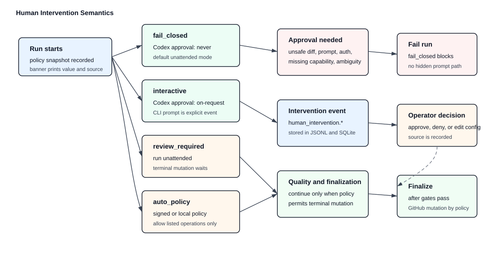

Human intervention is a policy, not hidden control flow.

| Mode | Codex approval policy | Runtime behavior | GitHub finalization |
| --- | --- | --- | --- |
| `fail_closed` | `never` | no prompts; fail on approval request, ambiguity, unsafe diff, missing auth, or unsupported capability | automatic only after quality gates |
| `interactive` | `on-request` | prompt through CLI for Codex approvals and explicit SDK intervention requests | automatic after accepted prompts and quality gates |
| `review_required` | `never` by default | run unattended but stop before terminal success mutation | requires operator review command |
| `auto_policy` | `never` or granular policy | auto-allow only operations listed in signed/local policy | automatic only when policy and quality gates pass |

`fail_closed` is the default for both SDK builders and the `agentactr` CLI. The only expected human prerequisites for unattended default operation are:

- Codex is installed and authenticated before the run starts, either through `codex login` for subscription auth or `CODEX_API_KEY` for non-interactive `codex exec` automation.
- `GITHUB_TOKEN` or the configured GitHub token environment variable is present.
- the repository/workspace is trusted by Codex and writable under the configured sandbox.
- Linux cgroup v2 and PSI requirements are available, or the operator explicitly selected an allowed degraded mode.

All other human input must be represented as an explicit mode change, a run override flag, or a stored config edit that appears in the run-start banner and event log.

## 10. GitHub Default Adapter

### 10.1 Authentication

Default token source:

1. `GITHUB_TOKEN`
2. `GH_TOKEN`
3. GitHub CLI token lookup only if explicitly enabled

Preferred production auth is a GitHub App installation token. Personal access tokens are allowed for local use but must be reported in `agentactr doctor` as lower-governance automation.

### 10.2 API Versioning

The REST adapter must send:

```text
Accept: application/vnd.github+json
X-GitHub-Api-Version: 2026-03-10
```

`2026-03-10` is the default because GitHub currently lists it as the latest supported REST API version. The adapter must expose this as configuration, store the observed response version metadata where available, and make `agentactr doctor` warn when the configured version is no longer supported. Doctor's support table must track every currently supported public GitHub REST API version, including `2022-11-28` until GitHub's documented March 10, 2028 end-of-support date.

GraphQL requests use GitHub's GraphQL endpoint and must be isolated in named query modules with fixture tests. Core logic must not depend on GraphQL response shapes directly.

### 10.3 Candidate Query

Default candidate issue:

- repository matches configured `OWNER/REPO`
- issue is open
- issue has `active_labels`
- issue does not have `ignore_labels`
- issue does not have `claim_label` unless claim lease is expired
- pull requests are excluded unless `include_pull_requests = true`

REST is used for simple issue lists and comments. GraphQL is used when the workflow needs Projects fields, node IDs, batch lookup, or precise nested data.

### 10.4 Claim Protocol

GitHub is not a transactional queue. The adapter must use a best-effort lease:

1. Re-fetch issue by ID.
2. Verify eligibility.
3. Add `claim_label` and `running_label`.
4. Post or update a hidden marker comment:

```text
<!-- agentactr:lease
run_id: RUN_ID
owner_id: HOST_PID_UUID
fencing_token: TOKEN
expires_at: RFC3339
-->
```

5. Re-fetch issue and marker.
6. Accept claim only if the marker still matches this run and no fresher lease exists.

If GitHub write policy is disabled, use local SQLite lease only and warn that duplicate dispatch is possible across machines.

### 10.5 Rate Limits

The adapter must:

- read and store rate-limit response headers
- avoid polling `GET /rate_limit` when response headers are available
- cap total concurrent GitHub requests below GitHub secondary-limit risk
- respect `retry-after`
- use `x-ratelimit-reset` for primary-limit backoff
- use exponential backoff for repeated secondary-limit failures
- persist rate-limit artifacts and expose them from the run context manifest
- emit `github.rate_limit.updated` trace events

## 11. Codex Runtime Default Adapter

### 11.1 Modes

Mode `cli_json` is required for v0.1 because the product defaults to Rust CLI running Codex locally through the stable non-interactive JSONL surface.

Mode `app_server` is a required design target for richer structured streaming and rich-client integrations. It remains feature-gated in `agentactr` until the stdio lifecycle is implemented and contract-tested; WebSocket transport and app-server experimental API fields are not production defaults.

Mode `codex_sdk` is a required design target for Codex SDK automation. The TypeScript `@openai/codex-sdk` bridge is the primary SDK target because OpenAI documents it for server-side application and CI/CD integration with Node.js 18 or later. The Python SDK is experimental and app-server-backed; it must remain opt-in until its stability and packaging requirements are proven.

Bootstrap implementation status: `codex.mode` is parsed and selected through the runtime adapter boundary. `cli_json` is implemented. `app_server` and `codex_sdk` are selectable but must fail closed with a capability/degradation report until their adapters are implemented and pass adapter contract tests. Milestone transport policy is validated in core/SDK config before adapter construction: stored config uses canonical spellings, app-server defaults to `stdio`, WebSocket requires explicit experimental opt-in, the Codex SDK bridge is `typescript`, and fallback mode is `cli_json`.

```rust
pub enum CodexMode {
    CliJsonExec,
    AppServer,
    CodexSdk,
}
```

Additional accepted config aliases:

```text
cli_json: cli_json, cli-json, exec_json, exec-json, codex_exec_json
app_server: app_server, app-server
codex_sdk: codex_sdk, codex-sdk, sdk
```

### 11.1.1 Codex Identity and Authentication

Codex identity is not the same thing as the agentactr runtime mode. A run must select one Codex identity, pin its `CODEX_HOME`, and record the identity name and redacted home path in artifacts. Shell aliases or functions such as `dwaicodex` are not a stable SDK boundary because process launch APIs execute binaries, not interactive shell functions.

Supported identity modes:

| Mode | Intended use | Required behavior |
| --- | --- | --- |
| `auto` | local default | use selected `CODEX_HOME` if configured, otherwise let Codex resolve its default home |
| `chatgpt` / `subscription` | local authenticated Codex homes | require `codex login status` or app-server account validation for that exact `CODEX_HOME` |
| `api_key` | CI and non-interactive automation | require configured `api_key_env`, pass it as `CODEX_API_KEY`, and do not require a stored login |

The CLI may support multiple local identities:

```toml
[codex.identity.personal]
home = "~/.codex"
auth_mode = "chatgpt"

[codex.identity.work]
home = "~/.codex-dwai"
auth_mode = "chatgpt"

[codex.identity.ci]
home = ".agentactr/codex-home"
auth_mode = "api_key"
api_key_env = "CODEX_API_KEY"
```

Selection order:

1. explicit CLI flag such as `--codex-identity work`;
2. `codex.identity` in `agentactr.toml`;
3. `CODEX_HOME` already present in the environment;
4. Codex default home.

Every runtime adapter must receive an explicit identity context containing `codex_home`, auth mode, API-key env name, and redaction policy. Runtime adapters must not inspect unrelated Codex homes.

When execution is delegated to `docker_linux_vm`, host Codex project trust is not authoritative because Codex runs inside the runtime image. The default CLI/Codex adapter path must validate the mounted worktree's repo-local `.codex/config.toml`, then synthesize a run-scoped `CODEX_HOME` under the mounted artifact directory that trusts only the mounted worktree path. The Docker path must not mutate host `~/.codex/config.toml` and must not rely on an empty container Codex home to discover `mcp_servers.agentactr`.

Docker execution must forward the effective Codex API-key credential explicitly into the container as `CODEX_API_KEY`. If `codex.openai_api_key_env` names a custom environment variable and preflight accepts fallback authentication from host `CODEX_API_KEY`, the Docker command wrapper must still pass that fallback value through an explicit environment entry. A run must not pass host-side preflight and then start a container without the credential path that preflight accepted.

### 11.2 CLI JSON Exec Contract

For each agent run:

1. Prepare workspace.
2. Start Codex as `codex exec --json` with explicit sandbox, approval, and `--cd` settings. The CLI must not require a global Codex profile. It must render repo-local `.codex/config.toml` with supported top-level project defaults, may pass those allowlisted scalar/array defaults as explicit `-c` overrides, and may accept legacy `[profiles.agentactr]` files only as a backward-compatibility input until regenerated.
3. Pass prompt through stdin or supported prompt argument.
4. Capture stdout/stderr separately.
5. Parse each stdout line as one Codex JSON event.
6. Map Codex event types such as `thread.started`, `turn.started`, `turn.completed`, `turn.failed`, `item.*`, and `error` into provider-neutral SDK events.
7. On timeout, pressure event, or cancellation, terminate process group.

The adapter must not rely on fragile terminal UI rendering. Raw text output is an artifact only; it is never the primary state transition source.

### 11.3 App-Server Contract

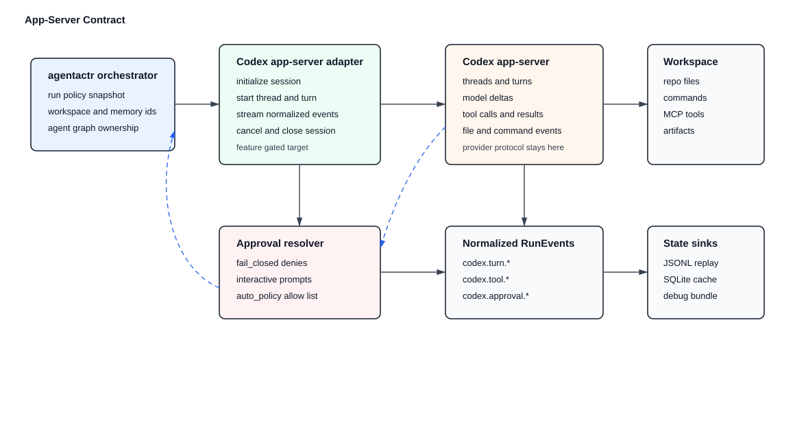

App-server mode must use Codex app-server as a runtime adapter, not as core orchestration. Production support starts with stdio transport only. Websocket and Unix-socket transports are optional experimental surfaces and must require explicit opt-in plus a local authentication and bind-address policy.

Required app-server adapter lifecycle:

- initialize session
- start thread
- start turn
- stream events
- approve/deny requests according to policy
- return tool results
- cancel turn
- close session

The Codex app-server adapter must implement a small explicit state machine rather than scattering JSON-RPC calls through CLI code:

```text
Configured
  -> ServerStarting
  -> TransportConnected
  -> Initialized
  -> ThreadReady
  -> TurnRunning
  -> TurnCompleted | TurnFailed | TurnInterrupted
  -> SessionClosed
```

Only `Initialized`, `ThreadReady`, `TurnRunning`, terminal turn states, and `SessionClosed` may emit SDK-visible state transitions. JSON-RPC request IDs, Codex thread IDs, and Codex item IDs are adapter metadata and must be stored behind artifact/runtime metadata references.

Additional app-server adapter requirements:

- send `initialize` exactly once per connection and record the app-server user agent, `codexHome`, platform family, and platform OS in artifacts;
- generate or capture the Codex app-server JSON schema/version for the selected Codex binary and store it in the debug bundle;
- preserve raw JSON-RPC request/response/notification logs as artifacts;
- implement bounded queues or backpressure handling, treating server overload as retryable with exponential backoff and jitter;
- support app-server account/auth diagnostics for both subscription and API-key identity modes;
- prefer ephemeral or per-run thread storage when available for unattended issue runs unless replay/resume policy explicitly requires persisted Codex thread history;
- attach runtime process attribution before submitting the first writable turn;
- implement turn interruption and process cleanup before claiming cancellation support;
- map app-server token usage into the same `usage.reported` and `codex.token_usage.updated` event family used by the exec JSON adapter;
- fail closed if approval requests cannot be resolved according to `HumanIntervention` and `RuntimeApprovalPolicy`.

Trust mutation policy: Codex app-server may update user-level trust state when starting writable threads for a project. `agentactr` must not trigger implicit user-level config mutation unless the operator explicitly opted in through an agentactr flag or config setting. If app-server cannot run a writable thread without user config mutation, the adapter must fail before workspace mutation and print the manual trust action or the `cli_json` fallback.

Default transport policy:

| Transport | Default status | Rationale |
| --- | --- | --- |
| `stdio` | required first implementation | local, bounded, no listener exposure, easiest to supervise in CI |
| `unix_socket` | optional experimental | local control-plane use only after auth and lifecycle tests |
| `websocket` | disabled by default | experimental/unsupported for production and must not bind non-loopback without explicit auth |

Normalized Codex events:

```text
codex.session.started
codex.turn.started
codex.model.delta
codex.tool.call
codex.tool.result
codex.approval.requested
codex.approval.resolved
codex.file.changed
codex.command.started
codex.command.completed
codex.token_usage.updated
codex.rate_limit.updated
codex.turn.completed
codex.turn.failed
codex.session.closed
```

Default flip criteria: `app_server` must not become the default until stdio transport passes contract tests for auth, quota diagnostics, schema drift, approval handling, cancellation, token usage, debug artifacts, Linux cgroup attachment, macOS degraded reporting, API-key CI mode, multi-`CODEX_HOME` local mode, and fallback to `cli_json`.

### 11.3.1 Codex SDK Contract

The Codex SDK adapter must use the Codex SDK as a runtime adapter, not as core orchestration. Initial production support targets a TypeScript sidecar using `@openai/codex-sdk`; it must run server-side under Node.js 18 or later. The sidecar receives typed agentactr runtime requests over a narrow JSON stdin/stdout bridge, and `agentactr-codex` maps sidecar events into `AgentRuntime` results and provider-neutral artifacts.

The SDK adapter must not import Node, npm, TypeScript, or Python concepts into `agentactr-core` or the public `agentactr-sdk` facade. Concrete package installation, sidecar launch, raw SDK output capture, and SDK version probing belong to `agentactr-codex` or a future narrower Codex SDK adapter crate if dependency ownership becomes too large.

Required SDK adapter lifecycle:

- verify Node.js and the selected SDK package/version before run start;
- start or resume a Codex SDK thread according to the run request;
- run the issue prompt and stream progress into normalized runtime events;
- route approvals through `HumanIntervention`;
- attach the sidecar/root runtime process to the assigned `MemoryLease` before writable work;
- preserve raw SDK logs, prompt artifacts, and final response artifacts;
- fail closed if cancellation, memory attribution, approval policy, or sidecar protocol guarantees cannot be met.

Default flip criteria: `codex_sdk` must not become the default until the TypeScript sidecar passes contract tests for auth, SDK version drift, request/response schema drift, approval handling, cancellation, token usage, debug artifacts, Linux cgroup attachment, macOS Docker/Linux backend mode, API-key CI mode, multi-`CODEX_HOME` local mode, and fallback to `cli_json`.

### 11.4 Codex Sub-Agent Mapping

Codex sub-agent behavior is an adapter implementation detail over the provider-neutral `SpawnManager` contract in section 12.4. The Codex adapter may satisfy a child `AgentNode` by using Codex native multi-agent tools when available, by creating app-server threads, or by launching separate `codex exec --json` processes. Core must see only `AgentNode`, `RuntimeProcessAttribution`, `ArtifactRef`, `MemoryLease`, and normalized `AgentRuntimeEvent` values.

Codex-specific mapping rules:

- one Codex thread, native sub-agent job, or process-backed session maps to one child `AgentNode`;
- app-server `thread/start`, `thread/resume`, or `thread/fork` responses must be recorded as runtime metadata, not core state types;
- Codex `features.multi_agent`, `agents.max_depth`, `agents.max_threads`, and `agents.<name>` config may inform adapter capabilities but may not override SDK spawn policy;
- Codex native sub-agent output must be converted to artifacts before it reaches the Implementer or finalization policy;
- Codex approval, tool, command, token, and rate-limit notifications must be normalized before `SpawnManager` reacts to them;
- if Codex cannot enforce a child agent's write/tool restrictions, the adapter must refuse that spawn or downgrade it to a deterministic SDK task.
- parallel child-agent orchestration must join every spawned helper before returning success or failure; the first child failure may determine the parent error, but slower helpers must still be joined or explicitly cancelled so no runtime process is left mutating, reading, or holding resources after the parent run fails.

Bootstrap status: `agentactr-core` exposes the provider-neutral `SpawnManager` use case and `SpawnPlan` contract. The default `agentactr-codex` `cli_json` adapter may execute bounded read-only child helpers as separate `codex exec --json` processes before the single Implementer writer runs. Those helper processes emit the same runtime-process lifecycle events as the writer, carry `parent_agent_run_id`, and use child-specific `MemoryLease` attribution when a child lease exists. Child outputs must be materialized as artifacts and summarized through `spawn_handoffs.json`; the Implementer consumes those artifacts as advisory context only. `app_server` and `codex_sdk` remain fail-closed stubs until their thread/session or SDK-sidecar support is implemented. Full stabilization still requires deterministic merge of child outputs through SDK ports and equivalent lifecycle/memory attribution for app-server and SDK-sidecar child execution modes before those transports become substitutable.

### 11.5 MCP Tool Policy

MCP tools are adapter inputs, not core authority. All MCP tool output must be normalized before it reaches core state. MCP tools must never bypass `IssueTracker`, `VersionControl`, `PreCommitRunner`, `HumanIntervention`, or merge policy ports.

Local MCP protocol compatibility is a tracked adapter contract. The `agentactr` stdio MCP server must negotiate and respond with a protocol version supported by both client and server, prefer the current MCP specification version when the client allows it, and keep compatibility tests for the versions it advertises. Implementations must not hardcode an obsolete protocol version such as `2024-11-05` without negotiation and an explicit compatibility reason.

Default tiers:

| Tier | MCP server | Default | Purpose |
| --- | --- | --- | --- |
| Required local | `agentactr` | enabled | SDK-owned read/status/report tools |
| Auto research | `openaiDeveloperDocs`, `GoogleDeveloperAPI`, `hf-mcp-server` | auto-enabled when auth is satisfied | documentation, benchmark, model, and ecosystem research |
| Auto remote tracker read | `github_remote` | auto-enabled read-only when token is detected | read-only GitHub context |
| Unsafe write-capable | remote GitHub write tools | disabled | branch, file, PR, merge, review, and delete mutations |
| App bridge | `codex_apps` | auto-enabled only when tools and bearer token are discovered | future Codex app integration |

The default CLI must fail startup when required local `agentactr` MCP is missing. Remote MCP setup is automatic when credentials are detected:

| Server | Auto-setup condition | Automatic action |
| --- | --- | --- |
| `openaiDeveloperDocs` | no auth required | write config, enable server, enable docs/read tools |
| `GoogleDeveloperAPI` | `GOOGLE_API_KEY` present | write config, attach `X-Goog-Api-Key` from env, enable `answer_query`, `get_documents`, `search_documents` |
| `hf-mcp-server` | Hugging Face OAuth session available or `HF_TOKEN` present | write config, enable read/research tools, verify `hf_whoami` when possible |
| `github_remote` | `GITHUB_TOKEN` or `GH_TOKEN` present | write config, enable read-biased allowlist, keep all write tools disabled |
| `codex_apps` | bearer token and non-empty tool list discovered | write config and enable discovered read-safe tools only |

If credentials are absent, the CLI must still render disabled config stanzas and print exact setup guidance in `agentactr doctor`. Optional remote MCP startup failure must degrade to `mcp.optional_unavailable` unless the operator marks that server `required = true`.

Remote GitHub MCP write tools must remain disabled by default because the SDK owns deterministic GitHub comments/labels, VCS worktrees, commits, push policy, PR policy, and merge policy. Enabling any remote write tool requires:

- `human_intervention.mode != "fail_closed"` or a signed/local `auto_policy`
- explicit tool allowlist
- audit event `mcp.remote_write_tool_enabled`
- `agentactr doctor` warning that SDK deterministic finalization can be bypassed

`codex_apps` is rendered as an auto-discovery placeholder. It remains effectively disabled while the discovered tool list is empty, and becomes enabled only when a bearer token and read-safe tools are both discovered.

## 12. Agent Roles and Default Workflow

### 12.1 Default Agent Graph

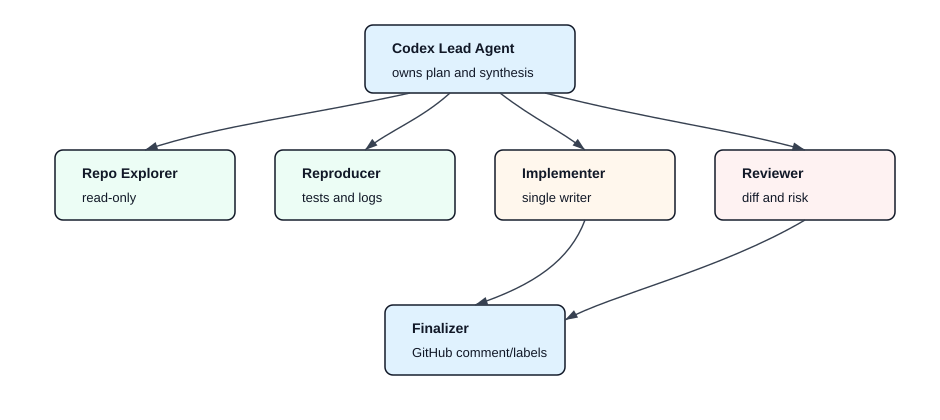

### 12.2 Role Defaults

| Role | Runtime | Workspace | Memory | Writes |
| --- | --- | --- | --- | --- |
| `Lead` | configured runtime adapter | read/write only if single-agent mode | medium | no direct writes by default |
| `RepoExplorer` | configured runtime adapter or deterministic SDK task | read-only | low | none |
| `Reproducer` | configured runtime adapter or deterministic SDK task | read-only plus temp test artifacts | medium | `.agentactr/artifacts` only |
| `Implementer` | configured runtime adapter | write-limited or full workspace | high | single writer |
| `Reviewer` | configured runtime adapter or deterministic SDK task | read-only | medium | none |
| `Finalizer` | SDK deterministic path plus optional runtime summary | no repo writes | low | tracker comment/labels only through tracker port |

Parallel writers are disabled in v0.1.

### 12.3 Default Skills

Skills are role capabilities loaded into prompts/config and backed by SDK ports where possible. They are not privileged execution paths.

| Skill | Default agents | MCP/tools allowed by default | Output artifact |
| --- | --- | --- | --- |
| `repo-map` | `RepoExplorer`, `Lead` | `agentactr.issue.read`, `agentactr.vcs.status`, `agentactr.artifact.read` | `repo_map.md` |
| `stack-detect` | `RepoExplorer`, `QualityAgent` | `agentactr.vcs.status`, `agentactr.quality.report` | `stack_detection.json` |
| `dependency-inventory` | `RepoExplorer`, `QualityAgent` | local filesystem through configured runtime sandbox, `agentactr.quality.report` | `dependency_inventory.md` |
| `reproducer` | `Reproducer` | local commands through configured runtime sandbox only | `repro_report.md` |
| `scoped-implementation` | `Implementer` | local workspace write scope only | `implementation_notes.md` |
| `quality-gates` | `QualityAgent`, `Reviewer` | `agentactr.quality.report`, local quality commands | `precommit_report.json` |
| `vcs-diff-review` | `Reviewer`, `VcsAgent` | `agentactr.vcs.status`, `agentactr.trace.read` | `diff_review.md` |
| `solid-architecture-review` | `Reviewer` | `agentactr.artifact.read`, local static reports | `architecture_review.md` |
| `security-review` | `Reviewer` | local static reports, optional research MCP if enabled | `security_review.md` |
| `final-summary` | `Finalizer` | `agentactr.trace.read`, `agentactr.artifact.read`, `agentactr.quality.report` | `final_run_summary.md` |

Additional logical agents may be implemented as runtime-native sub-agents, SDK-managed child sessions, hooks, or deterministic SDK tasks:

| Agent | Responsibility | Default write access |
| --- | --- | --- |
| `QualityAgent` | technology detection, pre-commit planning, pinned tool checks, normalized quality reports | none |
| `VcsAgent` | worktree status, touched-file index, diff classification, merge-risk report | none |
| `PolicyAgent` | policy explanation and waiver review artifact | none |

Remote research skills may use `openaiDeveloperDocs`, `GoogleDeveloperAPI`, or `hf-mcp-server` only when enabled in config. They must write research artifacts and may not directly mutate workspace, tracker, VCS, commits, PRs, or merge state.

### 12.4 Provider-Neutral SpawnManager

`SpawnManager` is an SDK use case. It is not a Codex feature, not a Claude feature, and not an MCP tool. Runtime adapters may expose native subagents, SDK-level agents, hooks, or separate processes, but they are all driven through the same provider-neutral `AgentNode` lifecycle.

```rust
pub struct AgentNode {
    pub run_id: RunId,
    pub agent_run_id: AgentRunId,
    pub parent_agent_run_id: Option<AgentRunId>,
    pub role: AgentRole,
    pub objective: AgentObjective,
    pub read_scope: ReadScope,
    pub write_scope: WriteScope,
    pub tool_policy: ToolPolicy,
    pub context_budget: ContextBudget,
    pub output_budget: OutputBudget,
    pub memory_policy: MemoryPolicyRef,
    pub artifact_root: ArtifactRoot,
    pub status: AgentNodeStatus,
}

pub struct SpawnDecision {
    pub decision: SpawnAction,
    pub reason: SpawnReason,
    pub expected_value: SpawnValueEstimate,
    pub budget_after_spawn: RunBudgetSnapshot,
}
```

Default efficient multi-agent policy:

| Agent | Purpose | Write access | Default parallelism |
| --- | --- | --- | --- |
| `Lead` / `Planner` | classify issue, budget context, decide whether to spawn helpers | none | 1 |
| `RepoExplorer` | build focused repo map and file shortlist | none | 0-2 |
| `Reproducer` | run targeted reproduction or failing tests | none | 0-1 |
| `Implementer` | make workspace changes and integrate child findings | assigned write scope only | exactly 1 |
| `Reviewer` | review diff, architecture, security, and missing tests | none | 0-1 |
| `QualityAgent` | interpret quality failures and produce normalized report | none | 0-1 |

Provider-neutral rules:

- one writer by default: only the Implementer may write to the workspace;
- read-only helpers may read scoped files, run allowed read/test commands, and write artifacts only;
- helpers return structured artifacts, not workspace patches, unless a later merge-planner milestone explicitly enables patch proposals;
- core owns spawn decisions and budgets; adapters only report capabilities and execute accepted child runs;
- native subagent features must not bypass write scope, tool policy, memory lease, event ordering, or artifact requirements;
- hooks from any runtime, including Claude hooks or Codex app-server notifications, are adapter inputs and must become normalized events before `SpawnManager` reacts;
- if a runtime cannot enforce the requested child scope, `SpawnManager` must choose another adapter, downgrade to a deterministic SDK task, or fail closed.

Spawn policy must be budget aware:

- spawn only when issue complexity, repo size, missing context, failure reproduction, or quality failure justifies it;
- pass compact `ContextPack` references, file digests, and artifact paths rather than full repo text;
- cap child context and output budgets independently from the parent;
- cap total uncached input, output, wall-clock, command count, and memory budgets per run;
- stop spawning once sufficient evidence exists;
- pause or deny helper spawns during memory pressure;
- record skipped spawns with reason codes such as `budget_exhausted`, `enough_context`, `policy_disabled`, `memory_pressure`, `runtime_capability_missing`, or `scope_not_enforceable`.

### 12.5 Artifact Handoff and Context Budgeting

Agent handoff is artifact-first. The default handoff path is:

```text
child agent
  -> writes typed artifact
  -> emits artifact.created event
  -> parent receives ArtifactRef plus digest/summary
  -> parent reads full artifact only if budget and policy allow
```

Required handoff artifacts:

| Artifact | Producer | Consumer | Purpose |
| --- | --- | --- | --- |
| `repo_map.md` / `repo_map.json` | RepoExplorer | Lead, Implementer, Reviewer | scoped file shortlist and architecture hints |
| `repro_report.md` | Reproducer | Implementer, Reviewer | exact reproduction command, observed failure, environment notes |
| `implementation_notes.md` | Implementer | Reviewer, Finalizer | changed intent, tradeoffs, omitted work |
| `diff_review.md` | Reviewer | Implementer, Finalizer | correctness, tests, architecture, security risks |
| `quality_report.json` | QualityAgent or quality runner | Implementer, Finalizer | normalized gate status and failure summaries |

Context budgeting rules:

- parent prompts receive artifact refs, summaries, hashes, and selected excerpts by default;
- full artifact bodies are loaded only on demand and must be counted against the requesting agent's budget;
- tool output defaults to failure-tail or summary mode for large commands;
- repeated static context should stay in stable prompt prefixes or artifact refs to preserve prompt-cache efficiency;
- every handoff records the producing agent id, artifact digest, redaction state, and whether the consumer saw the full body, summary, or reference only;
- default Codex helper handoffs must include prompt artifact and prompt metadata references in addition to handoff, stdout, and stderr references; the handoff record must include the handoff artifact digest, byte/character counts, redaction state, and visibility mode;
- default Codex prompt metadata must include a stable `artifact_sha256`, byte/character counts, redaction state, and visibility mode so replay/debug tooling can verify prompt identity without relying on terminal output;
- replay must prove the same artifact digests and visibility modes were available.

## 13. Linux Userspace Memory Management

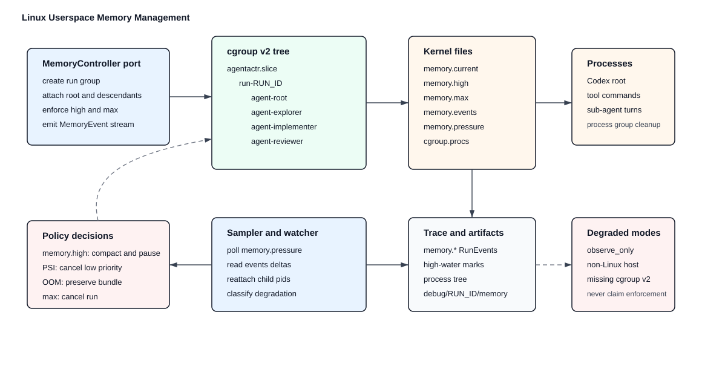

### 13.1 Design Boundary

`agentactr` does not implement a kernel module. It uses Linux userspace interfaces backed by kernel memory-management features:

- cgroup v2 memory controller
- per-cgroup PSI files
- `/proc/<pid>/status`, `/proc/<pid>/smaps_rollup`, and `/proc/<pid>/oom_score`
- `setrlimit` for child process address-space and file-size limits where useful
- process groups and pidfds for cancellation and cleanup
- `oom_score_adj` for relative OOM victim preference

Bootstrap status: creating run/agent cgroups, creating a distinct cgroup for each SDK-managed child `AgentNode`, writing `memory.high` and `memory.max`, attaching each runtime process tree to its assigned cgroup, sampling `memory.events`, monitoring descendants while the runtime runs, and writing debug bundles is a valid first enforcement slice. It is not the complete memory plane. The CLI must report missing capabilities as degraded or milestone-pending and must not claim full memory-policy enforcement until reclaim, PSI threshold actions, run-group finalization, and cancellation semantics are coordinated by the SDK `RunResourceGovernor` and executed through primitive memory/process adapter actions.

The SOLID boundary is strict:

- `MemoryController` performs primitive operations only: sample, reclaim, kill cgroup, attach pid, create/finalize group, and report capabilities.
- `RuntimeProcessSupervisor` performs runtime/process cancellation mechanics: runtime cancel where supported, process-group `SIGTERM`, bounded wait, and process-group `SIGKILL`.
- `RunResourceGovernor` owns policy transitions, spawn pausing, runtime mitigation requests, helper victim selection, terminal cleanup decisions, trace emission, and final run status. In the current `cli_json` bootstrap, helper processes are launched as a bounded batch before the writer; therefore spawn pause is recorded and enforced by spawn-policy inputs before launch, while pressure observed during live helper execution cancels active helper cgroups rather than pausing an already-empty launch queue.
- `MemoryController::kill_group` is the final cgroup primitive for helper cgroups or terminal cleanup after the process supervisor has attempted runtime/process cancellation.
- Linux launch limits are opt-in and capability-gated through `linux_memory.setrlimit_address_space` and `linux_memory.setrlimit_file_size`. Defaults are `"disabled"`; configured limits apply only on native Linux process launches.
- Runtime context compaction is a capability-gated mitigation request. It must be recorded as `RuntimeMemoryMitigation::ContextCompactionRequested` and must never be treated as proof that RSS or cgroup usage recovered.

Current bootstrap shape:

- cgroup root defaults to `/sys/fs/cgroup/agentactr.slice`
- `AGENTACTR_CGROUP_ROOT` may point at a writable delegated cgroup root for local/CI tests
- `execution.backend = "auto"` resolves to native Linux cgroup v2 on Linux and Docker Linux VM on macOS
- native macOS observe-only is an explicit degraded backend, not the strict default
- Linux cgroup integration tests are opt-in with `AGENTACTR_LINUX_CGROUP_IT=1`
- active read-only helper cgroups are registered with the runtime process supervisor; sustained pressure can cancel the selected active helper through the Linux cgroup primitive when `cgroup.kill` is available
- runtime monitor output is written to run artifacts, while the stable debug command will later aggregate it under `.agentactr/debug/RUN_ID/`

Execution backend selection is explicit and provider-neutral. It applies to all runtime adapters, including `cli_json`, `app_server`, `codex_sdk`, and future non-Codex runtimes:

| Config value | Host | Meaning |
| --- | --- | --- |
| `auto` | Linux or macOS | choose native Linux cgroup v2 on Linux; choose Docker Linux VM on macOS when strict memory is required |
| `native_linux_cgroup_v2` | Linux | require cgroup v2 and PSI unless explicitly relaxed |
| `docker_linux_vm` | macOS or Linux host with Docker | run each agent/sub-agent workload in a Linux container backend with Docker memory limits and verify cgroup v2/PSI from inside that backend |
| `native_macos_observe_only` | macOS | explicit observe-only process attribution and debug artifacts, no strict memory claim |
| `observe_only` | any | no strict enforcement; records degraded status and reason |

Docker Linux VM is an execution backend, not a Codex option. The same backend must launch the selected runtime command regardless of whether the runtime transport is Codex `cli_json`, Codex `app_server`, Codex SDK, or another future adapter.

### 13.2 Cgroup Hierarchy

```text
/sys/fs/cgroup/agentactr.slice/
  run-RUN_ID/
    agent-root/
    agent-explorer-AGENT_RUN_ID/
    agent-reproducer-AGENT_RUN_ID/
    agent-implementer-AGENT_RUN_ID/
    agent-reviewer-AGENT_RUN_ID/
```

Every runtime process and child process launched for an `AgentNode` must be attached to the correct cgroup when strict Linux enforcement is enabled. If attachment fails, the run fails closed unless `linux_memory.mode = "observe_only"`. Descendant membership validation must compare `/proc/<pid>/cgroup` membership against a canonical cgroup v2 path. If a configured delegated root cannot be resolved to a path under `/sys/fs/cgroup`, strict monitoring must fail closed rather than treating descendants as attached.

Per-child cgroups are a hardening requirement, not an optimization. The lead Implementer and every read-only helper receive separate `MemoryLease` values, separate cgroup paths, and separate status artifacts. A child helper must never silently inherit the lead Implementer's memory lease. If the memory controller cannot allocate or register a child cgroup while strict enforcement is active, the run fails before launching that child.

### 13.3 Memory Files

The memory controller reads:

- `memory.current`
- `memory.peak` where available
- `memory.high`
- `memory.max`
- `memory.events`
- `memory.stat`
- `memory.pressure`
- `cgroup.procs`

The memory controller writes:

- `memory.high`
- `memory.max`
- `memory.reclaim` when configured
- `cgroup.procs`
- `cgroup.kill` where supported and only on cancellation

### 13.4 Memory Policy

```rust
pub struct MemoryPolicy {
    pub run_high_bytes: u64,
    pub run_max_bytes: u64,
    pub agent_high_bytes: u64,
    pub agent_max_bytes: u64,
    pub psi_some_threshold_us: u64,
    pub psi_window_us: u64,
    pub sample_interval_ms: u64,
    pub kill_policy: KillPolicy,
}

pub enum KillPolicy {
    CancelLowestPrioritySubagent,
    CancelNewestSubagent,
    CancelWholeRun,
    ObserveOnly,
}
```

Default behavior:

1. `memory.high` crossed: emit warning, request runtime context compaction if supported, pause new spawns.
2. PSI memory pressure trigger fires: sample all child groups, cancel lowest-priority read-only sub-agent first.
3. `memory.events` reports `oom` or `oom_kill`: mark affected agent failed, preserve debug bundle, retry only if policy allows.
4. Run group over `memory.max`: cancel whole run and release GitHub claim as failed.

The pressure state machine is:

```text
Normal -> PressureObserved -> PressureSustained -> Remediation -> Terminal
```

Clearing pressure is explicit:

- `PressureCleared` is emitted when pressure samples fall below policy thresholds but spawn pause cooldown has not yet released.
- `SpawnPauseReleased` is emitted when cooldown completes and new read-only helper spawns are permitted again.

Helper victim selection is deterministic and traceable: read-only helpers only, lower priority first, higher memory pressure score next, newest start time next, and lexical `agent_run_id` as the final tie-breaker. The selected victim and skipped candidates must be recorded.

`oom` and `oom_kill` are independent event counters. Implementations must read both keys independently and treat either non-zero delta as a memory failure. Falling back from `oom` to `oom_kill` only when the `oom` key is absent is non-conforming because it misses `oom = 0, oom_kill > 0`.

Memory actions are implemented in phases:

| Capability | Bootstrap allowed | SDK-stable requirement |
| --- | --- | --- |
| cgroup creation | required when enforcement mode is enabled | behind `MemoryController::create_run_group` |
| PID attachment | required for runtime root and descendants | behind `MemoryController::attach_pid` |
| `memory.high` / `memory.max` writes | required | primitive setup action, not policy enforcement |
| `memory.events` sampling | required | emits `MemoryEvent` and trace event |
| `memory.reclaim` | milestone-pending unless implemented by adapter | primitive `MemoryController::reclaim`; default disabled by policy |
| `cgroup.kill` | implemented for active helper cgroups and terminal OOM cleanup when the kernel exposes the file | primitive `MemoryController::kill_group`; final helper/terminal cleanup only |
| PSI trigger actions | implemented as governor state and active-helper cancellation for `cli_json`; full runtime compaction remains capability-gated | pause spawn, compact, or cancel according to `RunResourceGovernor` policy |
| `setrlimit` / `oom_score_adj` | `setrlimit` implemented as opt-in native Linux launch limits; `oom_score_adj` remains policy-configured and pending process adapter application | child-process policy owned by memory/process adapter |
| run-group max finalization | milestone-pending | terminal run failure plus tracker release/failure policy |

The bootstrap memory monitor may reattach descendants discovered through `/proc/<pid>/task/*/children`. The SDK-stable memory plane must express this as a process-tree attachment policy and `MemoryEvent` stream, not as Codex-specific logic.

### 13.5 Pressure Event Flow

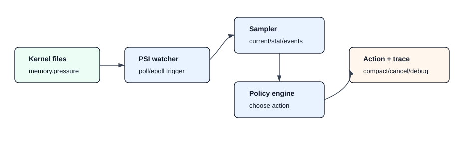

### 13.6 Memory Debug Bundle

On pressure, OOM, timeout, or cancellation, write:

```text
.agentactr/debug/RUN_ID/
  memory/
    run.memory.current
    run.memory.events
    run.memory.stat
    run.memory.pressure
    agent-*.memory.current
    agent-*.memory.events
    proc-PID-status.txt
    proc-PID-smaps-rollup.txt
  processes/
    process-tree.json
  traces/
    spans.jsonl
  codex/
    stdout.log
    stderr.log
  workspace/
    diff.patch
```

Debug bundle creation must be best-effort and must never block process termination indefinitely.

### 13.7 Cross-Platform Memory Pressure Semantics

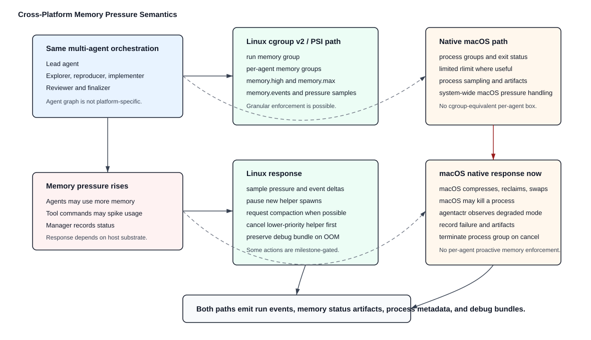

Multi-agent orchestration is platform-independent. Memory enforcement is platform-dependent.

The default Codex/GitHub agent graph may run on Linux or native macOS:

```text
lead agent
  -> explorer agent
  -> reproducer agent
  -> implementer agent
  -> reviewer agent
```

The difference is not whether sub-agents exist. The difference is whether the host provides a kernel substrate that lets `agentactr` put each run or agent into its own enforceable memory control group.

Current native platform behavior:

| Host mode | Multi-agent orchestration | Memory pressure behavior | Conformance claim |
| --- | --- | --- | --- |
| Linux with cgroup v2 and PSI | supported | per-run/per-agent cgroup setup, `memory.high`/`memory.max`, `memory.events`, pressure sampling, and debug artifacts | may claim Linux memory enforcement for implemented capabilities |
| Linux without required cgroup v2 or PSI | supported only in degraded policy | no strict memory enforcement unless requirements are relaxed explicitly | must report degraded or fail closed |
| native macOS observe-only | supported only when explicitly configured as degraded | macOS manages system memory globally through compression, reclamation, swap, and process termination; `agentactr` records status and failures but has no cgroup-equivalent per-agent memory box | observe/degraded only |
| macOS with Docker-backed Linux runtime | default when `execution.backend = "auto"` and strict memory is required | each agent/sub-agent runs in a separate Linux container with Docker memory limits; cgroup v2/PSI are verified from inside the configured runtime image | may claim strict enforcement only for the Linux backend, not native macOS |

Native macOS must not be documented, logged, or displayed as providing per-agent memory enforcement. Native macOS observe-only may still:

- start and track the same multi-agent graph;
- use isolated Git worktrees and role-scoped write policy;
- use process groups for cancellation;
- apply limited POSIX resource limits where useful;
- sample process status where available;
- detect process exit or command failure;
- write memory status artifacts, run events, and debug bundles.

Native macOS cannot currently provide the Linux memory contract:

- no cgroup v2 hierarchy;
- no per-cgroup PSI pressure files;
- no `memory.high` or `memory.max`;
- no `memory.events`;
- no `cgroup.procs` attachment;
- no cgroup-local OOM event stream;
- no reliable per-agent proactive memory pressure decision point equivalent to Linux cgroups.

Therefore, when memory pressure rises on native macOS observe-only, current conforming behavior is:

```text
macOS memory pressure increases
  -> macOS compresses memory, reclaims cache, swaps, or terminates processes
  -> agentactr observes degraded memory mode
  -> agentactr records run events and memory status artifacts
  -> agentactr detects agent/process failure if it occurs
  -> agentactr preserves logs and debug bundles
```

Native macOS observe-only behavior is not:

```text
memory pressure increases
  -> agentactr identifies the exact per-agent cgroup over budget
  -> agentactr applies memory.high throttling to that agent
  -> agentactr receives per-agent PSI pressure trigger
  -> agentactr cancels only the over-budget cgroup with Linux OOM evidence
```

That sequence is Linux-specific unless the workload is running inside a Linux VM/container backend that exposes the required Linux interfaces.

Linux behavior is more granular because the kernel exposes memory control and pressure signals at the cgroup level. In the full SDK-stable Linux memory plane, `agentactr` can make policy decisions such as:

1. pause new helper-agent spawns when run-level pressure rises;
2. ask the active runtime adapter to compact context when supported;
3. cancel lower-priority read-only helper agents before the implementer;
4. preserve memory debug bundles on OOM or cancellation;
5. fail the run when the run-level hard limit or final memory policy is violated.

The bootstrap implementation may implement only a subset of those actions. The CLI must distinguish implemented enforcement from milestone-pending policy actions in `doctor`, `memory status`, run events, and debug artifacts.

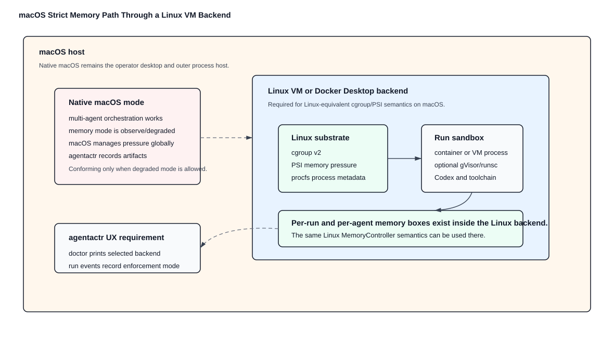

To provide Linux-equivalent strict memory behavior on macOS, the default conforming path is the Docker Linux backend:

```text
macOS host
  -> Docker Desktop Linux VM or equivalent Docker context
    -> one Linux container per agent/sub-agent process
      -> Docker memory limit and reservation
        -> runtime adapter and repository toolchain
```

This is a different backend from native macOS. The CLI and SDK must model it explicitly instead of silently treating native macOS as Linux-equivalent.

Memory attribution is provider-neutral. The memory/process adapter observes runtime process models such as Codex app-server, Claude SDK child processes, shell-backed agents, or future runtime daemons through `RuntimeProcessAttribution` events rather than provider logs. Server-style runtime transports must declare whether they run per issue, per agent, shared locally, remote, or containerized.

For server-style runtime transports, memory attribution depends on the selected backend:

| Backend | Runtime server process model | Required claim |
| --- | --- | --- |
| native macOS observe-only | one runtime server or session process per run/agent process group | observe-only memory status, process cleanup, no cgroup enforcement claim |
| macOS Docker/Linux VM | one container-scoped runtime server/session per run/agent, with host workspace/artifacts mounted back | strict only if Docker memory limits are configured and cgroup v2/PSI are visible inside the Linux backend |
| native Linux | one runtime server/session process per run/agent cgroup by default | strict cgroup/PSI enforcement when attachment, descendant monitoring, and memory event sampling pass |

Runtime adapters must not use one global shared server for multiple active runs until token usage, cancellation, memory attribution, and identity isolation are proven. The default strict implementation is one runtime server/session process per run or per child agent, attached to the corresponding memory/process group before work begins. A later pooling optimization may be added only behind a capability flag and must preserve per-run identity, workspace, artifact, and memory accounting.

For Docker Desktop or another macOS Docker Linux backend:

- `auto` backend selection must select `docker_linux_vm` on macOS when strict memory enforcement is required;
- the backend must launch one container per lead agent and per child agent rather than multiplexing unrelated agents into one shared container;
- Docker container flags must set a hard memory limit and a reservation from the configured per-agent memory policy;
- the configured runtime image must contain the selected runtime command, the `agentactr` CLI used by the required local MCP server, and required repository toolchains;
- the default runtime image is `ghcr.io/dwaiba/agentactr-runtime:0.1.0-linux-arm64`, while release pipelines should also publish a moving `latest-linux-arm64` convenience tag;
- the static CLI distribution image is `ghcr.io/dwaiba/agentactr-cli:0.1.0-linux-arm64-musl` and must not be used as the Docker execution runtime;
- the backend must verify Docker daemon reachability, Linux engine type, configured runtime image availability, runnable `codex` and `agentactr` commands in the image, host artifact mounts, and cgroup v2/PSI from inside the configured image before strict unattended execution;
- if Docker/Linux-VM bootstrapping fails and strict memory enforcement is required, the run must fail closed rather than falling back to native macOS observe-only;
- if policy explicitly allows degraded operation, the CLI may fall back to native macOS observe-only and must print the fallback reason;
- `doctor` must report Docker context, VM availability, configured VM CPU/memory/swap limits when discoverable, and whether Resource Saver/cold-start behavior may delay runs;
- the backend must verify cgroup v2 and PSI from inside the Linux environment, not from the macOS host;
- the runtime container must have model-provider egress, for example Docker `bridge` networking or a named restricted egress network, because Codex API calls originate inside the container;
- disabling repository command network access must be done through Codex sandbox/profile policy or a managed proxy, not by cutting off the whole runtime container unless an alternative model egress path exists;
- Docker command wrapping must preserve the selected runtime adapter's stdio contract; for `cli_json`, stdout and stderr must remain piped so the adapter can stream `codex.stdout.jsonl`, `codex.stderr.log`, token usage, failures, and debug artifacts exactly as it does on native execution;
- only selected environment variables may be forwarded into the container/VM;
- workspace mounts must be explicit and write-scoped;
- artifacts must be copied or bind-mounted back to the host artifact directory;
- strict memory policy must account for both the Docker Desktop VM/container limit and per-agent cgroup limits;
- the end-user workflow should remain the same command shape as native runs. Docker-specific setup belongs in `agentactr doctor`, `agentactr init`, generated config, and deterministic preflight diagnostics, not in issue-run flags that every user must remember.

Required platform reporting:

- `agentactr doctor` must print host platform, selected memory backend, enforcement mode, cgroup v2 availability, PSI availability, and whether memory enforcement is strict or degraded.
- Run events must record the selected memory backend and whether enforcement is active.
- Debug bundles must include the memory status artifact even when enforcement is disabled or observe-only.
- If policy requires strict memory enforcement and the host is native macOS without a Linux backend, the run must fail closed before claiming full enforcement.
- If policy allows degraded mode, native macOS may proceed but must record `observe_elsewhere` or an equivalent explicit degraded memory mode.

## 14. State, Traceability, and Debugging

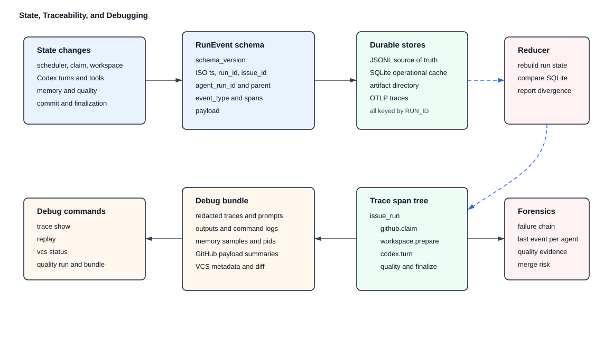

### 14.1 Storage

Required stores:

- SQLite: queryable run metadata, issue state, agent graph, leases, budgets, token usage, memory samples.
- JSONL: append-only immutable event stream.
- Artifact directory: prompts, outputs, diffs, logs, test results, debug bundles.

The run `context_manifest.json` must reference run-critical artifacts by path, including memory status, agent graph, spawn handoff manifest, runtime process events, Codex prompt artifacts, Codex raw stdout/stderr logs, GitHub issue and rate-limit artifacts, adapter version reports, quality reports, machine-readable quality status, GitHub lifecycle events, workspace diff patch/metadata artifacts, merge plan artifact/metadata paths, and finalization status. A manifest may point at deterministic paths before later phases create the files, but post-run audit and replay tooling must not need terminal output or hard-coded filename guesses to discover those artifacts. Debug and trace inspection tooling must consume available prompt, handoff, workspace diff, and merge plan digest metadata and report verification status without reading or printing sensitive prompt bodies.

Runtime adapters must write transport-specific raw artifacts without making them the canonical state source. For `cli_json`, this includes `codex.stdout.jsonl` and `codex.stderr.log`. For `app_server`, this includes:

- `codex.app_server.rpc.jsonl` for raw JSON-RPC requests, responses, and notifications;
- `codex.app_server.stderr.log`;
- `codex.app_server.schema.json` or a versioned schema digest for the selected Codex binary;
- `codex.thread.json`;
- `codex.turns.jsonl`;
- `codex.usage.json`;
- `codex.approvals.jsonl`.

For `codex_sdk`, this includes:

- `codex.sdk.request.json`;
- `codex.sdk.events.jsonl`;
- `codex.sdk.stderr.log`;
- `codex.sdk.version.json`;
- `codex.sdk.final_response.txt`;
- `codex.sdk.usage.json`.

All raw artifacts are sensitive. Debug bundle generation must redact tokens, authorization headers, API keys, local credential paths, and unapproved prompt/body content according to the run redaction policy.

### 14.2 Event Log

Every state change emits a `RunEvent`:

```json
{
  "schema_version": "0.1",
  "ts": "2026-05-07T12:00:00Z",
  "run_id": "run_...",
  "issue_id": "github:OWNER/REPO#123",
  "agent_run_id": "agent_...",
  "parent_agent_run_id": null,
  "event_type": "agent.started",
  "span_id": "span_...",
  "parent_span_id": "span_...",
  "payload": {}
}
```

The orchestrator state is recoverable by reducing JSONL events plus SQLite snapshots. JSONL is the source of truth for replay; SQLite is the indexed operational cache.

### 14.3 Trace Span Tree

```text
trace issue_run
  scheduler.poll
  github.fetch_candidates
  github.claim
  vcs.worktree.create
  workspace.prepare
  memory.cgroup.create
  codex.lead.start
    codex.turn
    spawn.repo_explorer
      memory.cgroup.create
      codex.turn
      artifact.write
    spawn.implementer
      memory.cgroup.create
      codex.turn
      workspace.diff
      test.run
      precommit.run
    spawn.reviewer
      codex.turn
      artifact.review
  vcs.commit.local
  vcs.merge_plan
  github.final_comment
  github.release
```

### 14.4 Required Debug Commands

Bootstrap `agentactr trace list` groups the local JSONL event ledger by run id and prints run id, issue id, event count, first timestamp, last timestamp, and last event type without mutating the trace.

Bootstrap `agentactr trace show RUN_ID` filters the local JSONL event ledger for a run and prints issue id, event count, run status, last event per agent, failure events, runtime-process attribution summaries, GitHub rate-limit events, artifact-producing events, and a compact event timeline. The SDK-stable debug/replay milestone extends this into the full trace tree below:

- issue and run status
- agent graph
- last event per agent
- memory high-water marks
- runtime process IDs, process groups, container refs, or VM refs from `RuntimeProcessAttribution`
- GitHub rate-limit status
- VCS base commit, worktree path, branch name, touched files, commit ref, and merge plan
- repository emptiness, stack detection evidence, selected quality profile, pre-commit command report, pinned tool status, dependency check output, architecture check output, and failing command output
- artifact paths
- failure chain

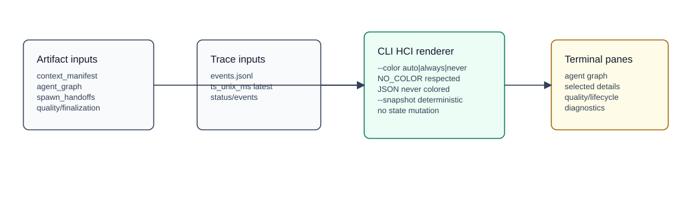

Bootstrap `agentactr tui run RUN_ID [--refresh 1s]` and `agentactr tui latest [--refresh 1s]` are CLI/HCI-only renderers. They read `context_manifest.json`, `agent_graph.json`, `spawn_handoffs.json`, trace events, runtime-process artifacts, quality reports, machine-readable quality status, GitHub lifecycle events, and lifecycle/finalization artifacts when present. They render agent graph nodes with event-derived pending, active, complete, failed, blocked, or review state so operators can see who is doing what without reading raw JSONL. They must never orchestrate work, mutate worktrees, mutate SQLite state, call GitHub, call Codex, or change run lifecycle state. `agentactr tui run RUN_ID --snapshot` renders deterministic text for tests and non-interactive environments. `tui latest` must resolve the latest run from trace summaries sorted by `ts_unix_ms`, never artifact directory modification time; if no trace run exists, it must fail with guidance to pass `RUN_ID`. Human output color is controlled by top-level `--color auto|always|never`, by `NO_COLOR`, and by TUI-local `--no-color`; JSON output must never contain ANSI escapes.

`agentactr replay RUN_ID` rebuilds state from JSONL and reports divergence from SQLite.

`agentactr vcs list` prints run id, issue id, branch name, worktree path, base commit, current commit when available, source checkout cleanliness at prepare time, and last known run status for each retained local worktree. The JSON form must be stable enough for menu/UI clients and CI inventory checks.

`agentactr vcs show RUN_ID` prints the full VCS/worktree record for one run, including `.agentactr-run.toml`, `context_manifest.json` worktree fields, base/current commit, branch, source checkout cleanliness, touched-file summary, configured VCS policy, and milestone status for diff/commit/merge.

`agentactr vcs status RUN_ID` prints worktree path, base commit, current commit, touched-file set, overlap status, and whether the source checkout was clean at preparation time.

`agentactr vcs diff RUN_ID [--output PATH]` writes a run-scoped workspace diff patch artifact plus JSON metadata with run id, artifact paths, base/current commit, touched files, untracked-file names, patch size, and SHA-256 digest. It must use `VersionControl::diff`, must validate the recorded worktree with the same fail-closed rules as `vcs show` and `vcs status`, and must emit a `vcs.diff.recorded` trace event. The patch artifact must be a valid `git apply` input: tracked-file hunks must preserve patch terminators/newlines, and untracked file bodies must be embedded as new-file diffs when `includes_untracked_file_bodies = true`. Local VCS commit and merge remain disabled until their contracts are implemented; `agentactr finalize` is implemented separately through SDK lifecycle/finalization use cases and typed tracker ports.

`agentactr vcs apply RUN_ID --check|--yes [--3way] [--allow-dirty]` is a bootstrap-local operator helper for the manual merge path. It validates the recorded worktree scope, records a fresh run-scoped workspace diff artifact, and then runs `git apply` from the current source checkout. `--check` is read-only and must fail closed on conflicts. `--yes` mutates the current source checkout and must fail closed when the source checkout is dirty unless `--allow-dirty` is explicit. `--3way` requests Git's three-way application mode so operators get conflict-aware diagnostics when a patch cannot apply cleanly. The helper does not commit, push, open a pull request, merge, or mutate tracker finalization state.

`agentactr quality run RUN_ID` re-runs the detected pre-commit plan in the isolated worktree and writes a new `PreCommitReport` artifact without mutating finalization state unless explicitly passed to `agentactr finalize`.

Run-scoped commands that execute commands or inspect VCS state from `context_manifest.json`, including `quality run`, `vcs show`, `vcs status`, `vcs diff`, `vcs apply`, and `merge plan`, must fail closed when the manifest run id does not match `RUN_ID`, when `worktree.run_id` is present and mismatched, or when the recorded worktree path is outside `vcs.worktree_root` after lexical normalization and canonical symlink resolution. `vcs list` must not run Git against invalid recorded worktree paths; it may report the local entry as invalid with the validation error so operators can clean stale artifacts safely.

`agentactr merge plan RUN_ID [--json]` writes run-scoped `merge_plan.json` and `merge_plan.metadata.json` artifacts and emits `vcs.merge_plan.recorded`. The metadata artifact must include a stable SHA-256 digest, byte count, and character count for `merge_plan.json` so debug/replay tooling can verify merge-plan identity without depending on terminal output. The bootstrap plan is read-only: it records base/current commit, current `vcs.base_ref` commit, base-ref drift, whether the worktree HEAD contains the current base ref, workspace diff artifact presence, configured `merge.mode`, touched files, blockers, warnings, and recommendation. With the default `merge.mode = "disabled"`, the recommendation must block merging even when the worktree is otherwise clean. Cross-issue overlap remains a warning/place-holder until the overlap detector lands.

VCS command groups must be explicit about side effects:

| Command | Side effect level | Bootstrap status |
| --- | --- | --- |
| `vcs list` | read-only local artifact/worktree inventory | implemented |
| `vcs show RUN_ID` | read-only local artifact/worktree detail | implemented |
| `vcs status RUN_ID` | read-only Git status plus trace event | implemented |
| `vcs diff RUN_ID` | read-only diff artifact generation | implemented |
| `vcs apply RUN_ID --check` | read-only source-checkout patch validation | implemented |
| `vcs apply RUN_ID --yes` | source-checkout patch application; no commit/push/merge | implemented |
| `vcs commit RUN_ID` | local Git commit mutation | milestone until `VersionControl::commit` is implemented |
| `merge plan RUN_ID` | read-only merge-risk artifact generation | implemented |
| `vcs cleanup RUN_ID` | local worktree removal | milestone until retention and approval policy are implemented |

Bootstrap `agentactr debug bundle RUN_ID` creates a local redacted directory under `observability.debug_bundle_root` containing the run artifact directory, a run-scoped trace slice, trace summary, VCS status when the worktree is available, workspace diff integrity status when diff metadata exists, merge plan integrity status when merge-plan metadata exists, merge plan artifacts when recorded, and a bundle manifest. `RUN_ID` is an opaque generated path segment; run-scoped commands must reject empty values, path separators, and relative path segments before reading or writing local paths. Debug bundling does not mutate the trace, worktree, GitHub, or finalization state. Debug bundle artifact copying must inspect symlink metadata without following symlinks. Symlinked artifacts, including symlinked directories, must be skipped and recorded as bundle metadata instead of dereferenced or copied, so a runtime-created artifact cannot cause a shareable bundle to include files outside the run artifact root. SDK-stable debug bundling later adds OTLP export context and stricter schema/redaction contracts.

## 15. Scheduler and Run Lifecycle

### 15.1 Daemon Tick

```text
load config
print human-intervention banner and override steps
validate Codex availability
validate GitHub auth
detect MCP credentials and auto-render repo-local Codex MCP config
validate required local MCP and auto-enabled remote MCP policy
validate VCS state and pre-commit toolchains
sample host memory and pressure
renew active leases
reconcile running issues
fetch GitHub candidates
rank candidates
claim issue
prepare isolated VCS worktree
create run cgroup
start Codex lead agent
spawn bounded sub-agents if policy allows
collect artifacts
run pre-commit and stack-specific quality gates
create local commit if policy allows
compute merge plan and cross-issue overlap risk
run final quality gates
comment and label GitHub issue
release or retry
```

Bootstrap one-shot `run issue` lifecycle may implement a strict prefix of the daemon lifecycle:

```text
load effective config
print human-intervention banner and override source
resolve execution backend
validate Codex transport; probe host Codex command/auth/capacity only for native host execution, and probe Docker runtime image tools for Docker Linux execution
validate GitHub token
validate local agentactr MCP readiness on the host for native execution, or in the Docker runtime image for Docker Linux execution
validate VCS source checkout
create run id, artifact root, trace path, and run state
prepare optional memory run context
prepare isolated Git worktree
fetch GitHub issue by id
write context manifest and single-agent graph
run one Codex Implementer through AgentRuntime
run detected quality gates
convert quality/run artifacts into `QualityGateSummary` and `RunOutcomeSummary`
apply SDK-owned GitHub lifecycle policy or record local-only disabled finalization
record terminal state
```

This prefix lifecycle must fail fast before side effects where possible. Once side effects begin, every phase must either complete or record a phase-specific failure state such as `worktree_failed`, `github_fetch_failed`, `codex_preflight_failed`, `codex_exec_failed`, or `quality_failed`.

### 15.2 Failure Handling

| Failure | Action |
| --- | --- |
| GitHub primary rate limit | pause polling until reset |
| GitHub secondary rate limit | back off exponentially, do not hammer |
| Codex command missing | fail startup in daemon mode |
| Codex auth missing | fail startup and print `codex login` / auth-specific setup guidance |
| GitHub token missing | fail startup and print exact token environment variable expected |
| Required local MCP unavailable | fail startup with exact `agentactr mcp serve` diagnostic |
| Auto-enabled research MCP unavailable | continue and emit `mcp.optional_unavailable` unless marked required |
| MCP credentials detected but config render fails | fail startup with `mcp_config_render_failed` |
| Remote GitHub write MCP tool enabled in `fail_closed` | fail startup unless explicit `auto_policy` allows the tool |
| Git source checkout dirty | fail startup or issue run before creating worktree |
| Git worktree creation fails | fail run and preserve VCS diagnostic output |
| Cross-issue touched-file overlap | fail quality gate in `fail_closed`; require review in `review_required` |
| Pre-commit toolchain missing | fail quality gate unless technology is explicitly excluded |
| Pre-commit command fails | fail quality gate and preserve command output |
| Empty repository without declared stack | fail before claim or fail run before coding with `repository_stack_required` |
| Low-confidence technology detection | fail before coding unless explicit stack is configured |
| Required pinned stack tool missing | fail quality gate and print exact pin/setup guidance |
| Required dependency integrity check fails | fail quality gate and preserve dependency diff/output |
| Required architecture check fails | fail quality gate and preserve linter/reviewer artifact |
| Codex approval requested in `fail_closed` | cancel run, preserve debug bundle, record `human_intervention_required`, label/comment according to failure policy |
| Codex turn timeout | cancel agent, save debug bundle, retry if below retry cap |
| Memory pressure | pause spawns, compact/cancel low-priority sub-agent |
| cgroup OOM | fail affected agent, preserve bundle, retry only if policy allows |
| Ambiguous diff in `fail_closed` | fail quality gate and preserve diff/review artifacts |
| `review_required` finalization | stop before `done_label`, emit review instructions, preserve claim according to lease policy |
| Workspace path violation | hard fail and block issue |
| Trace sink failure | continue with JSONL fallback |
| SQLite unavailable | fail startup unless `--event-log-only` |

## 16. Workspace, VCS, Pre-Commit, Commit, and Merge Contract

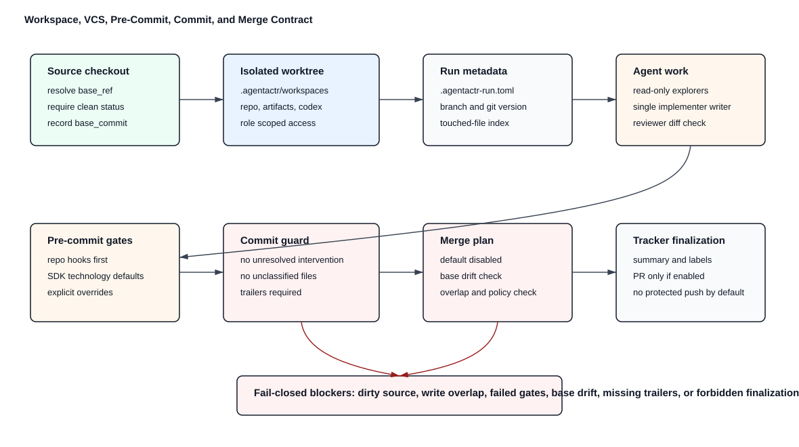

Workspace path:

```text
.agentactr/workspaces/OWNER_REPO_ISSUE_NUMBER/
```

Required files:

```text
.agentactr/workspaces/.../
  .agentactr-run.toml
  repo/
  artifacts/
  codex/
```

`repo/` is the Codex working directory. `artifacts/` is writable by all agents for logs and reports. Sub-agents get scoped views:

- read-only roles: read-only bind/mount if sandbox supports it; otherwise post-run diff validation must prove no writes occurred.
- implementer: write access to `repo/`.
- reviewer: read-only access to `repo/` plus implementer diff artifact.

### 16.1 Git Worktree Usage

When VCS is Git, the default workspace strategy is `git worktree`. The SDK must not let issue runs mutate the operator's source checkout directly.

Default sequence:

1. Resolve `vcs.base_ref` to an immutable `base_commit`.
2. Fail if the source checkout is dirty and `vcs.fail_on_dirty_source_checkout = true`.
3. Create a per-run worktree at `vcs.worktree_root/RUN_ID` or the configured workspace `repo/`.
4. Use a detached worktree or local branch named from `vcs.branch_template`.
5. Record `base_ref`, `base_commit`, `worktree_path`, `branch_name`, and `git_version` in `.agentactr-run.toml`.
6. Run all agent work inside the worktree path only.
7. Remove the worktree only after retention TTL unless the operator explicitly cleans it.

Required Git commands, expressed semantically:

```text
git rev-parse --verify BASE_REF
git status --porcelain=v1
git worktree add --detach WORKTREE_PATH BASE_COMMIT
git worktree list --porcelain
git -C WORKTREE_PATH status --porcelain=v1
git -C WORKTREE_PATH diff --binary BASE_COMMIT...HEAD
```

If the repository is not Git, the SDK must use the `VersionControl` port to provide equivalent base revision, diff, workspace isolation, commit, and merge-plan semantics. If equivalent semantics are unavailable, the run fails closed.

The VCS CLI surface must cover the full lifecycle without hiding unavailable pieces:

```text
agentactr vcs prepare --issue ISSUE [--repo OWNER/REPO]
agentactr vcs list [--json]
agentactr vcs show RUN_ID [--json]
agentactr vcs status RUN_ID [--json]
agentactr vcs diff RUN_ID [--output PATH]
agentactr vcs commit RUN_ID [--message MESSAGE]
agentactr vcs cleanup RUN_ID [--dry-run|--force]
agentactr merge plan RUN_ID [--json]
```

Read-only commands may be implemented before mutation commands. Mutation commands must remain milestone-labeled and fail closed until their SDK use cases and VCS adapter methods are implemented. Help and completions must expose this distinction instead of silently omitting lifecycle phases.

### 16.2 Cross-Issue Codebase Contention

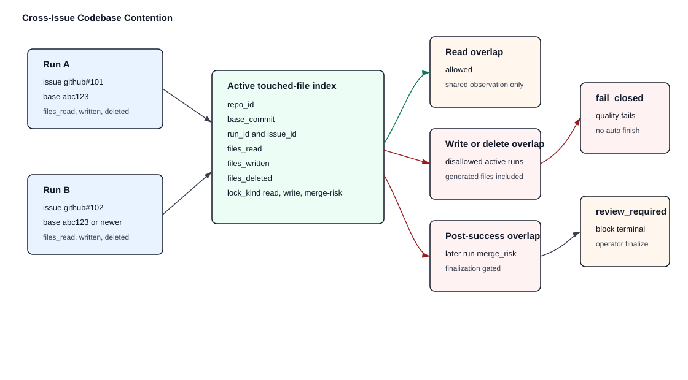

Multiple issue runs may target the same codebase. Isolation prevents direct filesystem corruption, but it does not remove semantic merge risk.

The scheduler must maintain an active touched-file index:

```text
repo_id
base_commit
run_id
issue_id
files_read
files_written
files_deleted
lock_kind = read | write | merge-risk
```

Strict default policy:

- read overlap is allowed
- write overlap is disallowed across active runs
- delete overlap is disallowed across active runs
- generated-file overlap is treated as write overlap unless the path is ignored by policy
- if two successful runs touch the same file set, the later run is `merge_risk`
- in `fail_closed`, `merge_risk` fails quality gates
- in `review_required`, `merge_risk` blocks automatic finalization and prints `agentactr finalize` instructions

### 16.3 Pre-Commit Scope

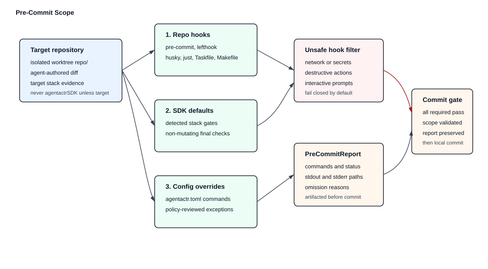

Pre-commit applies to the repository being worked on, not to `agentactrSDK` itself. The SDK must discover and run the target repository's own quality gates before commit/finalization.

Order of precedence:

1. Existing `.pre-commit-config.yaml`, `lefthook.yml`, `.husky/`, `justfile`, `Taskfile.yml`, `Makefile`, or repo-specific documented commands.
2. Technology-specific defaults from SDK policy.
3. Explicit `agentactr.toml` overrides.

Existing repo-defined hooks are authoritative unless they require network, secrets, destructive actions, or interactive prompts. Unsafe hooks fail closed unless the operator explicitly grants a policy exception.

### 16.4 Clean Repository and Bootstrap Policy

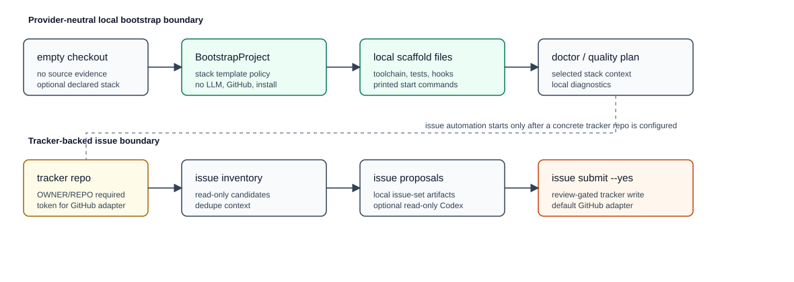

The SDK must distinguish an empty repository from an undetected or unsupported repository.

Empty repository detection:

- Git repository has zero commits, or
- Git repository has only VCS metadata and no tracked source/config files, or
- worktree has no recognized project files after ignore rules are applied.

For an empty repository, the SDK must emit:

```text
repository.empty_detected
repository.primary_stack = unknown | declared_stack
repository.bootstrap_allowed = true | false
```

Strict default behavior:

- If no primary stack is declared, fail closed with `repository_stack_required`.
- If a tracker issue explicitly declares a stack through labels/fields, or `agentactr.toml` sets `repository.declared_primary_stack`, the SDK may create minimal prerequisites for that stack.
- The SDK must not infer a new application framework from prose alone when `human_intervention.mode = "fail_closed"`.
- Bootstrap must create only minimal, conventional files required for toolchain, dependency, and quality gates.
- Bootstrap-generated files must be listed in the final summary and commit message.

Default stack declaration examples:

```text
agentactr config set repository.declared_primary_stack typescript
agentactr config set repository.allowed_bootstrap explicit_only
agentactr config set quality.profile strict
```

`agentactr bootstrap project --stack python|golang|rust|typescript|pulumi|terraform|sql --yes [--force] [--allow-non-empty]` is the explicit blank-project scaffold command. It is write-capable, must require `--yes`, and must refuse non-empty directories by default. Agentactr bootstrap metadata created by `agentactr init`, such as `.git`, `.agentactr`, `.codex`, `agentactr.toml`, `WORKFLOW.md`, and `.gitignore`, does not make a directory non-blank for this check. Operators must pass `--allow-non-empty` to intentionally scaffold into a reviewed non-empty directory. The command must also refuse to overwrite existing target files unless `--force` is passed; `.gitignore` is the narrow exception and may be merged by appending missing scaffold ignore rules while preserving existing entries. It prints every written file and the stack-specific start commands. The bootstrap surface is local and provider-neutral: it must not call an LLM, mutate GitHub, create a worktree, install dependencies, run networked commands, or infer cloud/provider choices. The scaffolds must include conventional source/test folders, toolchain config, quality commands, and `.pre-commit-config.yaml` for:

- Python: Hatch build backend, `uv`, Ruff, Pytest, Pyright, `poetry.toml`, `src/`, and `tests/`.
- Go: `go.mod`, `cmd/`, `internal/`, tests, `golangci-lint`, and pre-commit hooks.
- Rust: workspace layout, pinned `rust-toolchain.toml`, declared workspace MSRV, `deny.toml`, tests, and pre-commit hooks modeled after this repository.
- TypeScript: Bun, Biome, strict TypeScript, tests, and pre-commit hooks. Fresh scaffolds must use plain `bun install`, not `bun install --frozen-lockfile`, because the scaffold does not generate `bun.lock` before the first install. Generated tests must be compatible with `moduleResolution = "NodeNext"`, including emitted `.js` specifiers for local relative imports.
- Pulumi: modular TypeScript Pulumi project, local lint/typecheck/test gates, and pre-commit hooks. Fresh scaffolds must use plain `bun install`, not `bun install --frozen-lockfile`, because the scaffold does not generate `bun.lock` before the first install. Live `pulumi preview` is documented as optional because it can require credentials, backend access, and network; it must not be in default pre-commit hooks or printed start commands.
- Terraform: modular layout, tracked `.terraform.lock.hcl` provider lock policy, `terraform fmt`, `validate`, `test`, and pre-commit hooks.
- SQL: forward migrations, reviewed rollbacks, backfills, seeds, smoke tests, SQLFluff, and pre-commit hooks.

Local blank-project scaffold/init and tracker-backed issue automation are separate operator workflows. `agentactr init --yes` may render a placeholder tracker repo for local metadata. `agentactr issue draft --local --stack STACK --prompt TEXT` is available for tracker-offline local issue proposal drafting and defers tracker dedupe until `agentactr issue submit ISSUE_SET_ID --proposal PROPOSAL_ID --repo OWNER/REPO --yes`. `agentactr issue find`, tracker-backed `agentactr issue draft --repo OWNER/REPO`, local submit, and `agentactr run issue` still require a concrete tracker repository when they fetch or mutate GitHub state.

The default Rust Codex/GitHub CLI must print exact recovery steps when empty repo detection fails:

```text
Repository is empty and no primary stack is declared.

Declare a stack and rerun:
  agentactr config set repository.declared_primary_stack typescript
  agentactr doctor

Supported starter stacks:
  python
  golang
  rust
  typescript
  pulumi
  terraform
  sql
```

### 16.5 Technology Detection and Prerequisite Setup

Technology detection is deterministic and confidence-scored. The SDK must record `detected_stack`, `confidence`, `evidence_files`, and `selected_quality_profile`. `selected_quality_profile` is resolved from `quality.profile` with `strict` as the secure default; supported bootstrap profiles are `strict`, `standard`, and `minimal`. Strict profile enforces pinned-tool and strict-prerequisite findings. Standard and minimal profiles intentionally relax strict prerequisite findings and compose smaller quality plans, but they must still preserve deterministic stack detection, fail-closed unknown-stack behavior, and explicit setup guidance. Repository discovery must inspect directory entries without following symlinks; symlinked directories and files are not valid stack evidence and must be skipped before recursion or evidence collection. This keeps local discovery scoped to the checkout and prevents cycles or out-of-tree files from influencing preflight decisions.

Primary stack selection:

1. explicit `repository.declared_primary_stack`
2. tracker label or structured field mapped by tracker adapter
3. high-confidence repository evidence
4. fail closed if multiple stacks conflict and no monorepo policy exists

Prerequisite setup rules:

- Existing repository files and lockfiles are authoritative.
- Terraform scaffolds must keep `.terraform.lock.hcl` tracked once providers are selected; generated ignore rules must not exclude the provider lock file because readonly lockfile validation depends on it for reproducible fresh checkouts.
- The SDK may install or use tools only through repo-local, version-pinned, or lockfile-governed mechanisms.
- The SDK must not install global tools silently.
- If a required pinned tool is missing, the run fails quality gates and prints exact setup guidance.
- If a tool is introduced by an agent in a clean repo, the version must be pinned in the repository or configured toolchain file.
- Network-dependent dependency installation is allowed only when the sandbox/network policy explicitly permits it; otherwise missing dependencies fail closed.

Minimal bootstrap by declared stack:

| Stack | Minimal prerequisite files the SDK may ask the agent to create when bootstrap is explicit |
| --- | --- |
| `typescript` | `package.json` with pinned `packageManager`, `.nvmrc` or `.node-version`, `tsconfig.json`, lockfile after frozen install, `biome.json` when Biome is selected, test/build scripts appropriate to the declared framework, and Zod dependency/config only when new boundary validation is introduced |
| `rust` | `Cargo.toml` with `rust-version`, pinned `rust-toolchain.toml` when policy pins Rust, `.cargo/config.toml` only when needed, `deny.toml` for `cargo deny`, nextest config only when needed, fuzz target scaffolding only for fuzz-required code, and public-library metadata when semver checks are required |
| `golang` | `go.mod`, `go.sum` when external dependencies exist, Go version/toolchain declaration, pinned `golangci-lint` mechanism, `.golangci.yml` with depguard/import-boundary rules when architecture checks are required, and `tools.go`/tool config when the repo uses that convention |
| `python` | `pyproject.toml`, `uv.lock`, `.python-version`, Ruff config, Pyright config when type checking is required, pytest config, and dependency/security tool declarations such as `pip-audit`, `deptry`, and optional `bandit`/`import-linter` config when required |

The default CLI must never silently choose Vite, Next.js, Bun, Biome, Zod, `cargo fuzz`, `golangci-lint`, `uv`, Pyright, Mypy, Bandit, Semgrep, or a Python web framework for an empty repository unless the stack/framework/tool is declared by config, tracker metadata, or an already-existing repository convention.

### 16.6 Technology-Specific Strict Policies

TypeScript detection:

- `package.json`, `tsconfig.json`, `pnpm-lock.yaml`, `yarn.lock`, `package-lock.json`, `bun.lockb`, or `deno.json`
- package manager chosen by lockfile: pnpm, yarn, npm, bun, then deno
- install command must be frozen/lockfile-respecting
- run only scripts that exist unless config explicitly supplies commands
- `.nvmrc`, `.node-version`, `mise.toml`, or `volta`/`engines.node` pin is required in strict profile unless the repo is Deno-only
- Bun is allowed only when `bun.lockb` or explicit config pins Bun usage
- Biome is required when `biome.json`, `biome.jsonc`, or strict bootstrap introduces formatting/linting
- Zod is required for new TypeScript boundary validation code introduced by agents unless the repo already has a competing validation standard

TypeScript default gate order:

```text
install with frozen lockfile
run pinned Biome check/ci if configured or introduced
run lint if script exists
run typecheck if script exists
run test if script exists
run build if script exists
run framework smoke check if Vite/Next/Remix/SvelteKit/Astro is detected and a non-interactive check command exists
```

Framework-aware checks:

- Vite: prefer `npm|pnpm|bun run build`; optional server smoke only when repo has a deterministic preview command.
- Next.js: run build/typecheck/test scripts; never start a long-lived server as a final gate.
- Node services: run unit/integration tests and contract tests if present; long-lived server smoke must use timeout and reserved port policy.

Rust detection:

- `Cargo.toml`
- workspace mode when `[workspace]` is present

Rust default gate order:

```text
cargo fmt --all -- --check
cargo clippy --workspace --all-targets --all-features -- -D warnings
cargo nextest run --workspace --all-features
cargo test --doc --workspace --all-features
cargo deny check
cargo machete
```

Rust conditional gates:

- Public libraries: add `cargo semver-checks`.
- Unsafe, parser, network, deserialization, or input-heavy code: add Miri and fuzzing gates.
- Miri gate: `cargo miri test` for supported targets and test scope.
- Fuzz gate: require `cargo fuzz` target discovery and run configured smoke fuzz targets with bounded time.
- If `cargo nextest`, `cargo deny`, `cargo machete`, `cargo semver-checks`, Miri, or `cargo fuzz` are required but not pinned/available, strict profile fails with exact setup guidance.

Golang detection:

- `go.mod`
- `go.sum` is required for modules with external dependencies
- Go version/toolchain is read from `go.mod`, `toolchain`, `.tool-versions`, `mise.toml`, or explicit config
- `golangci-lint` must be pinned in strict profile through repo tooling, `mise`, `asdf`, a checked-in tool installer, or explicit config

Golang default gate order:

```text
gofmt-check
go mod verify
go mod tidy-check
go vet ./...
golangci-lint run
govulncheck ./...
go test ./...
```

`gofmt-check` means the quality adapter lists files that would change under `gofmt` and fails if any exist. The implementer may format during the coding phase; the final gate must be non-mutating.

`go mod tidy-check` means the quality adapter runs tidy in a temporary copy or uses a non-mutating diff strategy and fails if `go.mod` or `go.sum` would change.

The command labels `gofmt-check` and `go mod tidy-check` are logical quality steps, not executable names. A conforming implementation must expand them into real commands or adapter code, for example:

```text
gofmt-check      => list tracked *.go files, run gofmt -l, fail if output is non-empty
go mod tidy-check => copy or snapshot module files, run go mod tidy, fail if go.mod/go.sum diff changes
```

Executing the literal strings through a shell is non-conforming unless the repository or configured toolchain provides wrapper binaries with exactly those names.

Golang architecture checks:

- SOLID checks are enforced as practical static architecture constraints, not as subjective LLM judgment.
- DIP: no forbidden imports from inner/domain packages to infrastructure packages, enforced through `golangci-lint` depguard or repository import-boundary config.
- ISP: interfaces introduced by agents must be consumer-owned and minimal; generated review artifact must list new interfaces and their consumers.
- OCP: new behavior should prefer extension through existing interfaces/registries when present; reviewer artifact must flag switch/type-assertion expansion in core paths.
- package cycle checks are mandatory through `go list`/`go test` behavior and linter output.

Python detection:

- `pyproject.toml`, `uv.lock`, `.python-version`, `requirements*.txt`, `poetry.lock`, `pdm.lock`, `Pipfile.lock`, `setup.py`, `setup.cfg`, `tox.ini`, `noxfile.py`, `pytest.ini`, or `mypy.ini`
- `uv` is preferred when `uv.lock` exists or strict bootstrap is explicitly configured
- existing Poetry, PDM, Hatch, tox, or nox configuration is authoritative when already present
- legacy `requirements*.txt` is supported only when no modern project metadata exists
- Python version must be pinned by `.python-version`, `runtime.txt`, `requires-python`, `mise.toml`, `uv` config, or explicit config

Python default gate order:

```text
uv sync --frozen
uv run ruff format --check .
uv run ruff check .
uv run pyright
uv run pytest
uv run pip-audit
uv run deptry .
```

Python conditional gates:

- If the repository already uses Mypy, run `uv run mypy`.
- If coverage policy exists, run coverage and enforce the configured threshold.
- Public libraries: run `uv build` and `uv run twine check dist/*`.
- Web/API services: run contract tests and OpenAPI/schema validation when present.
- Parser, network, deserialization, auth, security, or input-heavy code: run Bandit and Semgrep when configured, and require Hypothesis/property tests for new boundary-heavy logic unless explicitly waived.
- Import/layer architecture checks use `import-linter` when configured; otherwise reviewer artifact must list package boundaries touched and flag new inward imports.
- If `uv`, Ruff, Pyright, pytest, `pip-audit`, `deptry`, or required conditional tools are missing or unpinned in strict profile, fail with exact setup guidance.

### 16.7 Default Rust CLI Implementation Behavior

The default `agentactr` Rust CLI with Codex and GitHub must implement the SDK policies above as concrete startup behavior:

1. `agentactr doctor` reports whether the target repo is empty, detected stack evidence, selected stack, selected quality profile, missing pinned tools, and whether bootstrap is allowed.
2. `agentactr run issue` resolves an effective repository context before fail-closed repository gates. Precedence is explicit `repository.declared_primary_stack`, tracker structured field/stack label, then local repository detection.
3. If a GitHub issue has configured stack labels such as `stack:typescript`, `stack:rust`, `stack:golang`, or `stack:python`, the run may use that label as the declared stack for this run. This enrichment is read-only, must be cached in artifacts, and must happen outside local repository inspection.
4. `agentactr run issue` fails before GitHub claim if empty repo bootstrap is required but neither config nor tracker metadata declares a supported stack.
5. Codex may create prerequisite files only after the SDK passes a structured bootstrap objective into the runtime.
6. The CLI must print exact setup commands for missing prerequisites, for example `agentactr config set repository.declared_primary_stack rust` or `agentactr config set quality.rust.public_library_extra '[cargo semver-checks]'`.
7. The CLI must preserve all bootstrap files, tool outputs, dependency lock changes, and quality reports as artifacts.

Default CLI fail-closed examples:

| Condition | CLI action |
| --- | --- |
| empty repo, no declared stack | fail before claim with stack declaration commands |
| TypeScript strict profile, no Node version pin | fail quality gate with `.nvmrc` / `.node-version` guidance |
| TypeScript introduces boundary validation without repo standard | require Zod or explicit validation-policy override |
| Go strict profile, missing pinned `golangci-lint` | fail quality gate with pinning guidance |
| Go external dependencies changed but `go.sum` missing/stale | fail quality gate |
| Python strict profile, missing `uv.lock` or Python version pin | fail quality gate with `uv lock` / `.python-version` guidance |
| Python strict profile, missing Ruff, Pyright, pytest, `pip-audit`, or `deptry` | fail quality gate with dependency/tool pin guidance |
| Python public library without build/twine check | fail quality gate unless explicitly exempted |
| Python parser/network/input-heavy code without security/property-test policy | fail quality gate or require review, according to config |
| Rust strict profile, missing `cargo deny` or `cargo machete` | fail quality gate with install/pin guidance |
| Rust public library without `cargo semver-checks` | fail quality gate unless explicitly exempted |
| unsafe/parser/network/input-heavy Rust without Miri/fuzz policy | fail quality gate or require review, according to config |

### 16.8 Commit Policy

Default commit mode is `local_after_quality_gates`.

Rules:

- no commit before pre-commit gates pass
- no commit with unresolved human intervention
- no commit with untracked files unless explicitly classified as expected artifacts or generated files
- no commit with files outside assigned write scope
- no commit when base branch changed and patch no longer applies cleanly
- commit author defaults to the operator's Git config unless policy overrides it
- commit message must include required trailers

Default commit message:

```text
agentactr: fix TRACKER_REF

Summary:
- concise deterministic summary

Validation:
- pre-commit: PASS
- tests: PASS or recorded omission reason

Agentactr-Run-Id: RUN_ID
Tracker-Ref: TRACKER_REF
Base-Commit: BASE_COMMIT
Policy: fail_closed
```

The local commit is an artifact of the isolated worktree. It is not pushed by default.

### 16.9 Merge Policy

Default merge mode is `disabled`.

Strict defaults:

- no direct merge to default branch
- no push to protected branches
- no auto-merge from a failed or skipped quality gate
- no merge when active runs have overlapping write sets
- no merge when default branch advanced and a clean rebase/fast-forward plan is unavailable
- no squash/rebase/merge strategy change without explicit policy
- no merge if commit trailers are missing
- no merge if reviewer rejected or review is required and not completed

Allowed explicit modes:

| Mode | Behavior |
| --- | --- |
| `disabled` | create local commit/diff artifact only; no push, no PR, no merge |
| `pr_only` | push a branch and open/update a PR; no auto-merge |
| `review_required` | stop after local commit or PR and wait for `agentactr finalize RUN_ID --approve` |
| `fast_forward_only` | merge only if configured, reviewed, no overlap exists, gates pass, and fast-forward is possible |

For GitHub, tracker lifecycle finalization comments the summary and labels the issue. It does not push, create a PR, or merge unless `[merge]` and tracker policy explicitly enable that behavior. For Linear or another tracker, the same `MergePlan` and `CommitRef` semantics apply through that tracker's adapter.

## 17. GitHub Finalization

GitHub lifecycle mutation is SDK-owned and deterministic. The secure default is `github.finalization = "require_human_review"`: the run may claim the issue, apply the running label, and post/update redaction-safe progress comments, but terminal done-label and close behavior require `agentactr finalize RUN_ID --approve` unless the operator explicitly configures `automatic_after_quality_gates`.

Finalization policy:

1. `disabled`: no tracker mutation; preserve local artifacts only.
2. `require_human_review`: claim, running/progress comment, run work, remove running label, and post review-required summary. Do not add `done_label` or close.
3. `automatic_after_quality_gates`: after successful runtime and quality summaries, post final summary, add `done_label`, remove claim/running/failed labels, and close with `state_reason = completed`.
4. Failure: post failure summary, add `failed_label`, remove `running_label`, and leave the issue open.
5. Reject: record `review_rejected`, remove `running_label`, keep `claim_label` for audit/review ownership, do not add `done_label`, and do not close.

The SDK must decide from typed `QualityGateSummary` and `RunOutcomeSummary`, not from CLI ad hoc JSON parsing. The CLI may run bootstrap quality gates only if their results are converted to these provider-neutral summaries before lifecycle/finalization use cases run. Recorded-run finalization uses a SDK-owned `RunFinalizationArtifactSource` bootstrap adapter to load finalization status and quality status artifacts before tracker mutation.

`ClaimRequest`, `CommentRequest`, and `ReleaseRequest` are provider-neutral typed ports. `ReleaseResult` must report applied and removed labels, final issue state, state reason, comment refs, source artifacts, verification status, and mismatch details. Capabilities must be granular: `claim_mutation`, `comment_create`, `comment_update`, `label_set`, `issue_close`, and `state_reason`.

Hidden claim and comment markers must include a marker schema version, run id, idempotency key or fencing token, owner identity for claims, and digest/expiry fields as appropriate. Comment retries must list existing comments, update or reuse a matching marker comment, and create only when no matching marker exists. The stable comment lookup identity is marker schema version, run id, comment kind, and idempotency key; the digest verifies/comment-documents the body version but must not prevent finding an older marker for update. `finalize --resume` must be idempotent when recorded marker/digest and remote labels/state already match; it must fail closed on mismatch, missing artifacts, or conflicting external mutation.

GitHub label mutation must preserve unrelated labels. If the adapter uses GitHub's set-labels behavior, it must fetch current labels and submit the merged final set; if it uses add/remove endpoints, it must still verify the final label set. Configured claim/running/failed/done labels must already exist; `doctor` reports missing labels and the SDK must not auto-create labels in this feature.

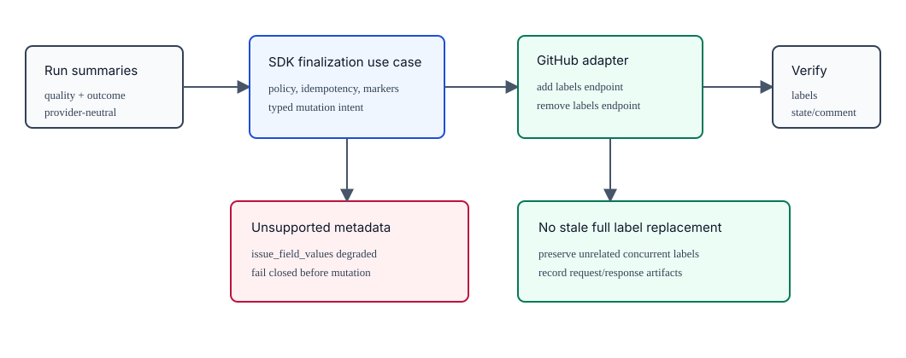

The default GitHub adapter should prefer additive label and per-label removal endpoints for lifecycle labels so a stale issue snapshot cannot replace unrelated concurrent label changes. If a future adapter uses a set-label operation, it must re-fetch immediately before mutation, merge unrelated labels, and verify after mutation. State close/update requests must be scoped to state fields and must not piggyback unrelated metadata.

Every lifecycle transition must emit trace events and a compact run-scoped `github_lifecycle_events.jsonl` artifact with event type, run id, repo, issue, lifecycle mode, mutation intent, result, artifact paths, and verification status.

If `human_intervention.mode = "review_required"`, finalization stops after `final_run_summary.md` and before `done_label`. The CLI must print exact continuation commands:

```text
Review required before GitHub finalization.
Inspect:
  agentactr trace show RUN_ID
  agentactr debug bundle RUN_ID

Finalize after review:
  agentactr finalize RUN_ID --approve

Fail after review:
  agentactr finalize RUN_ID --reject --reason "REASON"
```

Codex may draft final text, but the SDK performs label/comment mutations so traceability is deterministic.

GitHub finalization is an SDK use case, not a Codex prompt and not a remote MCP write-tool shortcut. The GitHub adapter owns REST/GraphQL mutation details, rate-limit backoff, response headers, and API-version compatibility. Core owns the finalization decision, idempotency key, fencing token check, and event order.

### 17.1 Issue Proposal Submission

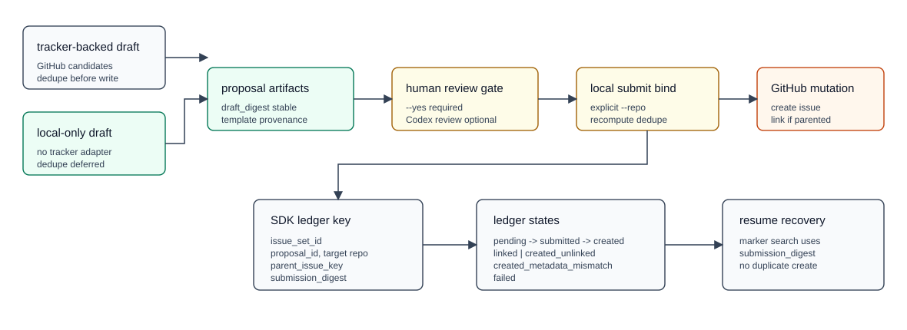

Issue discovery and drafting are distinct from implementation runs. `agentactr issue find` may query the tracker and write issue-set artifacts, but it must not prepare a worktree, launch an implementation agent, or mutate GitHub. `agentactr issue draft` may create local proposals from deterministic repository evidence, deterministic prompt policy, stack/domain-aware templates, or explicit read-only Codex structured drafting, but it must remain read-only until `agentactr issue submit ... --yes` is invoked. Tracker-backed drafting uses `--repo OWNER/REPO`, fetches tracker inventory, and computes dedupe before writing proposals. Tracker-offline drafting uses `--local`, must not construct or call the GitHub adapter, writes an empty candidate artifact with `reason = "not_fetched_local_draft"`, stores proposals under `repo = "local:<workspace_slug>"`, and records `dedupe = deferred`. When `--codex-draft` is supplied, the default CLI may run Codex through `codex exec --json` with `--sandbox read-only`, `approval_policy=never`, `--output-schema`, and `--output-last-message` to inspect the current checkout and produce a bounded structured JSON proposal set. The SDK must validate and normalize that structured output into provider-neutral `IssueProposal` values before writing `issue_proposals.json`; invalid, empty, over-limit, repo-mismatched, or parent-mismatched output fails closed and no proposals are materialized. When `--codex-review` is supplied, the default CLI may run a separate Codex read-only review of the local proposal set against the current checkout. Drafting and review must produce explicit artifacts and must not mutate files or GitHub.

Issue-set artifacts are independent of run artifacts and local Git repositories. An `IssueSetArtifactContext` must include:

- `schema_version`
- `artifact_format_version`
- `issue_set_id`
- optional `compat_run_id` for legacy run-generated proposals
- `created_at`
- `producer`
- `source = find | draft | run_legacy`
- `repo`
- optional `parent_issue`
- optional `framework` as `FrameworkDeclaration`
- `draft_mode = tracker_backed | local_only`
- `tracker_network_required`
- `planner_network_required`
- `submit_requires_repo`
- optional `submit_target_repo`
- `dedupe_deferred`
- candidates, proposals, dedupe-report, trace, manifest, planner prompt, and planner metadata paths

Run IDs remain accepted as issue-set IDs for legacy run-generated proposals. New discovery/draft IDs are issue-set IDs and are not run IDs.

`CandidateQuery` must be typed and deterministic: repo, state, labels, assignee, author, since, optional `text_query`, pull-request inclusion, sort, direction, pagination cursor/page, per-page, and limit. GitHub adapters must filter pull requests unless requested, because GitHub issue endpoints can return PR-shaped records identified by `pull_request`. Search/list pagination and endpoint/query metadata must be recorded in artifacts.

`IssueDraftPlanner` is a provider-neutral planning port, not `AgentRuntime::run_issue`. Planner execution must be read-only: no worktree mutation, no GitHub mutation, no write MCP tools, bounded timeout, structured output schema validation, deterministic error artifacts, and discarded partial output on timeout/schema failure. Codex-authored drafting is an adapter-backed implementation of this planner contract, not a GitHub mutation path and not a replacement for `issue submit`. The target SDK port is async; a bootstrap synchronous CLI wrapper is acceptable only until SDK stabilization. Prompt persistence is secure by default: store prompt metadata and a redacted prompt artifact; raw prompt persistence requires explicit configuration.

For existing repositories without a prompt, drafting must be deterministic SDK policy and emit only rule/evidence-backed proposals. Prompt-based drafting may use a planner adapter, but it must emit concrete, scoped implementation proposals when the operator asks for a breakdown; it must not collapse such prompts into a generic "planning" placeholder issue. Proposal digests must exclude raw prompt text, raw local paths, tokens, timestamps, and raw inventory payloads.

Stack/domain issue body templates are SDK-owned policy, not CLI string assembly. Selection precedence is `framework > explicit domain > stack > generic`. Template provenance and digest inputs include `template_id`, `template_family`, `template_variant`, and `template_version`. Initial families are `python`, `golang`, `rust`, `typescript`, `nextjs`, `pulumi`, `terraform`, `sql`, `postgres`, `clickhouse`, `kafka`, `valkey`, `protobuf`, `grpc`, and `generic`. Generated issue bodies must include Summary, Evidence, Scope, Acceptance Criteria, Architecture Boundaries, Quality Gates, Security/Data/Migration Notes, Test Plan, Agentactr Artifacts, and Dedupe/Related Issues.

Codex-authored and Codex-reviewed proposal creation are explicit and fail-closed. `issue draft --codex-draft` writes at least `codex_issue_draft_prompt.txt`, `codex_issue_draft_schema.json`, `codex_issue_draft.stdout.jsonl`, `codex_issue_draft.stderr.log`, `codex_issue_draft_response.json`, and `codex_issue_draft_status.json`. `issue draft --codex-review` writes at least `codex_issue_review_prompt.txt`, `codex_issue_review.stdout.jsonl`, `codex_issue_review.stderr.log`, `codex_issue_review.md`, and `codex_issue_review_status.json`. `issue submit ... --require-codex-review` must refuse GitHub mutation unless the issue-set review status is approved and covers the selected proposal ID. Plain `issue submit --yes` remains available for explicit human-only review, but it must not imply LLM validation.

`FrameworkDeclaration` is extensible and provider-neutral. It must not be a closed core enum. The default CLI may initially accept `nextjs` and `none`, represented as `{ ecosystem, id, version_or_profile }`.

Duplicate policy is mandatory before submission:

- `unique`: eligible for `issue submit --yes`
- `possible_duplicate`: requires `--allow-possible-duplicate --reason TEXT`, or an equivalent recorded operator rationale transition
- `duplicate_blocked`: cannot be submitted
- `deferred`: local draft placeholder only; must be recomputed against a concrete tracker target before mutation

Title dedupe normalization must be versioned in `issue_dedupe_report.json`; the default normalization trims, collapses whitespace, lowercases, and preserves Unicode without secret-bearing inputs.

For `draft_mode = local_only`, `agentactr issue submit ISSUE_SET_ID --proposal PROPOSAL_ID --repo OWNER/REPO --yes` requires an explicit concrete target repo. Config fallback is intentionally not used in this slice. The CLI rejects placeholders, `local:*`, empty values, and malformed repos before network calls. The SDK prepares a target submission proposal, fetches target repo candidates, recomputes dedupe, blocks exact duplicates, requires the existing possible-duplicate override policy for possible duplicates, and computes a separate `submission_digest`. The stored `IssueProposal.digest` remains the draft digest in the proposal artifact for compatibility; ledger keys and recovery markers use the target-bound `submission_digest`, and submit artifacts retain both `draft_digest` and `submission_digest`.

Multi-agent issue submission is review-gated by default. Child/helper agents may propose tracker issues as artifacts, but they must not mutate GitHub directly.

Provider-neutral contracts:

- `IssueProposal`
- `IssueCreateRequest`
- `IssueCreateResult`
- `IssueLinkRequest`
- `IssueLinkResult`
- `IssueMutationCapability`
- `IssueSubmissionLedgerEntry`
- `IssueSetArtifactContext`
- `IssueDraftMode`
- `IssueDedupeStatus::Deferred`
- `PreparedIssueSubmissionProposal`
- `IssueTemplateProfile`
- `IssueTemplateContext`
- `IssueTemplateRenderResult`
- `FrameworkDeclaration`

Sub-issue semantics are provider-neutral link semantics, not a GitHub-shaped core API. The GitHub adapter implements this as:

1. Create a normal issue.
2. Link the created issue to the parent issue using the created issue's numeric id as `sub_issue_id`.

Issue mutation capabilities must be reported separately:

- `issue_create`
- `issue_link`
- `issue_labels`
- `issue_assignees`
- `issue_milestone`
- `issue_type`
- `issue_field_values`
- `standard_label_ensure`
- `github_projects_v2`

The default GitHub REST adapter must not advertise metadata capabilities it cannot parse, send, and verify. Capabilities such as `issue_field_values` remain degraded until the proposal parser and response verifier can round-trip them without silently dropping operator intent.

Unsupported issue metadata must fail closed before mutation. While `issue_field_values` is degraded for the default GitHub REST adapter, `issue submit --yes` must not include it in the create-issue payload and must reject proposals that require it unless a separate supported project-field automation path handles that intent.

For GitHub issue creation, milestone metadata is transport-specific: GitHub associates a milestone by milestone number. The core proposal may carry provider-neutral milestone text, but the default GitHub REST adapter must accept only a canonical positive decimal milestone number, serialize it as a JSON integer, and fail closed on milestone titles or non-canonical numeric strings before sending the create request.

For GitHub issue creation, standard label maintenance is narrowly scoped and configuration-driven. When `github.standard_label_policy = "ensure_on_issue_create"`, the GitHub adapter may create only the representative built-in labels requested by a proposal: `bug`, `dependencies`, `documentation`, `duplicate`, `enhancement`, `go`, `good first issue`, `help wanted`, `invalid`, `python:uv`, `question`, `tool`, and `wontfix`. It must not create arbitrary proposal labels, lifecycle labels, or project labels. Label creation is part of the explicit `issue submit --yes` mutation path and must write response/header artifacts. When the policy is `disabled`, missing labels fail according to GitHub create-issue behavior.

GitHub Projects V2 automation is separate from the REST issue API and must be opt-in through `github.project_automation = "ensure_on_issue_create"`. The provider-neutral proposal shape may include `project_fields`; the default GitHub adapter currently supports single-select `Priority` values `P0|P1|P2` and `Size` values `XS|S|M|L|XL`. When enabled, the adapter resolves or creates the configured ProjectV2 using GraphQL, creates missing `Priority`/`Size` fields when absent, adds the created issue to the project through `addProjectV2ItemById`, and sets field values through `updateProjectV2ItemFieldValue`. When disabled, proposals containing `project_fields` fail closed before mutation. ProjectV2 request/response artifacts must be recorded with the issue-set artifacts, and the adapter must not couple SDK code to MCP tool shapes.

Issue creation idempotency is mandatory for all write adapters. The SDK ledger is authoritative and must use an atomic transaction or compare-and-set around `pending -> submitted`. The default ledger key is:

```text
(issue_set_id, proposal_id, repo, parent_issue_key, proposal_digest)
```

For tracker-backed drafts, `proposal_digest` is the stored proposal digest. For local-only drafts submitted to a target repo, `proposal_digest` is the computed `submission_digest`; the draft artifact keeps its original digest for audit and compatibility.

`parent_issue` is optional. `parent_issue_key` must be stable for both parented sub-issue proposals and top-level issue proposals. Canonical values are `top_level` for absent parents and `parent:N` for a parent issue number. SQLite migrations must be additive: add `issue_set_id` and `parent_issue_key`, backfill from legacy `run_id` / `parent_issue`, switch reads/writes to the new identity, and only later deprecate legacy columns.

Allowed ledger states:

```text
pending
submitted
created
linked
created_unlinked
created_metadata_mismatch
failed
```

A redaction-safe hidden body marker may be used only as a secondary recovery aid after uncertain outcomes such as timeout after request submission. The marker must contain only non-secret identifiers and a digest:

```text
<!-- agentactr:issue-proposal issue_set_id=... proposal_id=... digest=... -->
```

It must not include raw repo paths, prompt excerpts, issue-body content, secrets, or token-adjacent data.

After issue creation, the adapter must compare requested labels, assignees, milestone, issue type, and issue field values with the response. If GitHub silently drops metadata because of permissions or repository features, the SDK records `created_metadata_mismatch`, preserves the created issue URL/number, skips linking, and requires human review.

`agentactr issue submit ISSUE_SET_ID --proposal PROPOSAL_ID --resume --yes` resumes linking for `created` or `created_unlinked` ledger entries and must not create a duplicate issue. If the ledger is still `submitted`, resume first searches for the redaction-safe marker and links the recovered issue only if one exact created issue is found and metadata still matches; if no marker match is found, the command fails closed and requires human inspection before any duplicate create attempt. Top-level issue proposals create normal issues and complete without sub-issue linking.

Required finalization event order:

```text
finalization.started
vcs.diff.recorded
vcs.commit.local.created | vcs.commit.skipped
vcs.merge_plan.recorded
github.summary.comment.created | github.summary.comment.skipped
github.labels.updated | github.labels.skipped
github.claim.released | github.claim.preserved_for_retry
finalization.completed | finalization.failed
```

When GitHub mutation capability is disabled, finalization must stop before the first GitHub mutation and emit `finalization.failed` or `finalization.deferred` with a clear capability reason.

## 18. Quality Gates

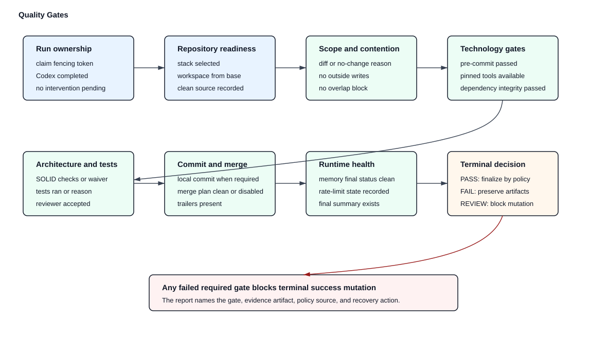

Default pass conditions:

- issue was claimed by current fencing token
- Codex completed without unresolved approval request
- no unresolved `HumanIntervention` request exists
- current human-intervention mode permits finalization
- repository was classified as non-empty, or empty-repo bootstrap was explicitly configured and recorded
- primary technology stack was detected with sufficient confidence or explicitly declared
- VCS worktree was created from recorded base commit
- source checkout was clean at workspace preparation time
- no cross-issue write overlap or merge-risk block exists
- workspace diff exists or no-change reason exists
- no file outside workspace changed
- no write outside assigned write scope
- pre-commit gates passed for detected technology stacks
- required pinned tools were available through repo-local or configured toolchain policy
- dependency integrity checks passed for the detected stack
- required architecture checks passed or produced an explicit policy-reviewed waiver
- tests ran or test omission reason is recorded
- reviewer accepted or policy says reviewer optional
- diff is classified as deterministic and non-ambiguous by policy
- local commit exists when `commit.mode = "local_after_quality_gates"`
- merge plan is `disabled`, clean, or explicitly review-approved according to policy
- memory status did not end in OOM for final implementer
- final summary exists

## 19. Security Defaults

Default:

- Codex network off.
- Codex approval policy `never`.
- human-intervention mode `fail_closed`.
- only local `agentactr` MCP is required/enabled.
- remote research MCP servers auto-enabled only when their credentials or no-auth condition are satisfied.
- remote GitHub MCP read tools auto-enabled only when `GITHUB_TOKEN` or `GH_TOKEN` is detected.
- remote GitHub MCP write tools disabled by default.
- workspace-write sandbox.
- GitHub token redacted from logs.
- no automatic terminal-state issue closure.
- no protected-branch pushes.
- no push by default.
- no merge by default.
- no local commit until pre-commit gates pass.
- no destructive cleanup until retention TTL.
- no nested sub-agent spawning.
- no parallel writers.
- no secrets passed to sub-agents unless tool scope explicitly grants them.

## 20. Evaluation Harness

### 20.1 Local Evaluation

```text
agentactr eval replay --runs .agentactr/runs/events.jsonl
agentactr eval contract --adapter github
agentactr eval contract --adapter codex
agentactr eval memory --pressure-fixture fixtures/memory/
```

### 20.2 SWE-bench Evaluation

The evaluation adapter must support:

- loading issue records from Hugging Face SWE-bench datasets
- creating temporary workspaces
- running Codex in the same agentactr lifecycle
- collecting diffs
- exporting predictions in benchmark-compatible format
- storing cost, duration, token, memory, and pressure data

Default first subset: `SWE-bench/SWE-bench_Verified` smoke subset with small sample size. Store the Hugging Face dataset revision with every result. `princeton-nlp/SWE-bench_Verified` is accepted only as a compatibility alias. `SWE-bench Pro` is a later long-horizon gate.

## 21. MVP Milestones

Current bootstrap status is tracked against these milestones, not by deleting the target requirements. A command or adapter method that is specified below but not implemented must advertise that status explicitly. A bootstrap implementation may pass local verification while still being non-conforming for later milestone requirements.

Status labels:

- `implemented`: present in the current bootstrap shape and locally tested
- `partial`: present but incomplete versus the target SDK contract
- `pending`: specified but not implemented
- `target`: architectural extraction or SDK-stabilization requirement

### Milestone 1: SDK and Rust CLI Skeleton

- `implemented`: `agentactr-core` provider-neutral bootstrap ports
- `partial`: `agentactr-sdk` public facade, currently core re-exports plus config/discovery/render helpers
- `implemented`: `agentactr init`
- `implemented`: `agentactr doctor`
- `implemented`: required local `agentactr` MCP bridge with protocol negotiation tests
- `implemented`: automatic MCP credential detection and repo-local Codex MCP config rendering
- `partial`: MCP policy validation and remote write-tool denylist
- `partial`: default skill prompts/artifact contracts for RepoExplorer, Reproducer, Implementer, Reviewer, QualityAgent, VcsAgent, PolicyAgent, and Finalizer
- `partial`: config parsing and validation
- `partial`: structured logging through local `tracing` and JSONL
- `partial`: SQLite and JSONL stores

### Milestone 2: GitHub Poller

- `partial`: authenticated issue fetch by explicit ID
- `pending`: authenticated candidate fetch / poller
- `pending`: claim marker comment
- `pending`: labels
- `implemented`: REST rate-limit handling for issue fetch
- `partial`: run state persistence

### Milestone 3: Codex Single-Agent Run

- `implemented`: Git worktree workspace creation
- `implemented`: `codex exec --json` process launch
- `implemented`: `codex.mode` transport selector with `cli_json` default plus `app_server` and `codex_sdk` fail-closed stubs
- `implemented`: app-server / Codex SDK milestone config keys are rendered, loaded, canonicalized at CLI write boundaries, core-validated, and included in fail-closed capability diagnostics
- `implemented`: adapter version reports expose explicit degraded features and required actions for doctor/audit output and are persisted as run artifacts/trace events
- `partial`: JSONL event capture; full provider-neutral normalization pending
- `partial`: timeout and cancellation through process group
- `pending`: final GitHub comment

### Milestone 3.5: Codex App-Server Adapter

- `implemented`: `app_server_transport`, `app_server_experimental_api`, and `fallback_mode` config are rendered, loaded, canonicalized at CLI write boundaries, validated, and surfaced in fail-closed diagnostics
- `pending`: stdio JSON-RPC client with initialize/thread/start/turn/start lifecycle
- `pending`: app-server schema/version artifact generation and drift diagnostics
- `pending`: subscription and API-key auth validation for selected `CODEX_HOME`
- `pending`: app-server approval request bridge to `HumanIntervention`
- `pending`: turn interruption and cleanup semantics
- `pending`: app-server token usage, rate-limit, and quota event normalization
- `pending`: raw JSON-RPC artifact capture and redacted debug bundle integration
- `pending`: app-server fallback to `cli_json` when configured policy permits fallback
- `pending`: app-server contract tests for macOS observe-only, macOS Linux VM, and native Linux cgroup modes

### Milestone 3.6: Codex SDK Adapter

- `implemented`: `codex_sdk` mode parsing, capability reporting, and fail-closed runtime selector
- `implemented`: `sdk_bridge` and `fallback_mode` config are rendered, loaded, canonicalized at CLI write boundaries, validated, and surfaced in fail-closed diagnostics
- `pending`: TypeScript `@openai/codex-sdk` sidecar bridge with Node.js 18+ preflight
- `pending`: SDK request/response schema artifacts and drift diagnostics
- `pending`: SDK auth validation for subscription and API-key automation
- `pending`: SDK approval request bridge to `HumanIntervention`
- `pending`: SDK cancellation, token usage, raw artifact capture, and memory attribution tests
- `pending`: SDK fallback to `cli_json` when configured policy permits fallback

### Milestone 4: Pre-Commit and VCS Policy

- `implemented`: technology detection for TypeScript, Rust, Golang, and Python
- `implemented`: empty repository detection, explicit stack bootstrap policy, and `agentactr bootstrap project --stack ... --yes` scaffolds for Python, Go, Rust, TypeScript, Pulumi, Terraform, and SQL
- `pending`: existing repo pre-commit hook discovery
- `partial`: pinned toolchain and dependency integrity checks
- `partial`: stack-specific strict gates for TypeScript, Rust, Golang, and Python
- `partial`: non-mutating final quality gates
- `implemented`: bootstrap-local `agentactr quality run RUN_ID` reruns gates in the recorded isolated worktree and writes a new rerun artifact without changing finalization state; SDK-stable quality rerun use case remains required before finalization/replay promotion
- `implemented`: local `agentactr vcs list [--json]` and `agentactr vcs show RUN_ID [--json]` provide read-only local worktree inventory/detail from run manifests with worktree scope validation
- `implemented`: local `agentactr vcs status RUN_ID` reads run context/worktree metadata, reports base/current commit and touched files, and emits a trace event
- `implemented`: local `agentactr vcs diff RUN_ID [--output PATH]` writes a read-only workspace diff patch and metadata artifact through `VersionControl::diff`
- `implemented`: local `agentactr vcs apply RUN_ID --check|--yes [--3way] [--allow-dirty]` validates or applies the recorded patch into the source checkout for manual merge workflows
- `implemented`: local `agentactr merge plan RUN_ID [--json]` writes a read-only merge-risk artifact through `VersionControl::merge_plan`; default merge remains disabled
- `partial`: typed `clap` top-level and nested generated help, generated shell completions, generated CLI Markdown reference, bootstrap-static `agentactr commands` / `agentactr commands --json` inventory, read-only `agentactr menu` / `agentactr menu --json` navigator, top-level color policy, and read-only `agentactr tui` snapshot/refresh rendering are implemented; per-command exhaustive help details, full documentation site generation, and interactive menu action execution remain pending
- `pending`: local commit after gates
- `pending`: cross-issue touched-file overlap detection

### Milestone 5: Linux Memory Plane

- `implemented`: cgroup v2 creation in bootstrap Linux memory adapter
- `implemented`: root PID attachment and descendant monitoring/reattachment
- `implemented`: per-child `AgentNode` memory leases and cgroup registration for SDK-managed Codex CLI helper processes on Linux enforcement hosts
- `implemented`: `memory.high` and `memory.max`
- `partial`: `memory.events` and `memory.pressure` sampling during Codex run
- `implemented`: provider-neutral `execution.backend` config and `agentactr-execution` Docker command wrapper
- `implemented`: macOS `execution.backend = "auto"` resolves to Docker Linux VM with fail-closed Docker daemon/image/cgroup/PSI preflight when strict memory is required
- `implemented`: Docker backend launches each runtime process through a per-agent container command with Docker memory limit and reservation flags
- `implemented`: PSI/memory-event samples drive `RunResourceGovernor` transitions, run-trace events, and active helper cancellation for `cli_json`
- `partial`: memory debug bundle in run artifacts; stable `agentactr debug bundle RUN_ID` aggregation pending
- `implemented`: Docker runtime image build scripts, static CLI image build scripts, Depot-backed trusted GitHub Actions image build/publish workflows, and Depot-backed push-to-main Dockerfile checks
- `partial`: Docker Desktop VM aggregate memory accounting and remote repository protection/ruleset activation are pending
- `implemented`: Linux memory exposes primitive `MemoryController` methods for sampling, reclaim, kill, attach, create, and finalize; CLI bootstrap still owns product wiring

### Milestone 6: Sub-Agent Spawn

- `implemented`: provider-neutral budget-aware `SpawnManager` and `SpawnPlan`
- `partial`: read-only explorer/reproducer/reviewer helpers through `agentactr-codex` `cli_json`
- `implemented`: implementer single writer
- `partial`: artifact handoff via context manifest, agent graph, per-child artifact roots, and `spawn_handoffs.json`
- `partial`: trace tree for single implementer; child span tree pending
- `implemented`: one-writer enforcement across planned child agents
- `partial`: child agent context budget and artifact handoff policy
- `partial`: macOS strict memory bootstrap through Docker Linux VM; native macOS observe-only remains explicit degraded mode
- `pending`: Codex app-server child threads/sessions

### Milestone 7: Replay and Evaluation

- `implemented`: bootstrap-local `agentactr trace list` and `agentactr trace show RUN_ID` read the JSONL event ledger without mutating it
- `implemented`: bootstrap-local `agentactr debug bundle RUN_ID` aggregates existing run artifacts plus a redacted run-scoped trace slice without mutating run state
- `pending`: JSONL replay
- `partial`: debug bundle schema/redaction hardening and merge-plan integration
- `pending`: SWE-bench smoke harness

## 22. References

[1] A. Kotliarskyi, V. Zhu, and Z. Brock, "An open-source spec for Codex orchestration: Symphony," OpenAI, Apr. 27, 2026. [Online]. Available: https://openai.com/index/open-source-codex-orchestration-symphony/. [Accessed: May 15, 2026].

[2] R. Lopopolo, "Harness engineering: leveraging Codex in an agent-first world," OpenAI, Feb. 11, 2026. [Online]. Available: https://openai.com/index/harness-engineering/. [Accessed: May 15, 2026].

[3] OpenAI, "Best practices," Codex Documentation. [Online]. Available: https://developers.openai.com/codex/learn/best-practices. [Accessed: May 15, 2026].

[4] OpenAI, "Non-interactive mode," Codex Documentation. [Online]. Available: https://developers.openai.com/codex/noninteractive. [Accessed: May 15, 2026].

[5] OpenAI, "Config reference," Codex Documentation. [Online]. Available: https://developers.openai.com/codex/config-reference. [Accessed: May 15, 2026].

[6] OpenAI, "Command line options," Codex CLI Documentation. [Online]. Available: https://developers.openai.com/codex/cli/reference. [Accessed: May 15, 2026].

[7] OpenAI, "App Server," Codex Documentation. [Online]. Available: https://developers.openai.com/codex/app-server. [Accessed: May 15, 2026].

[8] OpenAI, "SDK," Codex Documentation. [Online]. Available: https://developers.openai.com/codex/sdk. [Accessed: May 15, 2026].

[9] OpenAI, "Slash commands," Codex CLI Documentation. [Online]. Available: https://developers.openai.com/codex/cli/slash-commands. [Accessed: May 15, 2026].

[10] OpenAI, "Agent approvals and security," Codex Documentation. [Online]. Available: https://developers.openai.com/codex/agent-approvals-security. [Accessed: May 15, 2026].

[11] OpenAI, "Agents SDK guide," OpenAI Platform Docs. [Online]. Available: https://developers.openai.com/api/docs/guides/agents. [Accessed: May 15, 2026].

[12] OpenAI, "Sandbox agents," OpenAI Platform Docs. [Online]. Available: https://developers.openai.com/api/docs/guides/agents/sandboxes. [Accessed: May 15, 2026].

[13] OpenAI, "Tools guide," OpenAI Platform Docs. [Online]. Available: https://developers.openai.com/api/docs/guides/tools. [Accessed: May 15, 2026].

[14] Hugging Face, "Agents," smolagents Documentation. [Online]. Available: https://huggingface.co/docs/smolagents/reference/agents. [Accessed: May 15, 2026].

[15] Hugging Face, "Multi-agent systems," smolagents Documentation. [Online]. Available: https://huggingface.co/docs/smolagents/examples/multiagents. [Accessed: May 15, 2026].

[16] Hugging Face, "Secure code execution," smolagents Documentation. [Online]. Available: https://huggingface.co/docs/smolagents/tutorials/secure_code_execution. [Accessed: May 15, 2026].

[17] SWE-bench, "SWE-bench Verified," Hugging Face dataset. [Online]. Available: https://huggingface.co/datasets/SWE-bench/SWE-bench_Verified. [Accessed: May 15, 2026].

[18] Princeton NLP, "SWE-bench Verified," Hugging Face dataset. [Online]. Available: https://huggingface.co/datasets/princeton-nlp/SWE-bench_Verified. [Accessed: May 15, 2026].

[19] Scale AI, "SWE-bench Pro," Hugging Face dataset. [Online]. Available: https://huggingface.co/datasets/ScaleAI/SWE-bench_Pro. [Accessed: May 15, 2026].

[20] SWE-bench, "SWE-agent-LM-32B," Hugging Face model. [Online]. Available: https://huggingface.co/SWE-bench/SWE-agent-LM-32B. [Accessed: May 15, 2026].

[21] Anthropic, "SDK MCP," Claude Code Documentation. [Online]. Available: https://docs.anthropic.com/en/docs/claude-code/sdk/sdk-mcp. [Accessed: May 15, 2026].

[22] Anthropic, "Subagents," Claude Code Documentation. [Online]. Available: https://docs.anthropic.com/en/docs/claude-code/sub-agents. [Accessed: May 15, 2026].

[23] Anthropic, "Hooks," Claude Code Documentation. [Online]. Available: https://docs.anthropic.com/en/docs/claude-code/hooks. [Accessed: May 15, 2026].

[24] Anthropic, "Subagents," Claude Agent SDK Documentation. [Online]. Available: https://code.claude.com/docs/en/agent-sdk/subagents. [Accessed: May 15, 2026].

[25] OpenAI, "OpenAI Developer Docs MCP," OpenAI Developers. [Online]. Available: https://developers.openai.com/mcp. [Accessed: May 15, 2026].

[26] Model Context Protocol, "Lifecycle," Model Context Protocol Specification, version 2025-11-25. [Online]. Available: https://modelcontextprotocol.io/specification/2025-11-25/basic/lifecycle. [Accessed: May 15, 2026].

[27] Google, "Developer Knowledge MCP," Google Developer API. [Online]. Available: https://developerknowledge.googleapis.com/mcp. [Accessed: May 15, 2026].

[28] Hugging Face, "MCP Server," Hugging Face Hub. [Online]. Available: https://huggingface.co/mcp. [Accessed: May 15, 2026].

[29] GitHub, "GitHub Copilot MCP endpoint," GitHub Copilot API. [Online]. Available: https://api.githubcopilot.com/mcp/. [Accessed: May 15, 2026].

[30] Linear, "Developers," Linear Documentation. [Online]. Available: https://linear.app/docs/api/. [Accessed: May 15, 2026].

[31] Linear, "API and webhooks," Linear Documentation. [Online]. Available: https://linear.app/docs/api-and-webhooks. [Accessed: May 15, 2026].

[32] Linear, "Rate limiting," Linear Developers. [Online]. Available: https://linear.app/developers/rate-limiting. [Accessed: May 15, 2026].

[33] Linux Kernel Organization, "Control Group v2," Linux Kernel Documentation. [Online]. Available: https://docs.kernel.org/admin-guide/cgroup-v2.html. [Accessed: May 15, 2026].

[34] Linux Kernel Organization, "Pressure Stall Information," Linux Kernel Documentation. [Online]. Available: https://docs.kernel.org/accounting/psi.html. [Accessed: May 15, 2026].

[35] Docker, "Resource constraints," Docker Engine Documentation. [Online]. Available: https://docs.docker.com/engine/containers/resource_constraints/. [Accessed: May 15, 2026].

[36] Docker, "docker container run," Docker CLI Reference. [Online]. Available: https://docs.docker.com/reference/cli/docker/container/run/. [Accessed: May 15, 2026].

[37] Docker, "Virtual Machine Manager," Docker Desktop Documentation for Mac. [Online]. Available: https://docs.docker.com/desktop/features/vmm/. [Accessed: May 15, 2026].

[38] Docker, "Settings," Docker Desktop Documentation. [Online]. Available: https://docs.docker.com/desktop/settings-and-maintenance/settings/. [Accessed: May 15, 2026].

[39] Docker, "Resource Saver," Docker Desktop Documentation. [Online]. Available: https://docs.docker.com/desktop/use-desktop/resource-saver/. [Accessed: May 15, 2026].

[40] GitHub, "API Versions," GitHub REST API Documentation. [Online]. Available: https://docs.github.com/en/rest/about-the-rest-api/api-versions. [Accessed: May 15, 2026].

[41] GitHub, "REST API endpoints for issues," GitHub REST API Documentation. [Online]. Available: https://docs.github.com/en/rest/issues/issues. [Accessed: May 15, 2026].

[42] GitHub, "GraphQL API," GitHub Documentation. [Online]. Available: https://docs.github.com/graphql. [Accessed: May 15, 2026].

[43] GitHub, "Using the API to manage Projects," GitHub Projects Documentation. [Online]. Available: https://docs.github.com/en/issues/planning-and-tracking-with-projects/automating-your-project/using-the-api-to-manage-projects. [Accessed: May 15, 2026].

[44] GitHub, "Rate limits for the REST API," GitHub REST API Documentation. [Online]. Available: https://docs.github.com/rest/using-the-rest-api/rate-limits-for-the-rest-api. [Accessed: May 15, 2026].

[45] Protocol Buffers, "Dos and don'ts," Protocol Buffers Documentation. [Online]. Available: https://protobuf.dev/best-practices/dos-donts/. [Accessed: May 15, 2026].

[46] Protocol Buffers, "Editions overview," Protocol Buffers Documentation. [Online]. Available: https://protobuf.dev/programming-guides/editions/. [Accessed: May 15, 2026].

[47] Buf Technologies, "Buf CLI," Buf Documentation. [Online]. Available: https://buf.build/docs/cli/. [Accessed: May 15, 2026].

[48] gRPC Authors, "Status codes and their use in gRPC," gRPC Documentation. [Online]. Available: https://grpc.io/docs/guides/status-codes/. [Accessed: May 15, 2026].

[49] gRPC Authors, "Cancellation," gRPC Documentation. [Online]. Available: https://grpc.io/docs/guides/cancellation/. [Accessed: May 15, 2026].

[50] PostgreSQL Global Development Group, "UUID Type," PostgreSQL 18 Documentation. [Online]. Available: https://www.postgresql.org/docs/18/datatype-uuid.html. [Accessed: May 15, 2026].

[51] Valkey, "Introduction to Valkey Streams," Valkey Documentation. [Online]. Available: https://valkey.io/topics/streams-intro/. [Accessed: May 15, 2026].

[52] Valkey, "Pub/Sub," Valkey Documentation. [Online]. Available: https://valkey.io/topics/pubsub/. [Accessed: May 15, 2026].

[53] Apache Kafka, "Kafka Design," Apache Kafka Documentation, version 4.1. [Online]. Available: https://kafka.apache.org/41/design/design/. [Accessed: May 15, 2026].

[54] Apache Kafka, "Transaction Protocol," Apache Kafka Documentation, version 4.2. [Online]. Available: https://kafka.apache.org/42/operations/transaction-protocol/. [Accessed: May 15, 2026].

[55] Prometheus Authors, "Metric and label naming," Prometheus Documentation. [Online]. Available: https://prometheus.io/docs/practices/naming/. [Accessed: May 15, 2026].

[56] OpenTelemetry Authors, "Overview," OpenTelemetry Specification. [Online]. Available: https://opentelemetry.io/docs/specs/otel/overview/. [Accessed: May 15, 2026].

[57] Amazon Web Services, "Security best practices for Amazon S3," Amazon S3 User Guide. [Online]. Available: https://docs.aws.amazon.com/AmazonS3/latest/userguide/security-best-practices.html. [Accessed: May 15, 2026].

[58] Microsoft, "Authorize access to blobs using Microsoft Entra ID," Azure Storage Documentation. [Online]. Available: https://learn.microsoft.com/en-us/azure/storage/common/storage-auth-aad-app. [Accessed: May 15, 2026].

[59] Resend, "Idempotency Keys," Resend Documentation. [Online]. Available: https://resend.com/docs/dashboard/emails/idempotency-keys. [Accessed: May 15, 2026].

[60] Internet Engineering Task Force, "Universally Unique IDentifiers (UUIDs)," RFC 9562. [Online]. Available: https://www.rfc-editor.org/rfc/rfc9562. [Accessed: May 15, 2026].

[61] clap-rs, "Derive Reference," clap 4.6.1 Documentation. [Online]. Available: https://docs.rs/clap/4.6.1/clap/_derive/. [Accessed: May 15, 2026].

[62] Tokio, "Tracing," Tokio Documentation. [Online]. Available: https://tokio.rs/tokio/topics/tracing. [Accessed: May 15, 2026].

[63] OpenTelemetry Authors, "OpenTelemetry Rust," OpenTelemetry Documentation. [Online]. Available: https://opentelemetry.io/docs/languages/rust/. [Accessed: May 15, 2026].

[64] Depot, "Container builds in GitHub Actions," Depot Documentation. [Online]. Available: https://depot.dev/docs/container-builds/integrations/github-actions. [Accessed: May 16, 2026].

[65] Docker, "Validating build configuration with GitHub Actions," Docker Docs. [Online]. Available: https://docs.docker.com/build/ci/github-actions/checks/. [Accessed: May 16, 2026].

[66] Apple, "Notarizing macOS software before distribution," Apple Developer Documentation. [Online]. Available: https://developer.apple.com/documentation/security/notarizing-macos-software-before-distribution. [Accessed: May 16, 2026].

[67] GitHub, "Secure use reference," GitHub Docs. [Online]. Available: https://docs.github.com/en/actions/reference/security/secure-use. [Accessed: May 17, 2026].
